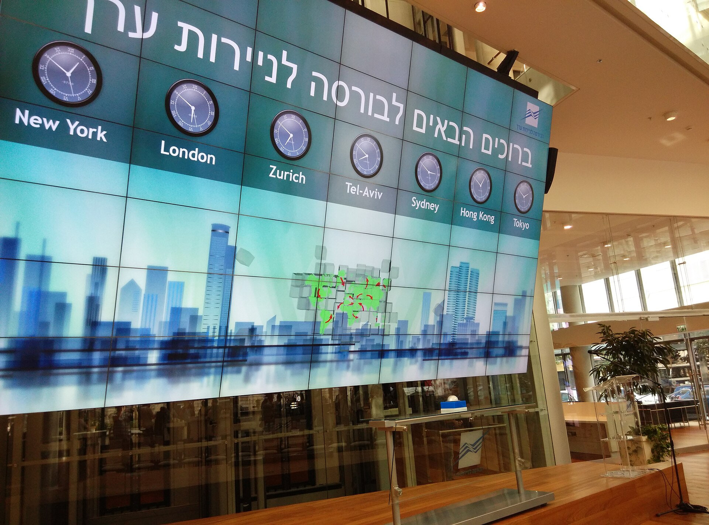

שער הדולר-שקל רשם ירידה משמעותית בחודשים האחרונים, כשהמטבע הישראלי מתחזק מול הדולר האמריקאי ומול סל המטבעות. התשובה הקצרה לשאלה מדוע: שילוב של רגיעה גיאופוליטית יחסית, זרימת הון זר חזרה לשוק המקומי, וביצועים חזקים של הבורסה בתל אביב, שהגבירו את הביקוש לשקל. עבור המשקיע והצרכן הישראלי מדובר בבשורה מעורבת — יש מרוויחים ויש מפסידים.

## מה מניע את התחזקות השקל?

שער הדולר-שקל מושפע ממכלול גורמים מקומיים וגלובליים. בשנה החולפת, לאחר תקופה של אי-ודאות ותנודתיות חדה, הסתמנה רגיעה שהחזירה את אמון המשקיעים הזרים. כשמשקיעים זרים רוכשים מניות ואג"ח ישראליות, הם נדרשים להמיר דולרים לשקלים — וזה מגביר את הביקוש למטבע המקומי ומחזק אותו.

גורם נוסף הוא עודף המט"ח הזורם לישראל מענף ההיי-טק. חברות טכנולוגיה שמגייסות הון בחו"ל וממירות אותו לשקלים לצורך תשלום משכורות מקומיות, מזרימות דולרים לשוק ותורמות ללחץ כלפי מטה על השער.

### תפקידו של בנק ישראל

בנק ישראל אוחז בעתודות מט"ח גדולות והוא שחקן מרכזי בשוק. עם זאת, בתקופה האחרונה הבנק המרכזי ממעט להתערב באופן ישיר, ומעדיף לתת לכוחות השוק לקבוע את השער. התערבות נעשית בעיקר במקרים של תנודתיות קיצונית. מדיניות הריבית של בנק ישראל, לצד זו של הפדרל ריזרב האמריקאי, ממשיכה להשפיע על כדאיות ההחזקה בכל אחד מהמטבעות.

## מי מרוויח ומי מפסיד מהתחזקות השקל?

התחזקות השקל היא סיפור של מנצחים ומפסידים. מצד אחד, היא מוזילה את היבוא — החל ממכוניות ומכשירי חשמל וכלה בדלק ובחומרי גלם. גם הנוסעים לחו"ל וקוני האונליין באתרים זרים נהנים מכוח קנייה גדול יותר.

מצד שני, היצואנים הישראלים נפגעים. חברה שמוכרת את מוצריה בדולרים ומשלמת הוצאות בשקלים, רואה את הכנסותיה השקליות מתכווצות כשהדולר נחלש. הדבר נכון במיוחד לחברות היי-טק, לתעשיות מסורתיות ולחברות תרופות כמו טבע, שחלק ניכר מהכנסותיהן נקוב במטבע חוץ.

| גורם בכלכלה | השפעת התחזקות השקל |
|---|---|
| יבואנים | חיובית — הוזלת עלות הסחורה המיובאת |
| יצואנים והיי-טק | שלילית — שחיקת ההכנסות השקליות |
| צרכנים | חיובית — הוזלת מוצרי יבוא ונסיעות לחו"ל |
| מחזיקי תיק מנייתי זר | שלילית — שחיקת שווי ההחזקות בשקלים |
| נוסעים לחו"ל | חיובית — כוח קנייה גבוה יותר |

## איך זה משפיע על תיק ההשקעות שלכם?

למשקיעים ישראלים המחזיקים חשיפה לשוקי חו"ל, שער הדולר-שקל הוא משתנה קריטי. גם אם מדד נאסד"ק או מדד אס אנד פי 500 עולים, התחזקות השקל עלולה לשחוק את התשואה במונחים שקליים. משקיע שרכש קרן סל על מדד אמריקאי עלול לגלות שהרווח הדולרי "נבלע" בהיחלשות הדולר.

מנגד, הבורסה בתל אביב נהנתה מהמגמה. מדד ת"א 35 ומדד ת"א 125 רשמו ביצועים חזקים, בין היתר בזכות חזרת המשקיעים הזרים והמוסדיים לשוק המקומי.

### מה צפוי בהמשך?

חיזוי שערי מטבע הוא מהמשימות המורכבות ביותר, ואפילו כלכלנים בכירים נמנעים מהתחייבות. ההמשך תלוי במידה רבה במצב הגיאופוליטי, בקצב הורדות הריבית בארצות הברית, ובזרימת ההשקעות הזרות. אם הרגיעה תימשך, ייתכן שהשקל ישמור על עוצמתו. לעומת זאת, כל התלקחות או אי-ודאות עלולות להפוך את המגמה במהירות.

השורה התחתונה: שער הדולר-שקל אינו רק מספר על מסך המסחר — הוא משפיע ישירות על מחירי המוצרים בסופר, על רווחי החברות בבורסה ועל התשואה בתיק הפנסיה. מעקב אחר המגמה, ובחינת החשיפה המטבעית בתיק ההשקעות, הם צעד חכם עבור כל משקיע ישראלי.
