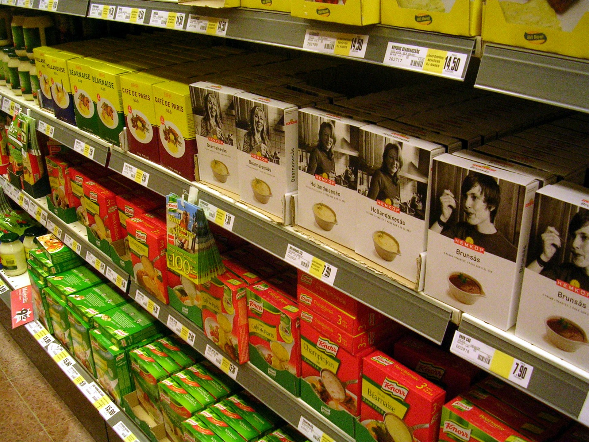

על מדפי הסופרמרקט בישראל מתחוללת בשקט מהפכה צרכנית: **המותג הפרטי** — אותם מוצרים שנושאים את שם הרשת במקום שם יצרן מוכר — הפך בשנים האחרונות לאחד ממנועי הצמיחה המשמעותיים של רשתות המזון, ולכלי מרכזי שבאמצעותו משפחות ישראליות מנסות להילחם ביוקר המחיה. התשובה הקצרה לשאלה "האם משתלם" היא ברוב המקרים כן: מוצר מותג פרטי מוצע לרוב במחיר נמוך בכ-20% עד 40% מהמוצר המקביל של מותג הדגל, לעיתים ללא פשרה מהותית באיכות.

## מהו מותג פרטי ולמה הוא זול יותר?

מותג פרטי (Private Label בלעז, או "מותג בית") הוא מוצר שהרשת הקמעונאית מזמינה מיצרן — לעיתים מאותו מפעל שמייצר גם את מותג הדגל — וממתגת בשמה שלה. הפער במחיר אינו נובע בהכרח מאיכות ירודה, אלא בעיקר ממבנה עלויות שונה:

- **חיסכון בפרסום ובשיווק:** מותגי הדגל משקיעים סכומי עתק בקמפיינים טלוויזיוניים ובקידום מכירות. הרשת לא צריכה לשלם על כך.
- **מיקוח מול היצרן:** הרשת מזמינה כמויות גדולות ומקבלת מחיר נמוך.
- **מיקום על המדף:** הרשת שולטת בשטח המדף שלה עצמה ואינה משלמת "דמי מדף".

התוצאה: מרווח בריא לרשת מצד אחד, ומחיר נמוך לצרכן מצד שני — מצב של win-win שמסביר את הזינוק בפופולריות.

## כמה באמת חוסכים? השוואה

כדי להמחיש את הפער, ריכזנו טווחי מחירים אופייניים לקטגוריות נפוצות. המספרים הם הערכות המבוססות על מגמות שוק ולא מחירון רשמי, אך הם משקפים את סדר הגודל של החיסכון.

| קטגוריה | מותג דגל (טווח) | מותג פרטי (טווח) | חיסכון מוערך |
|---|---|---|---|
| קורנפלקס 500 גרם | כ-18-24 ₪ | כ-11-15 ₪ | 30%-40% |
| שמן זית 750 מ"ל | כ-45-60 ₪ | כ-32-42 ₪ | 25%-30% |
| נייר טואלט 24 גליל | כ-40-55 ₪ | כ-28-38 ₪ | 25%-35% |
| חטיפי ילדים | כ-12-16 ₪ | כ-8-11 ₪ | 25%-35% |
| מוצרי ניקוי | כ-20-30 ₪ | כ-13-20 ₪ | 30%-40% |

עבור משפחה ממוצעת שמבצעת מעבר חלקי למותג הפרטי, החיסכון החודשי עשוי להסתכם במאות שקלים בשנה — סכום לא מבוטל בעידן שבו סל הקניות מתייקר בהתמדה.

## מי מובילות את המגמה בישראל?

כמעט כל השחקניות הגדולות בשוק הקמעונאי הישראלי הרחיבו בשנים האחרונות את קווי המותג הפרטי שלהן:

- **שופרסל** מפעילה מגוון רחב של מותגים פרטיים, מקו בסיסי וזול ועד קווי פרימיום ובריאות.
- **רמי לוי** בנתה חלק ניכר מהתדמית שלה על מחיר נמוך, והמותג הפרטי הוא חלק אינטגרלי מהמדף.
- **ויקטורי** ו**יינות ביתן** מרחיבות אף הן את ההיצע.
- ברשתות הפארם, כמו **סופר-פארם**, המותג הפרטי תופס נתח גדל בקטגוריות הטיפוח והתוספים.

המגמה מקבלת רוח גבית גם מכניסת רשת המזון הזולה **קרפור** לישראל, שהביאה איתה תרבות של מותג פרטי אירופי רחב וזול, והגבירה את התחרות מול השחקנים הוותיקים.

## האם האיכות נופלת ממותג הדגל?

זו השאלה שמעסיקה כל צרכן. התשובה מורכבת. במוצרי בסיס — קמח, סוכר, שמן, נייר, מוצרי ניקוי — הפער האיכותי לרוב זניח, ולעיתים מדובר בדיוק באותו מוצר שיוצר במפעל זהה. בקטגוריות מורכבות יותר, כמו מוצרי חלב מיוחדים, חטיפים או קפה, ייתכנו הבדלים בטעם ובמרקם, והדבר עניין של העדפה אישית.

המלצת הצרכנות הפשוטה: **התנסו**. אם המוצר הזול עומד בציפיות — נשארים איתו; אם לא — חוזרים למותג הדגל רק באותה קטגוריה ספציפית.

## איך לזהות חיסכון אמיתי?

כדי לא ליפול במלכודות שיווקיות, כדאי לאמץ כמה כללי אצבע:

1. **השוו מחיר ליחידה** (ל-100 גרם או לליטר) ולא מחיר לאריזה — לעיתים אריזה גדולה של מותג פרטי זולה בהרבה.
2. **בדקו את רשימת הרכיבים** ולא רק את המחיר, במיוחד במוצרי מזון.
3. **היזהרו ממבצעי מותגי דגל** שלעיתים מוזילים אותם מתחת למותג הפרטי — כדאי להשוות בכל קנייה.
4. **אל תתפשרו על מוצרים רגישים** אם אינכם מרוצים מהתוצאה.

## שורה תחתונה

המותג הפרטי כבר אינו "פתרון עניים" אלא בחירה צרכנית מושכלת שכובשת נתח שוק גובר. בעידן של יוקר מחיה מתמשך, מעבר חכם וסלקטיבי למותגי הבית של הרשתות הוא אחד הכלים הזמינים והיעילים ביותר לצמצום הוצאות הבית — בלי ויתור משמעותי על איכות החיים.
