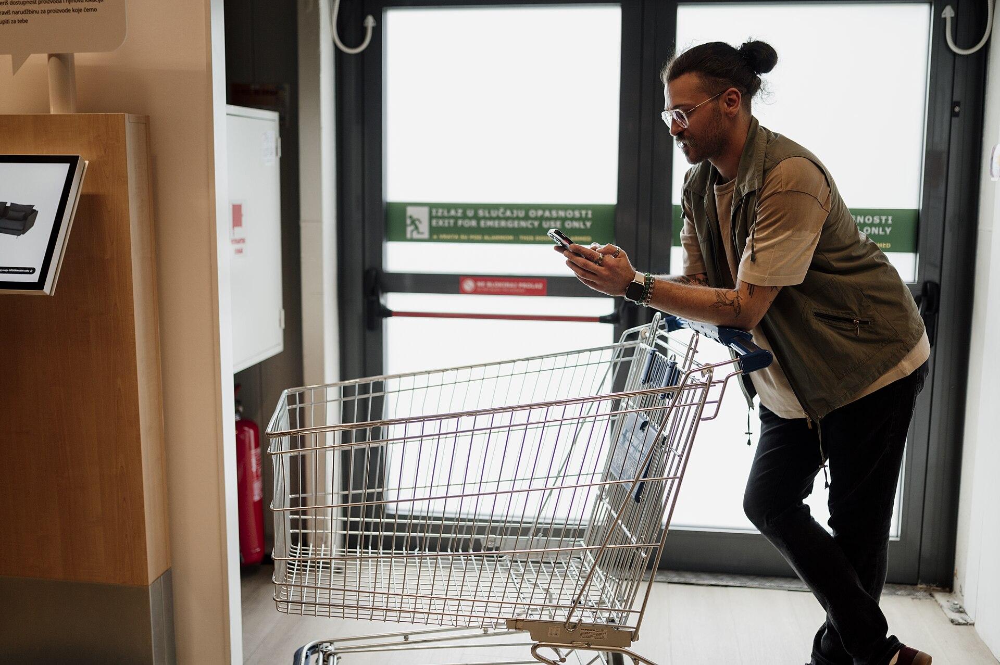

האתרים הסיניים **טמו** (Temu) ו**שיין** (Shein) הפכו בשנה החולפת לאחת המגמות הצרכניות הבולטות בישראל: מיליוני הזמנות של ביגוד, אביזרי בית, גאדג'טים ומוצרי אלקטרוניקה בזול קיצוני, ישירות מהיצרן בסין ועד לתיבת הדואר. הצלחתם של טמו ושיין נשענת על מודל פשוט — ייבוא ישיר, ללא חנויות פיזיות ומתווכים, בתוספת ניצול חכם של הפטור ממע"מ ומכס על יבוא אישי. אבל מאחורי המחירים המפתים מסתתרים גם סיכונים צרכניים ומהלכי רגולציה שעשויים לטרוף את הקלפים.

## למה טמו ושיין כל כך זולים?

הסוד המרכזי הוא קיצור שרשרת האספקה. במקום שמוצר יעבור יצרן, יבואן, מפיץ וקמעונאי — כל אחד עם מרווח רווח משלו — הפלטפורמות הסיניות מחברות את הצרכן הישראלי כמעט ישירות למפעל. לכך מתווסף היתרון של ייצור בהיקפי ענק ועלויות עבודה נמוכות.

הגורם השני, והמכריע מבחינה ישראלית, הוא המיסוי. על יבוא אישי מחו"ל קיים בישראל **פטור ממע"מ ומכס** בעסקאות עד סכום מסוים (סביב 75 דולר לפטור ממכס, ועד 500 דולר לפטור חלקי). המשמעות: מוצר שנקנה בטמו בכמה עשרות שקלים מגיע לצרכן ללא התוספת של כ-18% מע"מ שגובה כל חנות מקומית — פער שמסביר חלק ניכר מהזול.

## מה זה עושה למסחר הישראלי?

הרשתות הקמעונאיות והיבואנים בישראל נמצאים בעמדת נחיתות מובנית. חנות מקומית משלמת שכר דירה, ארנונה, עובדים ומע"מ מלא — ואינה יכולה להתחרות במחיר של חולצה בעשרה שקלים או אוזניות אלחוטיות בעשרים. התוצאה היא לחץ הולך וגובר על ענף האופנה, הצעצועים ואביזרי הבית, במיוחד בקטגוריות הזולות.

התגובה של השחקנים המקומיים מתפצלת לשניים: הוזלות ומבצעים אגרסיביים מצד אחד, והרחבת **המותג הפרטי** והשירות (החזרות מהירות, אחריות, התאמה) מצד שני — תחומים שבהם קשה לאתרים הסיניים להתחרות.

## היתרונות מול הסיכונים לצרכן

לצד המחיר, חשוב להכיר את הצד הפחות מבריק. איכות המוצרים משתנה מאוד, זמני המשלוח נעים בין שבוע לחודש, והחזרת מוצר פגום עלולה להיות מסורבלת ולעיתים לא כדאית כלכלית. בנוסף עולות שאלות של תקינה, בטיחות מוצרי חשמל וצעצועים, ופרטיות מידע.

| פרמטר | טמו / שיין | קמעונאות ישראלית |
|---|---|---|
| מחיר | נמוך מאוד | גבוה יחסית |
| זמן אספקה | כשבוע עד חודש | מיידי / 1-3 ימים |
| החזרות ואחריות | מסובך, לעיתים לא כדאי | נוח, מוסדר בחוק |
| תקינה ובטיחות | לא תמיד מפוקחת | כפופה לרגולציה |
| מע"מ ומכס | פטור עד תקרה | מע"מ מלא במחיר |

## האם הפטור ממס עומד להשתנות?

כאן טמונה הסכנה הגדולה למודל. משרד האוצר ורשות המסים בוחנים כבר תקופה את סוגיית הפטור על יבוא אישי, בטענה שהוא יוצר תחרות לא הוגנת מול העסקים המקומיים ומכרסם בהכנסות המדינה. מגמה דומה כבר מתרחשת באיחוד האירופי ובארצות הברית, שם נשקלת ביטול או צמצום של פטורי היבוא הזעיר.

אם ישראל תבטל את הפטור או תוריד את התקרה, המשמעות תהיה ייקור מיידי של הקנייה בטמו ושיין — תוספת מע"מ ואולי מכס שתקטין באופן דרמטי את פער המחירים מול החנות המקומית. עבור הצרכן שהתרגל למחירי רצפה, זו עשויה להיות הפתעה לא נעימה.

## איך לקנות נכון?

- **השוו מחיר סופי**, כולל משלוח ולא רק את מחיר המוצר.
- הימנעו ממוצרי חשמל וצעצועים בלא תו תקן, בעיקר לילדים.
- קנו מוצרים פשוטים וזולים שבהם הסיכון נמוך (אביזרים, טקסטיל).
- שמרו על סכום ההזמנה מתחת לתקרת הפטור כדי להימנע ממס ומעיכוב במכס.
- בדקו את מדיניות ההחזרות לפני הרכישה — לא תמיד היא משתלמת.

טמו ושיין שינו את כללי המשחק בצרכנות הישראלית, אבל העתיד שלהם תלוי לא רק במחיר אלא גם ביד הרגולטורית. הצרכן החכם ייהנה מהזול — בעיניים פקוחות.
