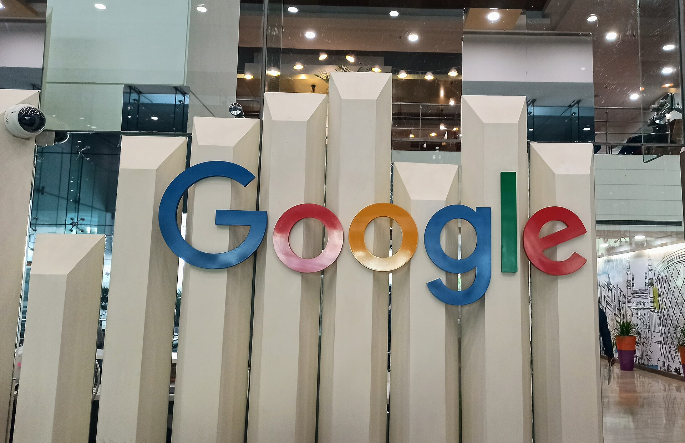

רכישת חברת הסייבר הישראלית **וויז** (Wiz) בידי גוגל, בעסקה המוערכת בכ-32 מיליארד דולר, היא הרכישה הגדולה ביותר בתולדות ההייטק הישראלי — ואחת העסקאות הבולטות בעולם הסייבר בעשור האחרון. עסקת גוגל–וויז אינה רק אירוע פיננסי חד-פעמי; היא מסמנת את בשלותו של ענף הסייבר הישראלי ואת יכולתו לייצר חברות בקנה מידה עולמי בתוך שנים ספורות.

## מה עומד מאחורי עסקת גוגל וויז?

וויז נוסדה בשנת 2020 בידי צוות יזמים ישראלי, ורבים מהם היגרו מחברת הסייבר אדליום שנמכרה בעבר למיקרוסופט. תוך פחות מחמש שנים הפכה החברה לאחת מספקיות אבטחת הענן הצומחות בעולם, עם קצב גידול הכנסות חריג שהעמיד אותה בשורה הראשונה של תעשיית הסייבר.

המוצר המרכזי של וויז מאפשר לארגונים לסרוק את סביבות הענן שלהם, לזהות פרצות אבטחה ולתעדף סיכונים — בלי להתקין תוכנה על כל שרת. הפשטות היחסית והמהירות של הפריסה הפכו את הפתרון לפופולרי בקרב תאגידי ענק, וסייעו לחברה לצבור בסיס לקוחות רחב.

### מדוע גוגל משלמת סכום כה גבוה?

עבור גוגל, שמפעילה את חטיבת **גוגל קלאוד**, הרכישה היא מהלך אסטרטגי במלחמת הענן העולמית מול אמזון ומיקרוסופט. אבטחת ענן היא אחד התחומים החמים בשוק, ושילוב טכנולוגיית וויז בפלטפורמה של גוגל אמור לחזק את הצעת הערך שלה מול לקוחות ארגוניים גדולים.

המחיר הגבוה משקף גם את המחסור בחברות סייבר בוגרות עם צמיחה מהירה, ואת התחרות העזה על נכסים איכותיים בשוק. גוגל, שכבר ניסתה לרכוש את וויז בעבר בעסקה שלא הבשילה, בחרה הפעם להעלות משמעותית את ההצעה.

## מה המשמעות להייטק הישראלי?

עסקת גוגל וויז היא נקודת ציון סמלית לענף. היא ממחישה שישראל מסוגלת לא רק לייצר סטארטאפים בשלב מוקדם, אלא גם לגדל חברות ל"יוניקורנים" ומעבר לכך — ולהגיע לאקזיטים בהיקפים שנחשבו בעבר לבלתי מציאותיים.

ההשלכות המרכזיות:

- **הזרמת הון ליזמים ולעובדים**: מאות עובדים ובעלי מניות צפויים לממש רווחים משמעותיים, שחלקם יופנה להקמת חברות חדשות והשקעות אנג'ל.
- **חיזוק אקוסיסטם הסייבר**: ישראל כבר מהווה מוקד עולמי לחברות אבטחת מידע, והעסקה מחזקת את מעמדה מול מרכזי טכנולוגיה אחרים בעולם.
- **עניין מחודש של המשקיעים הזרים**: אקזיטים בסדר גודל כזה מגבירים את התיאבון של קרנות הון סיכון וחברות ענק לחפש את "וויז הבאה" בישראל.

## השוואה: עסקאות ענק בהייטק הישראלי

הטבלה הבאה ממחישה את מקומה של עסקת גוגל–וויז ביחס לעסקאות בולטות אחרות בתולדות הענף (הערכות):

| עסקה | רוכשת | היקף מוערך | תחום |
|------|--------|-------------|-------|
| וויז | גוגל | כ-32 מיליארד דולר | אבטחת ענן |
| מובילאיי | אינטל | כ-15 מיליארד דולר | רכב אוטונומי |
| מלאנוקס | אנבידיה | כ-7 מיליארד דולר | תקשורת נתונים |
| אדליום | מיקרוסופט | כ-320 מיליון דולר | סייבר |

## האם העסקה תשלים ללא מכשולים?

עסקאות בסדר גודל כזה כפופות לאישורים רגולטוריים במספר מדינות, ובראשן בדיקות בתחום ההגבלים העסקיים. הרשויות בארצות הברית ובאירופה בוחנות בשנים האחרונות בקפדנות רכישות של חברות ענק טכנולוגיות, מתוך חשש לפגיעה בתחרות.

לכן, למרות ההכרזה, השלמת העסקה בפועל עשויה להימשך זמן, וקיים סיכון — גם אם נמוך — שהיא תיתקל בהתנגדות רגולטורית. עם זאת, שוק הסייבר מפוצל יחסית, מה שעשוי להקל על קבלת האישורים.

## שורה תחתונה

עסקת גוגל וויז היא הרבה מעבר לכותרת מרשימה: היא עדות לבשלותו של ההייטק הישראלי ולמעמדו כמעצמת סייבר עולמית. גם אם השוק המקומי ממתין עדיין להתאוששות רחבה יותר בגיוסים ובהנפקות, מהלך כזה מזכיר מדוע ישראל ממשיכה למשוך את תשומת לב ענקיות הטכנולוגיה — ומדוע התחום הזה עשוי להוביל את הצמיחה הבאה של המשק.
