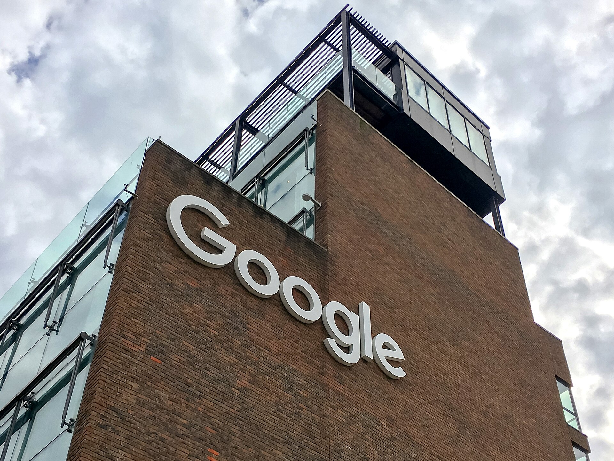

עסקת וויז, שבמסגרתה רוכשת גוגל את חברת אבטחת הענן הישראלית בכ-32 מיליארד דולר, היא האקזיט הגדול ביותר בתולדות ההייטק הישראלי — ואות ברור לכך שענף הסייבר המקומי הפך לנכס אסטרטגי מבוקש עבור ענקיות הטכנולוגיה בעולם. מדובר במהלך שמעצב מחדש את מפת שוק אבטחת המידע, ומזרים אנרגיה מחודשת לתעשייה שחוותה שנים מאתגרות.

## מה עומד מאחורי עסקת וויז?

וויז נוסדה על ידי צוות יזמים ישראלי ותיק, בהם אנשי מפתח שהגיעו מיחידות טכנולוגיות בצה"ל ומחברות סייבר קודמות. החברה זיהתה בעיה מהותית: ככל שארגונים מעבירים את תשתיותיהם לענן — לרבות ענני אמזון, מיקרוסופט וגוגל — כך גדל משטח התקיפה והחשיפה לפרצות אבטחה. הפתרון של וויז מאפשר לחברות לסרוק את סביבות הענן שלהן, לזהות חשיפות קריטיות ולתעדף את הטיפול בהן.

המוצר תפס תאוצה במהירות חריגה. וויז נחשבת לאחת החברות שהגיעו לקצב הכנסות שנתי של מאות מיליוני דולרים בזמן קצר מאוד, מה שהפך אותה למטרת רכישה אטרקטיבית. עבור גוגל, הרכישה נועדה לחזק את מערך הענן שלה — Google Cloud — ולצמצם את הפער מול המתחרות הגדולות בתחום אבטחת הענן.

## מדוע העסקה כל כך משמעותית לענף הישראלי?

מעבר לסכום העתק, עסקת וויז נושאת משמעות סמלית וכלכלית עמוקה. היא מוכיחה שחברה ישראלית יכולה לצמוח לשווי של עשרות מיליארדי דולרים תוך שנים ספורות, ולהתחרות בשחקניות הגדולות בעולם. ההשלכות מורגשות בכמה מישורים:

- **הזרמת הון חוזר:** בעלי מניות, קרנות הון-סיכון ועובדים שהחזיקו אופציות צפויים לממש רווחים משמעותיים, שחלקם יזרום בחזרה להשקעות בסטארטאפים חדשים.
- **חיזוק המותג הלאומי:** ישראל ממצבת את עצמה כ"מדינת הסייבר", והעסקה מחזקת את המוניטין הזה מול משקיעים ולקוחות עולמיים.
- **אפקט בוגרים:** ניסיון העבר מלמד שעובדי חברות אקזיט גדולות נוטים להקים חברות חדשות, וכך נוצר גל יזמות המשך.

## טבלת השוואה: אקזיטים בולטים של הסייבר הישראלי

| חברה | רוכשת / אירוע | שווי מוערך | תחום |
|---|---|---|---|
| וויז | גוגל | כ-32 מיליארד דולר | אבטחת ענן |
| מלאנוקס | אנבידיה | כ-7 מיליארד דולר | תקשורת ושבבים |
| סייברארק | חברה ציבורית בנאסד"ק | שווי שוק של מיליארדים | ניהול הרשאות |
| צ'ק פוינט | חברה ציבורית ותיקה | עשרות מיליארדי דולר | אבטחת רשת |

*הנתונים הם הערכות כלליות המבוססות על פרסומים בשוק ונועדו להמחשה בלבד.*

## מהם הסיכונים והחסמים?

העסקה עדיין כפופה לאישורים רגולטוריים, ובראשם בחינה של רשויות ההגבלים העסקיים בארצות הברית ובאירופה. הרגולטורים בוחנים בקפדנות רכישות של ענקיות הטכנולוגיה, מתוך חשש מריכוזיות בשוק הענן והאבטחה. אם העסקה תיתקל בהתנגדות, ייתכנו עיכובים ואף שינויים במבנה ההסכם.

סיכון נוסף נוגע לשימור העובדים והתרבות הארגונית. היסטורית, לא כל רכישה של סטארטאפ ישראלי בידי תאגיד ענק הבשילה למיזוג מוצלח, ולעיתים עובדי מפתח עוזבים לאחר תקופת ההסתגלות.

## מה זה אומר למשקיע הישראלי?

גם משקיעים שאינם מחזיקים ישירות במניות וויז יכולים להיות מושפעים מהמגמה. עסקת וויז מחזקת את האמון בענף ההייטק הישראלי, מה שעשוי לתמוך בסנטימנט חיובי בבורסה בתל אביב, בפרט במניות הטכנולוגיה והסייבר הנסחרות בישראל ובנאסד"ק. בנוסף, חברות ציבוריות כמו צ'ק פוינט וסייברארק עשויות ליהנות מעניין מחודש של משקיעים בתחום.

עם זאת, חשוב לזכור שאקזיט ענק בודד אינו מבטיח שגשוג רוחבי. שוק ההון-סיכון עדיין מתמודד עם סביבת ריבית מאתגרת ועם ברירה קפדנית יותר של השקעות. עבור המשקיע הישראלי, המסקנה המרכזית היא שענף הסייבר נותר אחד ממנועי הצמיחה החזקים של המשק — אך פיזור והבנת הסיכונים נותרים כללי הברזל.

## סיכום

עסקת וויז-גוגל אינה רק כותרת מרשימה; היא ציון דרך שמשקף את הבשלות של תעשיית הסייבר הישראלית ואת מרכזיותה בכלכלה העולמית. אם העסקה תושלם כמתוכנן, היא צפויה להזין גל חדש של יזמות, השקעות והון אנושי — ולהמשיך למצב את ישראל בחזית הטכנולוגיה העולמית.
