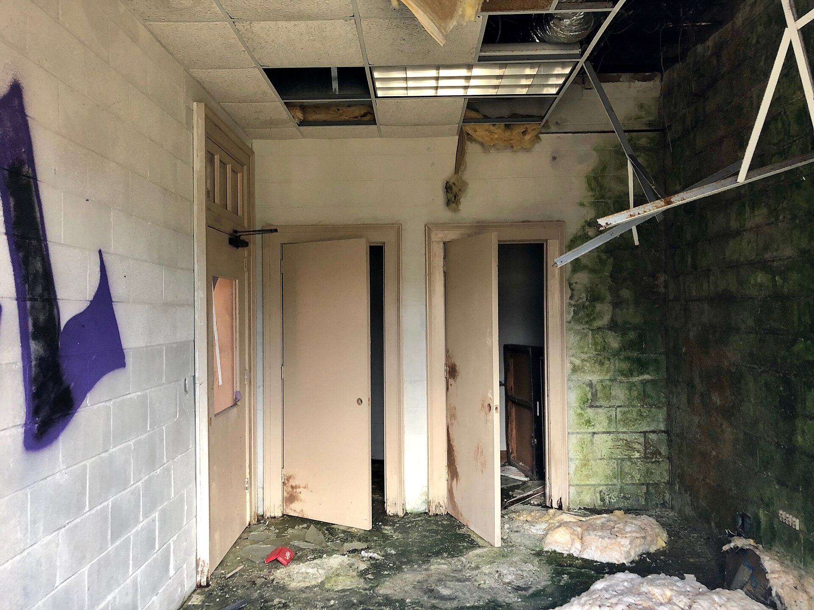

שוק המשרדים בישראל נכנס לאחת התקופות המאתגרות שלו בעשור האחרון: שילוב של גל בנייה עצום שיצא לדרך בשנות הריבית האפסית, מעבר נרחב למודל עבודה היברידי והתייקרות דרמטית של עלויות המימון יצר עודף היצע שמפעיל לחץ כבד על דמי השכירות ועל שיעורי התפוסה. בלב הסערה עומדת תל אביב, שבה עשרות מגדלים חדשים מתחרים על אותם שוכרים.

## מה גרם לעודף ההיצע בשוק המשרדים?

בשנים שבהן הריבית של בנק ישראל נעה סביב האפס, יזמי הנדל"ן המניב מיהרו להשיק פרויקטים חדשים. משך התכנון והבנייה של מגדל משרדים נמשך שנים, ולכן דווקא עכשיו — כשהביקוש נחלש — נכנסת לשוק כמות חסרת תקדים של שטחים חדשים. התוצאה: היצע שמגיע בדיוק בעיתוי הגרוע ביותר.

במקביל, ענף ההיי-טק הישראלי, שהיה מנוע הביקוש המרכזי לשטחי משרדים איכותיים, עבר שנתיים של האטה, גיוסים מצומצמים וייעול כוח אדם. חברות רבות ויתרו על קומות שלמות או השכירו אותן בשכירות משנה, מה שהגדיל את ההיצע ה"אפור" שאינו מופיע בסטטיסטיקות הרשמיות.

### העבודה ההיברידית משנה את המשחק

מאז מגפת הקורונה התבסס מודל העבודה ההיברידי כברירת מחדל בחלק ניכר מהמשק. חברות מגלות שהן זקוקות לפחות מטרים רבועים לעובד, ומעדיפות שטחים גמישים וקטנים יותר על פני קומות ענק. השינוי הזה, שנראה בתחילה זמני, הפך למגמה מבנית שמכרסמת בביקוש לטווח הארוך.

## איך זה משפיע על דמי השכירות?

בניגוד לירידה חדה ומיידית, בעלי הנכסים נמנעים מלהוריד את דמי השכירות ה"נקובים" כדי לא לפגוע בשווי הנכס בספרים. במקום זאת הם מציעים תמריצים: חודשי שכירות מתנה, השתתפות בעלויות התאמה ושדרוג המשרד, ותקופות התחייבות גמישות יותר. בפועל, דמי השכירות האפקטיביים נשחקים ריאלית, גם אם המחירון הרשמי נראה יציב.

הפער בין נכסים חדשים ומשודרגים (Class A) לבין בניינים ותיקים ופחות אטרקטיביים הולך ומתרחב. השוכרים מנצלים את כוח המיקוח כדי לעבור למגדלים חדשים בתנאים אטרקטיביים, ומשאירים מאחוריהם בניינים ישנים שמתקשים למצוא דיירים.

## טבלת השוואה: אפיקי הנדל"ן המניב בישראל

| אפיק | מצב הביקוש | לחץ על התשואות | רמת הסיכון |
|------|-----------|----------------|------------|
| משרדים במרכז הארץ | חלש עד בינוני | גבוה | גבוהה |
| מרכזים מסחריים ושטחי מסחר | יציב | בינוני | בינונית |
| לוגיסטיקה ומחסנים | חזק | נמוך | נמוכה־בינונית |
| מגורים להשכרה | חזק מאוד | נמוך | נמוכה |
| מרכזי נתונים | בצמיחה | נמוך | בינונית |

כפי שעולה מהטבלה, בעוד שוק המשרדים מתמודד עם רוחות נגד, אפיקים כמו לוגיסטיקה, מגורים להשכרה ומרכזי נתונים ממשיכים ליהנות מביקוש איתן — ולכן חברות הנדל"ן המניב מסיטות אליהם משאבים.

## מה קורה למניות הנדל"ן המניב בבורסה?

הבורסה בתל אביב כבר מתמחרת את החולשה. חברות נדל"ן מניב וקרנות ריט הנסחרות במדד ת"א 35 ובמדדי הנדל"ן ספגו לחצים, וחלקן נסחרות מתחת להון העצמי שלהן — סימן לכך שהמשקיעים חוששים משערוכים כלפי מטה של שווי הנכסים. הריבית הגבוהה מייקרת את מיחזור החוב של החברות הממונפות ומכבידה על הרווחיות.

עם זאת, יש שוני מהותי בין החברות: אלה שהתמקדו בנכסים איכותיים במיקומים מובילים, או שגיוונו לעבר לוגיסטיקה ומגורים, נמצאות בעמדה חזונה יותר מאשר בעלות פורטפוליו ותיק וריכוזי במשרדים.

## מה צפוי בהמשך?

המפתח להתאוששות שוק המשרדים נמצא בשני גורמים: קצב הורדות הריבית של בנק ישראל, שיוזיל את עלויות המימון ויתמוך בשערוכים, והתאוששות ענף ההיי-טק, שיחזיר את הביקוש לשטחים איכותיים. עד שאלה יתממשו, סביר שנראה תקופה של עודף היצע, שחיקה בדמי השכירות האפקטיביים ובלימה בהשקת פרויקטים חדשים.

למשקיעים ולשוכרים כאחד, זהו שוק שנוטה לטובת מי ששוכר — לפחות בטווח הקרוב.
