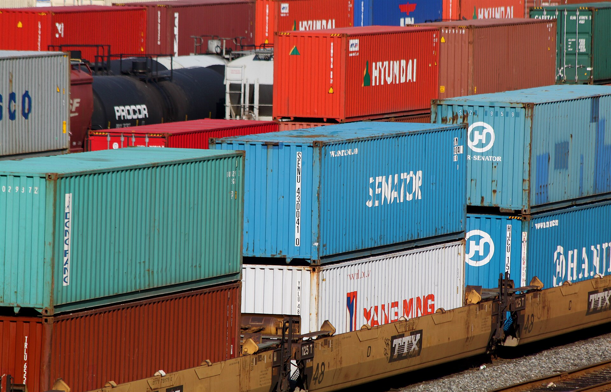

עידן הקניות הזולות במיוחד באתרים הסיניים עשוי להתקרב לסופו. **מס על חבילות מחו"ל** — כלומר צמצום או ביטול הפטור ההיסטורי ממע"מ וממכס על יבוא אישי בסכומים נמוכים — נמצא על שולחן קובעי המדיניות בישראל, מהלך שעשוי לשנות מן היסוד את כלכלת ההזמנות הקטנות מאתרים כמו טמו, שיין ועלי אקספרס. עבור מיליוני צרכנים ישראלים שהתרגלו למחירים נמוכים במיוחד, מדובר בשינוי שישפיע ישירות על הכיס.

## מה בעצם עומד להשתנות?

במשך שנים נהנה היבוא האישי מפטור: הזמנות שסכומן נמוך מתקרה מסוימת (סביב 75 דולר לצורך מע"מ ומכס) הגיעו לצרכן ללא תוספת מס. הפטור הזה, שנועד במקור להקל על הבירוקרטיה ולעודד תחרות, הפך למנוע צמיחה אדיר של פלטפורמות הסחר הסיניות שהציפו את ישראל בחבילות קטנות וזולות.

הלחץ לשינוי מגיע משני כיוונים: הקמעונאים המקומיים, הטוענים לתחרות לא הוגנת מול סחורה שמגיעה ללא מס, וקופת המדינה, המזהה מקור הכנסה פוטנציאלי בהיקף מאות מיליוני שקלים בשנה. גם באיחוד האירופי ובארצות הברית מתקדמים מהלכים דומים לצמצום הפטור על משלוחים זעירים.

## כמה זה יעלה לצרכן?

המשמעות המעשית פשוטה: מוצר שעד היום עלה, למשל, כ-50 דולר ללא תוספות, עשוי להתייקר בשיעור המע"מ (18%) ובמקרים מסוימים גם במכס ובדמי טיפול. עבור מוצרי אופנה זולים, אביזרי אלקטרוניקה קטנים וגאדג'טים — שהם לב ליבו של שוק הקניות הסיני — התוספת עלולה לשחוק חלק ניכר מהיתרון במחיר.

### השוואה: כך עשוי להשתנות מחיר ההזמנה

| רכיב | מצב קיים (פטור) | מצב אפשרי (אחרי המס) |
|---|---|---|
| מחיר מוצר בסיסי | כ-50 דולר | כ-50 דולר |
| מע"מ | פטור | כ-18% תוספת |
| מכס | פטור (מתחת לתקרה) | ייתכן על קטגוריות מסוימות |
| דמי טיפול | לרוב ללא | ייתכנו דמי טיפול נוספים |
| מחיר סופי מוערך | כ-50 דולר | כ-59 דולר ומעלה |

הטבלה ממחישה מדוע גם שינוי שנראה טכני עלול לשנות את שיקולי הכדאיות, במיוחד עבור הזמנות בסכומים בינוניים.

## מי המרוויח ומי המפסיד?

המרוויחים הברורים הם הקמעונאים המקומיים ורשתות הקניות בישראל, שמתלוננים כבר שנים על מגרש משחקים לא שוויוני. גם יבואנים רשמיים ובעלי חנויות אונליין ישראליות עשויים לזכות בהזדמנות להחזיר לקוחות שנטשו לטובת האתרים הזרים.

המפסידים העיקריים הם הצרכנים הרגישים למחיר, בעיקר במעמד הביניים ומטה, שעבורם הקנייה הזולה מחו"ל הפכה לפתרון של ממש לצריכה שוטפת. גם פלטפורמות הסחר עצמן, שבנו את הדומיננטיות שלהן בישראל על יתרון המחיר, יידרשו להתאים אסטרטגיה — בין השאר באמצעות הקמת מרכזים לוגיסטיים מקומיים או שינוי מודל התמחור.

## איך כדאי לצרכן להיערך?

המלצת המומחים ברורה: להסתכל על **המחיר הסופי** ולא על מחיר המדבקה. לפני כל הזמנה כדאי לחשב את התוספת הצפויה של מע"מ ומכס, ולבדוק אם הפער מול המוצר המקביל בישראל עדיין מצדיק את זמן ההמתנה ואת הסיכון בהחזרות.

- **רכזו הזמנות בחוכמה:** לעיתים כדאי לבחון אם עדיף לפצל או לאחד הזמנות בהתאם לכללי המס החדשים.
- **השוו מול הקמעונאות המקומית:** הפער מצטמצם, ולעיתים משתלם יותר לקנות בישראל עם אחריות ושירות.
- **שימו לב לדמי טיפול נסתרים:** חברות השילוח והמכס עשויות לגבות עמלות נוספות.
- **עקבו אחרי הרגולציה:** מועד הכניסה לתוקף והתקרות המדויקות עשויים להשתנות.

## שורה תחתונה

הטלת מס על חבילות מחו"ל מסמנת מפנה אפשרי בשוק הצרכנות הישראלי. גם אם היתרון של האתרים הסיניים לא ייעלם לחלוטין, הפער מול הקמעונאות המקומית צפוי להצטמצם. הצרכן החכם יהיה זה שיבחן כל הזמנה לגופה — ולא יניח עוד שהמחיר הנמוך באתר הוא בהכרח המחיר שישלם בסוף.
