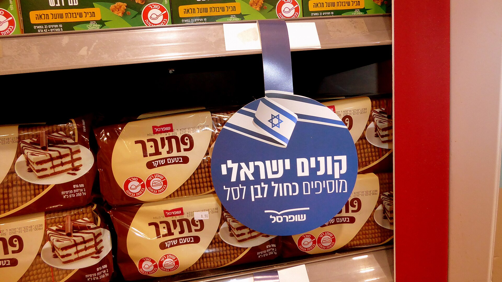

המותג הפרטי — אותם מוצרים הנושאים את שם הרשת במקום שם יצרן מוכר — הפך בשנים האחרונות לנשק המרכזי של הצרכן הישראלי במלחמה ביוקר המחיה. הנתון המרכזי פשוט: מוצרי **מותג פרטי** זולים בדרך כלל בכ-20% עד 40% ממקביליהם ממותג מוביל, ולעיתים אף יותר. התוצאה היא זינוק מתמשך בנתח שתופסים מוצרים אלה בעגלת הקניות הישראלית.

אם פעם נתפס המותג הפרטי כפתרון "זול ופחות איכותי", היום התמונה השתנתה. רשתות כמו שופרסל, רמי לוי, יינות ביתן, ויקטורי וטיב טעם משקיעות בפיתוח קווי מוצרים רחבים — מחלב ומוצרי מאפה ועד חומרי ניקוי, קוסמטיקה ומזון מעובד — במטרה לקשור את הלקוח לרשת ולשפר את שולי הרווח.

## למה המותג הפרטי כל כך זול?

הסיבה המרכזית לפער המחיר אינה בהכרח איכות נמוכה יותר, אלא **חיסכון בעלויות שיווק ופרסום**. יצרן מותג מוביל משקיע סכומי עתק בקמפיינים טלוויזיוניים, במיתוג ובקידום מכירות — עלויות שמגולגלות בסופו של דבר על הצרכן. המותג הפרטי מדלג על שלב זה כמעט לחלוטין: הרשת כבר מחזיקה במדף, בלקוחות ובחשיפה.

גורם נוסף הוא כוח הקנייה. הרשתות הגדולות מזמינות כמויות ענק ממפעלי ייצור — לעיתים מאותם מפעלים שמייצרים גם את המותגים המובילים — ומקבלות מחיר נמוך משמעותית. במקרים רבים, ההבדל בין מוצר מותג פרטי למוצר ממותג מוביל הוא בעיקר האריזה.

## היכן הפער הכי משתלם?

החיסכון בולט במיוחד במוצרי בסיס שבהם ההבדל האיכותי בין היצרנים זניח. הנה השוואה כללית של פערי מחיר אופייניים בין מותג פרטי למותג מוביל:

| קטגוריה | פער מחיר אופייני | הערכת חיסכון חודשית |
|---|---|---|
| מוצרי חלב בסיסיים | 15%-25% | בינוני |
| קטניות ופסטה | 25%-40% | גבוה |
| נייר טואלט ומגבונים | 20%-35% | גבוה |
| חומרי ניקוי וכביסה | 30%-45% | גבוה מאוד |
| חטיפים ומשקאות | 20%-30% | בינוני |

המסקנה הצרכנית ברורה: הפער הגדול ביותר טמון דווקא בקטגוריות שבהן המיתוג משמעותי — חומרי ניקוי, נייר וקוסמטיקה — שם המותג המוביל "גובה" פרמיה גבוהה על ההכרה בשם.

## האם האיכות משתווה?

כאן התמונה מורכבת יותר. במוצרים סטנדרטיים — קמח, סוכר, שמן, קטניות — ההבדל האיכותי לרוב זניח, ובדיקות טעם עיוורות רבות מראות שקשה להבחין. לעומת זאת, בקטגוריות שבהן המרכיב או תהליך הייצור קריטיים — קפה איכותי, שוקולד, מוצרי בשר מעובדים — עדיין קיים פער מורגש לטובת המותגים המובילים.

העצה הצרכנית: לאמץ גישה סלקטיבית. לעבור למותג פרטי בקטגוריות הבסיסיות, שם החיסכון גבוה והסיכון נמוך, ולשמור על המותג המועדף רק במוצרים שבהם הטעם או האיכות באמת משנים.

## מלחמת הרשתות על נאמנות הצרכן

ההתרחבות של המותג הפרטי אינה מקרית. על רקע השחיקה בכוח הקנייה ומחאות יוקר המחיה, הרשתות מבינות שהצרכן הישראלי רגיש למחיר מתמיד. הרחבת קווי המותג הפרטי מאפשרת להן להציע "אלטרנטיבה זולה" מבלי לוותר על שולי רווח — ולעיתים אף לשפר אותם, שכן הרווחיות על מותג פרטי גבוהה מזו של מוצר ממותג.

המגמה מקבלת רוח גבית גם מהכניסה ההולכת וגוברת של רשתות דיסקאונט וייבוא מקביל, המגבירות את התחרות ומאלצות את השחקנים הוותיקים להוזיל. עבור היצרנים הגדולים — כמו שטראוס, אסם-נסטלה ותנובה — מדובר באיום אסטרטגי: כל מדף שנכבש על ידי מותג פרטי הוא מדף אבוד.

## שורה תחתונה לצרכן

מעבר חכם למותג פרטי בקטגוריות הבסיס יכול לחסוך למשק בית ממוצע מאות שקלים בחודש, בלי פגיעה מורגשת ברמת החיים. המפתח הוא לא לפסול מראש ולא לאמץ באופן גורף — אלא לבחון מוצר-מוצר, להשוות מחיר לק"ג או ליחידה, ולזכור שהמותג הזול לא בהכרח פחות טוב.
