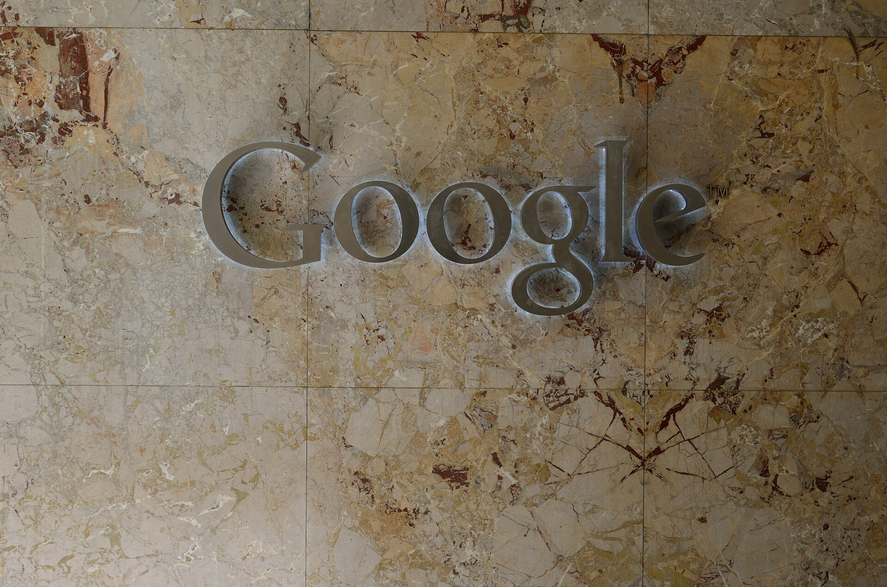

עסקת וויז-גוגל, שבמסגרתה רוכשת ענקית הטכנולוגיה האמריקאית את חברת הסייבר הישראלית תמורת סכום המוערך בעשרות מיליארדי דולרים, היא אחת מעסקאות ההייטק הגדולות בתולדות המדינה. המהלך ממצב מחדש את הסייבר הישראלי כזירת הצמיחה המשמעותית ביותר של התעשייה המקומית, ומספק זריקת עידוד לענף שהתמודד בשנתיים האחרונות עם האטה בגיוסי ההון ובהנפקות.

## מה עומד מאחורי עסקת וויז-גוגל?

חברת וויז, שהוקמה ב-2020 בידי צוות יזמים ישראלים ותיקים מתחום הסייבר, התמחתה בהגנה על סביבות ענן. הצמיחה המהירה שלה — מהמהירות שנרשמו אי פעם בתעשייה — הפכה אותה ליעד רכישה אטרקטיבי עבור ענקיות הטכנולוגיה. עבור גוגל, הרכישה נועדה לחזק את חטיבת הענן שלה, גוגל קלאוד, מול המתחרות אמזון ומיקרוסופט, בזירה שבה אבטחת המידע הפכה לשיקול מרכזי של לקוחות ארגוניים.

העסקה מגיעה לאחר שבשלב מוקדם יותר סירבה וויז להצעת רכישה, והחליטה להמשיך בצמיחה עצמאית לקראת הנפקה אפשרית — לפני שחזרה לשולחן המשא ומתן. עבור המשקיעים המוקדמים, ובהם קרנות הון סיכון ישראליות ובינלאומיות, מדובר באחד האקזיטים המשתלמים של השנים האחרונות.

## למה זה חשוב לענף ההייטק הישראלי?

הסייבר הוא אחד ממנועי הצמיחה המובהקים של ההייטק בישראל, ומהווה נתח משמעותי מיצוא השירותים של המשק. עסקה בסדר גודל כזה משפיעה הרבה מעבר לחברה הבודדת:

- **הזרמת הון לאקוסיסטם**: אקזיט גדול מייצר גל של יזמים ומשקיעים חדשים. עובדים ומייסדים שממשים אופציות הופכים לעיתים למשקיעים או למקימי סטארטאפים בעצמם.
- **חיזוק המותג הישראלי**: העסקה מחזקת את מעמדה של ישראל כמעצמת סייבר עולמית, לצד ארצות הברית.
- **אות לשוק**: לאחר תקופה של ירידה בגיוסים, עסקה גדולה עשויה להחזיר את התיאבון של המשקיעים הזרים לתחום.

## איך נראה שוק הסייבר הישראלי במספרים?

הטבלה שלהלן ממחישה את מקומו של הסייבר בתמונת ההייטק הרחבה, לצד תחומי טכנולוגיה מובילים אחרים (הערכות מגמה):

| תחום | מאפיין מרכזי | מגמה בשנים האחרונות |
|---|---|---|
| סייבר ואבטחת מידע | ריכוז גבוה של חברות וכישרון | צמיחה חזקה, אקזיטים גדולים |
| בינה מלאכותית | תחום צומח ומגייס הון | האצה משמעותית |
| פינטק | תחרות מול המערכת הבנקאית | צמיחה מתונה |
| שבבים וחומרה | מרכזי פיתוח של ענקיות זרות | יציב עם ביקוש גובר |

## מה המשמעות למשקיעים ולעובדים?

עבור עובדי ההייטק, עסקאות כאלה ממחישות את הערך הפוטנציאלי של אופציות ומניות בחברות צומחות — אך גם את הסיכון הגלום בהיצמדות לחברה אחת. עבור המשקיע הפרטי, החשיפה לתחום הסייבר הישראלי אפשרית בעיקר דרך חברות דואליות הנסחרות בבורסה בתל אביב ובוול סטריט, וכן דרך קרנות סל העוקבות אחר מדדי טכנולוגיה וסייבר בעולם.

חשוב לזכור: עסקאות ענק פרטיות אינן מתורגמות ישירות לרווח עבור הציבור הרחב, אלא בעיקר עבור בעלי המניות בחברה הנרכשת. עם זאת, האפקט המצרפי על שוק העבודה, על הבורסה המקומית ועל תחושת הביטחון של המשקיעים הזרים בישראל — משמעותי.

## מה צפוי הלאה?

השלמת עסקת וויז-גוגל כפופה לאישורים רגולטוריים, ובהם אישורי רשויות ההגבלים העסקיים בארצות הברית ובאירופה, שבחנו בשנים האחרונות ביתר קפדנות רכישות של ענקיות הטכנולוגיה. אם וכאשר תושלם, היא צפויה להצית דיון מחודש על עתיד תעשיית הסייבר הישראלית: האם החברות המקומיות ימשיכו במסלול של הימכרות לענקיות זרות, או שנראה יותר חברות שיבחרו לצמוח באופן עצמאי עד להנפקה בבורסה. כך או כך, הסייבר הישראלי ממשיך להוכיח שהוא נמצא בחזית העולמית.
