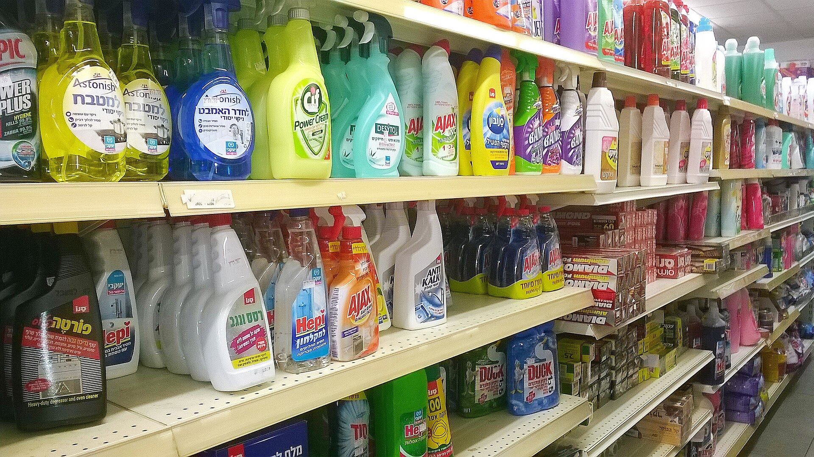

שאלתם את עצמכם למה שקית החטיפים מרגישה ריקה יותר מבעבר, למה חפיסת השוקולד דקה יותר, או למה בקבוק השמן נגמר מהר יותר — בעוד המחיר בקופה כמעט לא זז? התשובה נקראת **שרינקפלציה** (Shrinkflation): תופעה שבה יצרנים מקטינים את כמות המוצר, המשקל או הנפח, אך משאירים את המחיר על כנו או מעלים אותו במעט. התוצאה היא התייקרות אמיתית של סל הקניות של הצרכן הישראלי — רק שהיא מוסתרת היטב מהעין.

בשונה מהתייקרות רגילה, שבה השלט על המדף משתנה ומעורר תשומת לב, השרינקפלציה פועלת בשקט. הצרכן ממשיך לשלם מחיר מוכר, אך מקבל תמורה קטנה יותר. זו הסיבה שרבים מכנים אותה "ההתייקרות הסמויה" של השנים האחרונות.

## מה זו שרינקפלציה ולמה היא התגברה?

שרינקפלציה אינה תופעה חדשה, אך היא הואצה משמעותית בשנתיים האחרונות. על רקע עליית מחירי חומרי הגלם, האנרגיה, ההובלה והעבודה, יצרני המזון עמדו בפני דילמה: להעלות מחירים באופן גלוי ולהסתכן בנטישת לקוחות, או לצמצם את הכמות בשקט. רבים בחרו באפשרות השנייה.

מחקרים התנהגותיים מלמדים מדוע: צרכנים רגישים הרבה יותר לשינוי במחיר מאשר לשינוי בכמות. הקטנת שקית ממאה גרם לשמונים גרם כמעט אינה מורגשת על המדף, אך היא שקולה להתייקרות של 25% במחיר ליחידת משקל.

## אילו מוצרים פגיעים במיוחד?

התופעה בולטת בעיקר במוצרים שבהם קשה למדוד כמות במבט חטוף:

- **חטיפים ומזון מהיר** — שקיות שמתמלאות באוויר, כשהמשקל בתוכן פוחת.
- **שוקולד ועוגיות** — חפיסות דקות יותר או פחות ריבועים.
- **גבינות ומוצרי חלב** — אריזות שיורדות מ-250 גרם ל-200 גרם.
- **שמן, קפה ודגני בוקר** — צמצום נפח או משקל האריזה.
- **מוצרי ניקיון וטואלטיקה** — פחות גלילים בחבילה או בקבוקים קטנים יותר.

## איך מזהים שרינקפלציה בסל הקניות?

הכלי החשוב ביותר להתגוננות הוא **המחיר ליחידת מידה** — הנתון הקטן המופיע בתווית שעל המדף, המציין את העלות לקילוגרם, לליטר או ל-100 גרם. בעוד שהמחיר הכולל עשוי להטעות, המחיר ליחידת מידה חושף את התמונה האמיתית ומאפשר השוואה הוגנת בין מוצרים ואריזות.

### טבלת השוואה: מחיר גלוי מול מחיר אמיתי

הדוגמה הבאה ממחישה כיצד אותו מחיר "מגלם" התייקרות של ממש:

| פרמטר | לפני השינוי | אחרי השינוי |
|---|---|---|
| משקל האריזה | 100 גרם | 80 גרם |
| מחיר לצרכן | כ-10 ש"ח | כ-10 ש"ח |
| מחיר ל-100 גרם | כ-10 ש"ח | כ-12.5 ש"ח |
| התייקרות בפועל | — | כ-25% |

כפי שניתן לראות, המחיר בקופה נותר זהה — אך העלות האמיתית של המוצר זינקה בכ-25%, מבלי שהצרכן חש בכך.

## מה עושים הרגולטורים והצרכנים?

במדינות שונות באירופה ובארצות הברית מתחילים לחייב יצרנים ורשתות לסמן בבירור כאשר אריזה קטנה. בישראל הנושא עולה מדי פעם לדיון ציבורי, במיוחד סביב גל ההתייקרויות במחירי המזון והלחץ הצרכני על הרשתות הגדולות. עם זאת, חובת סימון מפורשת של "הקטנת אריזה" עדיין אינה מעוגנת באופן גורף.

בינתיים, כוח המיקוח נשאר בעיקר בידי הצרכן. שלוש פעולות פשוטות יכולות לחסוך מאות שקלים בשנה:

1. **השוו תמיד לפי המחיר ליחידת מידה**, ולא לפי מחיר האריזה.
2. **בדקו את המותגים הפרטיים** של הרשתות, שלעיתים מציעים כמות גדולה יותר במחיר דומה.
3. **עקבו אחר גודל האריזה** של מוצרים קבועים בסל — שינוי קל במשקל הוא סימן אזהרה.

השרינקפלציה ממחישה עד כמה חשוב לצרכן הישראלי להיות ערני. בעידן שבו מחירי המזון עולים והלחץ על משק הבית מתגבר, ההבדל בין קנייה חכמה לקנייה אוטומטית נמדד לא רק בשלט המחיר — אלא במה שבאמת נמצא בתוך האריזה.
