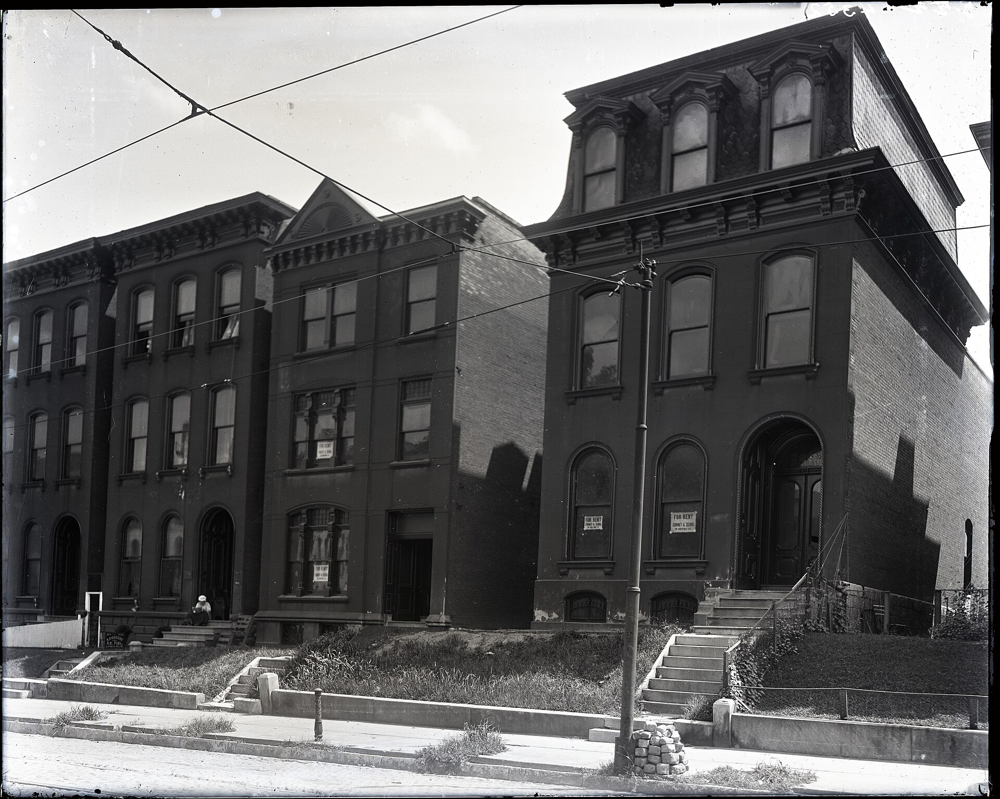

מחירי השכירות בישראל ממשיכים לטפס בקצב מהיר, כשבערים המרכזיות נרשמו בשנה החולפת עליות דו-ספרתיות שמכבידות על תקציב משקי הבית. שילוב של מחסור בהיצע, האטה בבנייה, ריבית גבוהה וביקוש ער — יוצר לחץ מתמשך כלפי מעלה, שממנו מתקשים השוכרים לחמוק.

## מה מניע את הזינוק במחירי השכירות בישראל?

הגורם המרכזי הוא פער עמוק בין היצע לביקוש. קצב אכלוס הדירות החדשות אינו מדביק את הגידול במספר משקי הבית, וכל דירה שמתפנה נחטפת במהירות. במקביל, הריבית הגבוהה שקבע בנק ישראל ייקרה משמעותית את המשכנתאות, ורבים שתכננו לרכוש דירה נאלצו לדחות את המהלך ולהישאר בשוק השכירות — מה שמעצים עוד יותר את הביקוש לדירות להשכרה.

גם המלחמה והשלכותיה תרמו ללחץ: פינויים של תושבים מאזורי הצפון והדרום יצרו ביקוש מקומי חד באזורים קולטים, בעוד שבענף הבנייה נרשמה האטה בשל מחסור בעובדים ועיכובים בפרויקטים.

### אילו ערים מובילות את ההתייקרות?

גוש דן ממשיך להוביל את מפת המחירים, כשבתל אביב שכר הדירה הממוצע לדירת שלושה חדרים נותר מהגבוהים במדינה. לצד המטרופולין, גם ערים כמו ירושלים, חיפה, באר שבע ופתח תקווה רשמו עליות ניכרות. במיוחד בולטת ההתייקרות בערי הפריפריה המבוקשות, שנהנות מהגירה פנימית של משפחות המחפשות איכות חיים במחיר נמוך יותר מהמרכז.

## כמה עלה שכר הדירה? מבט השוואתי

הטבלה הבאה מציגה הערכה של טווחי שכר הדירה החודשי לדירת שלושה-ארבעה חדרים בערים מרכזיות, לצד מגמת השינוי בשנה החולפת:

| עיר | טווח שכר דירה חודשי (הערכה) | מגמת שינוי שנתית |
|------|------------------------------|--------------------|
| תל אביב | כ-7,000–9,500 ש"ח | עלייה חדה |
| ירושלים | כ-5,500–7,500 ש"ח | עלייה מתונה-חדה |
| חיפה | כ-4,000–5,500 ש"ח | עלייה מתונה |
| באר שבע | כ-3,500–4,800 ש"ח | עלייה |
| פתח תקווה | כ-5,000–6,500 ש"ח | עלייה חדה |

*הנתונים הם הערכות טווח בלבד ומשתנים לפי מיקום, מצב הדירה וגודלה.

## כיצד ההתייקרות משפיעה על משקי הבית?

שכר הדירה הפך לאחד ההוצאות המשמעותיות ביותר בתקציב המשפחתי, ובקרב משפחות צעירות ושוכרים בערים היקרות הוא לא פעם בולע נתח של 30% ואף יותר מההכנסה נטו. עבור זוגות צעירים, ההתייקרות המתמשכת דוחקת את החיסכון להון עצמי לרכישת דירה, ומקבעת אותם למעגל שכירות ממושך.

מדד מחירי הדירות ומדד שכר הדירה, המתפרסמים על ידי הלשכה המרכזית לסטטיסטיקה, ממשיכים להצביע על מגמת עלייה — ורכיב הדיור מהווה משקל מרכזי גם במדד המחירים לצרכן, ובכך מזין את האינפלציה.

## מה צפוי בהמשך?

בטווח הקצר, כל עוד היצע הדירות החדשות אינו מתרחב וקצב הבנייה נותר איטי, קשה לראות היפוך מגמה. תרחיש של ירידת ריבית הדרגתית על ידי בנק ישראל עשוי להחזיר חלק מהשוכרים לשוק הרכישה ולהקל מעט על הביקוש לשכירות — אך השפעה כזו צפויה להיות מדורגת.

בטווח הבינוני, המפתח טמון בהגדלת ההיצע: קידום פרויקטים של התחדשות עירונית, עידוד שוק השכירות המוסדית ארוכת הטווח, וזירוז שיווק קרקעות. עד שאלה יבשילו, מחירי השכירות בישראל צפויים להישאר גבוהים.

### טיפים לשוכרים בשוק לוחץ

- **הרחיבו את מרחב החיפוש** — שכונות גובלות או ערים סמוכות עשויות להציע פער מחירים משמעותי.
- **שקלו חוזה ארוך טווח** — נעילת מחיר לשנתיים עשויה להגן מפני התייקרות עתידית.
- **בדקו את מצב הדירה והחוזה** — הוצאות תחזוקה ותיקונים יכולות לשנות את העלות האמיתית.
- **התארגנו מוקדם** — דירות מבוקשות נחטפות מהר, וזמן לחיפוש מפחית לחץ בקבלת החלטות.
