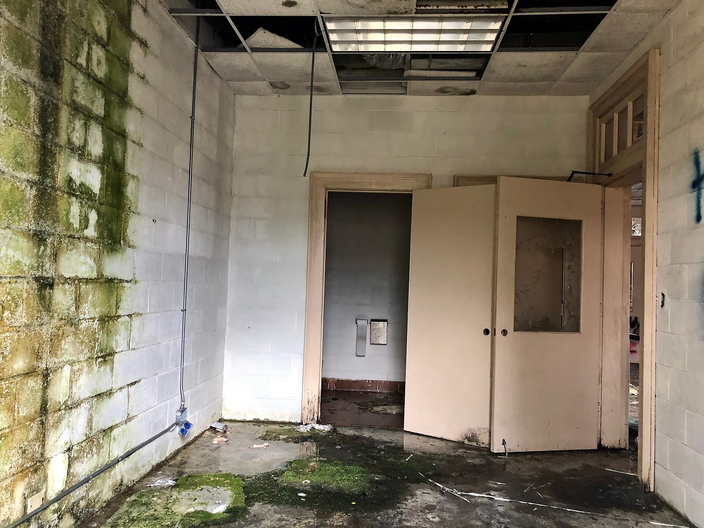

שוק ה**נדל"ן המסחרי** בישראל, ובראשו שוק המשרדים בגוש דן, נכנס לתקופה של אי-ודאות מהחריפות שידע בעשור האחרון. שילוב של מעבר לעבודה היברידית, האטה בגיוסי ההיי-טק, ריבית גבוהה ושפע של מגדלים חדשים שנכנסו לשוק — יצר עודף היצע של שטחים והפעיל לחץ מטה על דמי השכירות. התוצאה: קומות שלמות עומדות ריקות במגדלים יוקרתיים, בעוד בעלי הנכסים נאבקים לשמר את השוכרים הקיימים.

## מה קורה בשוק המשרדים בתל אביב?

במשך שנים היה שוק המשרדים בתל אביב וברמת גן מנוע צמיחה בטוח: הביקוש מצד חברות ההיי-טק, הפיננסים והשירותים היה כמעט בלתי נדלה, ודמי השכירות טיפסו בהתמדה. הקורונה שינתה את התמונה. מודל העבודה ההיברידי, שבו העובדים מגיעים למשרד שלושה ימים בשבוע בממוצע, הקטין את הצורך בשטחים. חברות רבות בחרו לצמצם את טביעת הרגל המשרדית שלהן, להשכיר בשכירות משנה שטחים עודפים, או שלא לחדש חוזים.

במקביל, ההאטה בענף ההיי-טק — קיצוצי כוח אדם, האטה בגיוסי ההון והתייעלות — פגעה דווקא בשוכר המסורתי הגדול ביותר של המגדלים. חברות שגייסו עובדים בקצב מסחרר בשנים 2021-2022 מצאו את עצמן עם שטחים גדולים מדי, וחיפשו דרכים לצמצם.

### עודף היצע פוגש ביקוש חלש

הבעיה מחריפה בגלל התזמון. בשנים האחרונות נכנסו לשוק גוש דן עשרות אלפי מטרים של שטחי משרדים חדשים במגדלים שתוכננו לפני שנים, בעידן הביקוש הגואה. כשההיצע החדש הזה פוגש ביקוש מצטמצם, התוצאה היא עלייה בשיעור השטחים הפנויים ולחץ על המחירים — בעיקר בשטחים ישנים, בקומות נמוכות ובמיקומים פחות מרכזיים.

## איך זה משפיע על המשקיעים ועל הבורסה?

חברות הנדל"ן המניב וקרנות הריט הנסחרות בבורסה בתל אביב חשופות ישירות למגמה. חלק מהמניות בענף נסחרות בדיסקאונט משמעותי ביחס להון העצמי (NAV), כשהמשקיעים מתמחרים חשש משחיקה בשווי הנכסים ומירידה בהכנסות משכירות. הריבית הגבוהה של בנק ישראל מוסיפה לחץ כפול: היא מייקרת את מימון החוב של החברות, ובמקביל מעלה את שיעורי ההיוון שלפיהם מוערכים הנכסים — מה שעלול להוריד את שוויים בספרים.

### טבלת השוואה: אפיקי נדל"ן מסחרי בישראל

| אפיק | מצב הביקוש | רמת סיכון | מגמת דמי שכירות |
|---|---|---|---|
| משרדים מרכז ת"א (מגדלים חדשים) | בינוני | בינוני | יציב עד יורד |
| משרדים ישנים / פריפריה | חלש | גבוה | יורד |
| מרכזי לוגיסטיקה ומחסנים | חזק | נמוך-בינוני | עולה |
| מרכזי מסחר וקניונים | מתאושש | בינוני | יציב |
| מרכזי נתונים | חזק מאוד | בינוני | עולה |

הטבלה ממחישה כי ה**נדל"ן המסחרי** אינו מקשה אחת: בעוד שוק המשרדים נחלש, שוק הלוגיסטיקה ומרכזי הנתונים — שנהנים מהמסחר המקוון ומגל הבינה המלאכותית — דווקא מציגים חוזק.

## מרכזי הלוגיסטיקה ומרכזי הנתונים בעלייה

הצד השני של המטבע הוא שכמה תת-מגזרים פורחים. הזינוק במסחר האלקטרוני הגביר את הביקוש למרכזי הפצה ומחסנים בפריפריה ובצירי התחבורה המרכזיים, ודמי השכירות בהם עולים. במקביל, גל ההשקעות בתשתיות מחשוב ובינה מלאכותית מזין ביקוש למרכזי נתונים — נכס שנחשב יציב וארוך-טווח. משקיעים מוסדיים מפנים אליהם חלק גדל מההון שיועד בעבר למשרדים.

## מה צפוי בהמשך?

התפנית בשוק תלויה בשלושה גורמים מרכזיים:

- **ריבית בנק ישראל** — ירידה בריבית תוזיל את המימון, תשפר את הערכות השווי ותעודד ייזום מחדש.
- **התאוששות ההיי-טק** — חזרה לגיוסי הון ולצמיחה בכוח האדם תחזיר ביקוש למשרדים.
- **התאמת ההיצע** — האטה בבנייה חדשה תאפשר לשוק לספוג את השטחים הפנויים בהדרגה.

בטווח הקצר, מאזן הכוחות עבר לצד השוכרים. חברות שמחדשות חוזים נהנות מגמישות רבה יותר, מהטבות ומדמי שכירות אטרקטיביים — בעיקר בשטחים ישנים. בעלי הנכסים, מצדם, משקיעים בשדרוג המגדלים, בשירותים משותפים ובגמישות חוזית, כדי למשוך ולשמר שוכרים בסביבה תחרותית.

המסקנה למשקיעים ולעסקים כאחד: שוק ה**נדל"ן המסחרי** נמצא בנקודת מפנה. מי שיזהה נכון את התת-מגזרים החזקים — לוגיסטיקה, מרכזי נתונים ומשרדים איכותיים במיקום מרכזי — עשוי למצוא הזדמנויות דווקא בתקופה של אי-ודאות.
