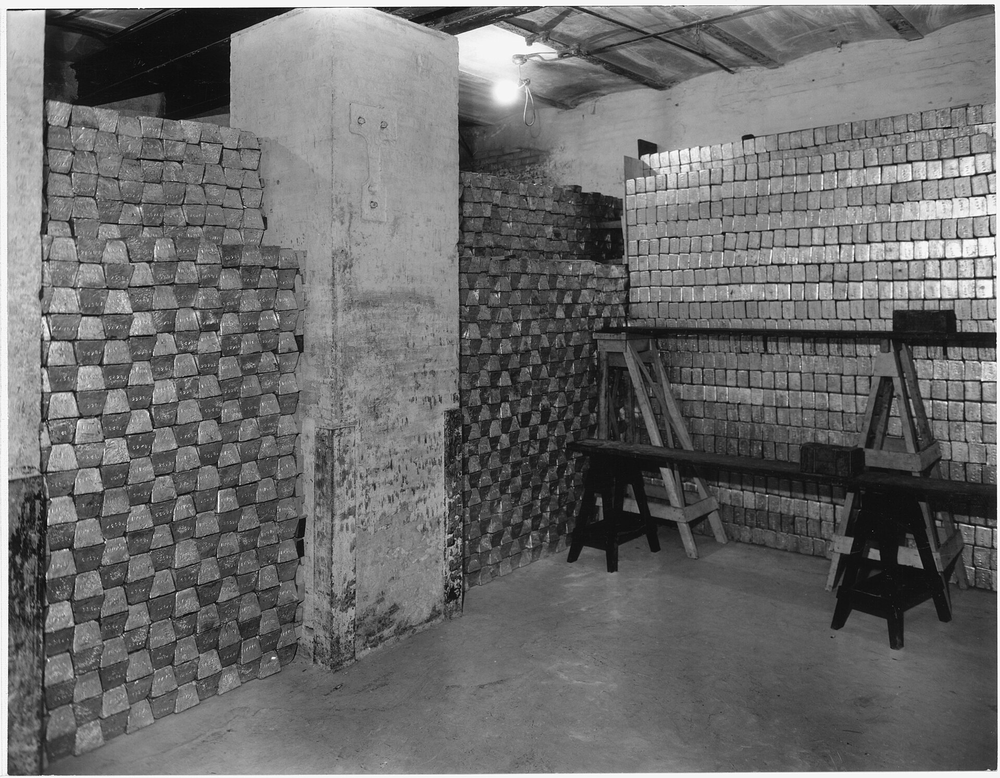

מחיר הזהב שובר בחודשים האחרונים שיאים היסטוריים וחצה לראשונה את רף ה-4,000 דולר לאונקיה, כשהוא רושם עלייה חדה מתחילת השנה. הזינוק מחזיר את המתכת היקרה למרכז תשומת הלב של המשקיעים בישראל ובעולם, שמחפשים מקלט בטוח מפני אי-ודאות גאופוליטית וכלכלית. אבל האם השיא הנוכחי הוא הזדמנות כניסה או דווקא סימן אזהרה?

## מדוע מחיר הזהב מזנק כעת?

הראלי בזהב אינו נובע מגורם יחיד, אלא משילוב של כמה כוחות שפועלים בו-זמנית:

- **ציפיות להורדות ריבית:** כאשר הבנק הפדרלי בארצות הברית מאותת על מגמת ריבית יורדת, נכסים שאינם נושאי ריבית כמו זהב הופכים אטרקטיביים יותר, שכן עלות ההחזקה בהם יורדת.
- **אי-ודאות גאופוליטית:** מתחים בזירה הבינלאומית, מלחמות סחר ואי-יציבות פוליטית מגבירים את הביקוש לנכס מפלט מסורתי.
- **רכישות בנקים מרכזיים:** בנקים מרכזיים ברחבי העולם, בהובלת סין והודו, ממשיכים לצבור זהב בהיקפים חסרי תקדים כחלק ממאמץ לגוון את יתרות המט"ח ולהפחית תלות בדולר האמריקאי.
- **חולשת הדולר:** היחלשות מטבע הרזרבה העולמי תומכת אף היא בעליית מחיר הזהב, המתומחר בדולרים.

## איך הישראלים משקיעים בזהב?

בניגוד לתפיסה הרווחת, רוב המשקיעים הישראלים אינם רוכשים מטילי זהב פיזיים. הדרך הנפוצה והנוחה יותר לחשיפה היא דרך שוק ההון:

- **קרנות סל וקרנות מחקות:** מכשירים העוקבים אחר מחיר הזהב או אחר מדדי חברות כרייה. הם נזילים, זולים לניהול וניתן לסחור בהם בקלות בבורסה בתל אביב או בבורסות בחו"ל.
- **מניות חברות כרייה:** חשיפה עקיפה שמושפעת גם ממחיר הזהב וגם מהביצועים התפעוליים של החברה.
- **זהב פיזי:** מטילים ומטבעות. אפיק זה כרוך בעלויות אחסון, ביטוח ופער קנייה-מכירה גבוה יחסית.

## טבלת השוואה: אפיקי חשיפה לזהב

| אפיק | נזילות | עלויות | התאמה |
|------|--------|--------|--------|
| קרן סל / מחקה | גבוהה | נמוכות | משקיע קמעונאי מגוון |
| מניות כרייה | גבוהה | בינוניות | משקיע שמחפש מינוף לתנועת המחיר |
| זהב פיזי | נמוכה | גבוהות | חושש מקריסת מערכת פיננסית |
| חוזים עתידיים | גבוהה | משתנות | סוחר מתוחכם בלבד |

## האם עדיין כדאי להיכנס בשיא?

זו השאלה שמעסיקה כל משקיע. מצד אחד, המניעים הבסיסיים לעליית מחיר הזהב עדיין בעינם. מצד שני, לאחר ראלי כה חד קיים סיכון מוגבר לתיקון מחירים, שכן חלק ניכר מהחדשות החיוביות כבר מתומחר.

חשוב לזכור כי זהב, בשונה ממניה או אג"ח, **אינו מניב ריבית או דיבידנד**. הרווח היחיד ממנו הוא עליית ערך. לכן מרבית יועצי ההשקעות מתייחסים אליו כאל **רכיב הגנה** בתיק ולא כאל מנוע צמיחה מרכזי. ההמלצה הרווחת היא להקצות לזהב משקל מוגבל, בטווח של 5% עד 10% מהתיק, כפוליסת ביטוח מול זעזועים בשווקים.

## מה ההבדל בין זהב לביטקוין כ"מקלט"?

בשנים האחרונות מרבים להשוות בין הזהב לביטקoין, שזכה לכינוי "הזהב הדיגיטלי". ואולם, בעוד לזהב היסטוריה של אלפי שנים כמאגר ערך ותנודתיות נמוכה יחסית, הביטקוין מאופיין בתנודתיות קיצונית ובקורלציה גבוהה יותר לנכסי סיכון. משקיעים שמרנים ממשיכים להעדיף את היציבות היחסית של המתכת הצהובה.

## שורה תחתונה למשקיע הישראלי

מחיר הזהב בשיא משקף עולם רווי אי-ודאות, וזה בדיוק הרקע שבו נכס מפלט זוהר. עם זאת, כניסה נבונה מחייבת פרספקטיבה: לא לרדוף אחרי הראלי בלהט, אלא לשלב את הזהב כרכיב מגוון ומדוד בתיק השקעות מאוזן. בשוק שבו הבורסה בתל אביב ומדד ת"א 35 רושמים תנודתיות, ורבים עוקבים אחר שער הדולר-שקל, הזהב מציע ערוץ נוסף לפיזור סיכונים — אך אינו תחליף לתכנון פיננסי כולל.
