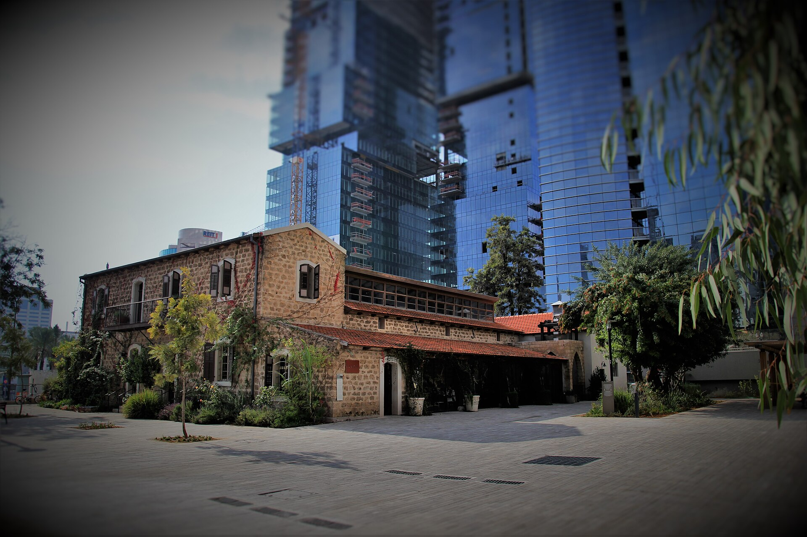

**פינוי-בינוי** הפך בעשור האחרון לכלי המרכזי של המדינה למאבק במצוקת הדיור בערים הוותיקות — אך בשנה החולפת הגלגלים כמעט נעצרו. השילוב של ריבית בנק ישראל הגבוהה, זינוק בעלויות הבנייה ומחסור בעובדים הפך פרויקטים רבים ללא-כדאיים כלכלית, והותיר מאות מתחמים תקועים בין תכנון למימוש. התוצאה: דיירים שממתינים שנים לדירה חדשה, ויזמים שמתקשים לגייס אשראי.

## מהו פינוי-בינוי ולמה הוא כה חשוב?

במסלול **פינוי-בינוי** נהרסים מבנים ישנים — בדרך כלל שיכונים בני עשרות שנים — ובמקומם נבנים מגדלי מגורים חדשים בצפיפות גבוהה בהרבה. הדיירים הקיימים מקבלים דירה חדשה וגדולה יותר ללא תשלום, בעוד היזם מממן את הפרויקט ממכירת הדירות העודפות בשוק החופשי.

היתרון הלאומי ברור: ניצול יעיל של קרקע במרכזי הערים, חיזוק מבנים מפני רעידות אדמה, וחידוש שכונות מתפוררות בלי לצרוך שטחים פתוחים חדשים. לצד תמ"א 38, המהווה מסלול חיזוק נקודתי, פינוי-בינוי נחשב לפתרון בקנה מידה גדול לבעיית ההיצע בערים כמו תל אביב, בת ים, רמת גן וחולון.

## מדוע הפרויקטים נתקעים?

המודל העסקי של **התחדשות עירונית** רגיש מאוד לתנאי השוק. עליית ריבית בנק ישראל לרמות של סביב 4.5% בשנה החולפת ייקרה משמעותית את מימון הביניים שהיזמים נזקקים לו לאורך שנות הבנייה. במקביל, עלויות התשומות בבנייה — חומרי גלם, פלדה, בטון ובעיקר עבודה — זינקו, בין היתר על רקע המחסור החריף בפועלי בניין מאז פרוץ המלחמה.

כתוצאה מכך, פרויקטים שתוכננו כשהריבית הייתה אפסית ומחירי הדירות עלו במהירות — כבר אינם רווחיים. יזמים רבים מקפיאים החתמת דיירים או דוחים תחילת עבודות, והבנקים מחמירים את תנאי המימון ודורשים שיעור מכירות מוקדם גבוה יותר לפני שהם פותחים את הברז.

### מחסום החתמת הדיירים

גם ההיבט האנושי מכביד. פרויקט פינוי-בינוי דורש הסכמה של רוב מיוחס של בעלי הדירות במתחם, והתנגדות של מיעוט דיירים עלולה לעכב את כל התהליך בשנים. סכסוכים בין דיירים, חוסר אמון ביזם ודרישות לשיפור התמורה — כל אלה מאריכים את משך ההבשלה של פרויקט לעשור ויותר.

## השוואה בין מסלולי ההתחדשות העירונית

| פרמטר | פינוי-בינוי | תמ"א 38/1 (חיזוק) | תמ"א 38/2 (הריסה ובנייה) |
|---|---|---|---|
| היקף | מתחמים שלמים | בניין בודד | בניין בודד |
| תוספת דירות | גבוהה מאוד | מוגבלת | בינונית |
| משך ממוצע | 8-12 שנים | 2-4 שנים | 3-6 שנים |
| מורכבות תכנונית | גבוהה | נמוכה | בינונית |
| רגישות לריבית | גבוהה מאוד | בינונית | גבוהה |

## מה עושה המדינה כדי לזרז?

הרשות הממשלתית להתחדשות עירונית מקדמת בשנים האחרונות שורת כלים לזירוז: מתחמי "מתחם מועדף" עם הליכי תכנון מקוצרים, מנגנוני הכרעה מול דיירים סרבנים, וסיוע בליווי משפטי וכלכלי לדיירים. במקביל נבחנים פתרונות מימון ממשלתיים שיסייעו ליזמים לגשר על פער הכדאיות בתקופת ריבית גבוהה.

עם זאת, מומחים בענף מעריכים כי ללא ירידה מהותית בריבית או התייצבות בעלויות הבנייה, קשה יהיה להחזיר את שוק הפינוי-בינוי לקצב שאפיין אותו בשנים 2021-2022.

## מה כדאי לדיירים לבדוק לפני חתימה?

למי ששוקל להיכנס לפרויקט, מומלץ לנקוט משנה זהירות:

- **איתנות היזם** — בדקו ניסיון קודם, יציבות פיננסית ופרויקטים שהושלמו בפועל.
- **ערבויות** — ודאו קיומן של ערבות חוק מכר, ערבות שכירות וערבות מיסים.
- **ליווי מקצועי** — עורך דין המייצג את הדיירים (ולא את היזם) ומפקח בנייה מטעם הדיירים הם קריטיים.
- **לוחות זמנים ריאליים** — הישמרו מהבטחות אגרסיביות; פרויקט פינוי-בינoy אורך שנים.

## שורה תחתונה

פינוי-בינוי נותר הפתרון המבטיח ביותר לחידוש הערים הוותיקות בישראל ולהגדלת היצע הדירות במרכזי הביקוש. אך בטווח הקצר, סביבת הריבית הגבוהה ועלויות הבנייה הופכות אותו לזירה מאתגרת — הן ליזמים והן לדיירים. התאוששות משמעותית של השוק תלויה בעיקר במהלכי ריבית של בנק ישראל ובהתמתנות בעלויות התשומות.
