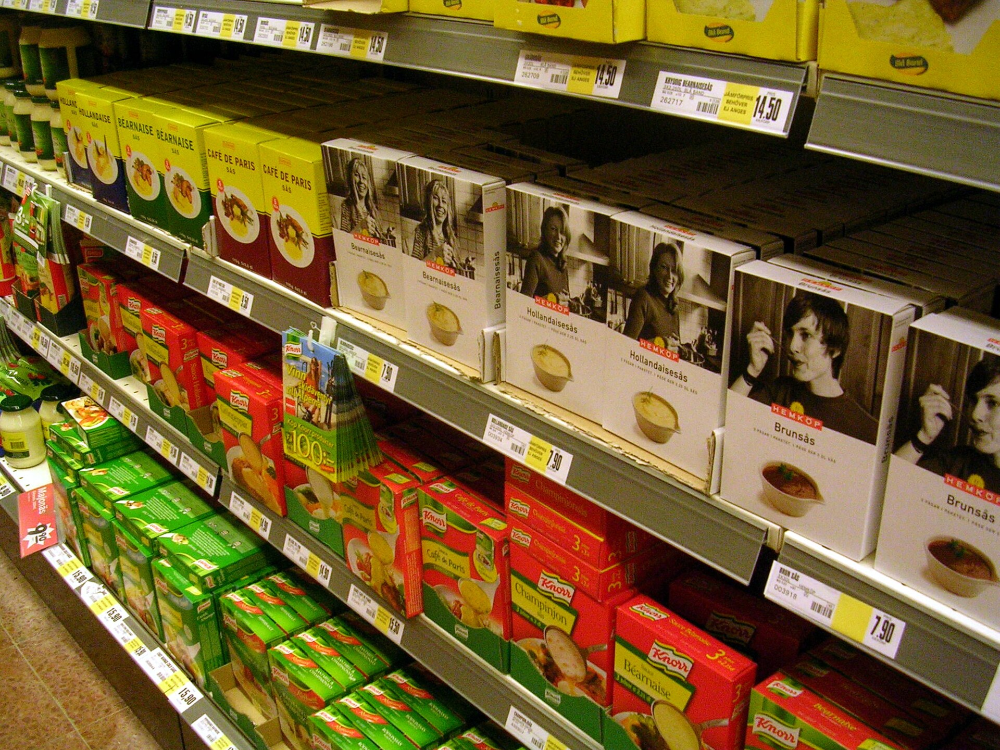

על רקע גל התייקרויות מתמשך בסל המזון, הצרכן הישראלי מגלה מחדש נשק ותיק אך יעיל: **המותג הפרטי**. מותגי הבית של הרשתות — שופרסל, רמי לוי, ויקטורי, יינות ביתן וטיב טעם — הפכו בשנתיים האחרונות ממוצרי "מדף תחתון" למנוע צמיחה מרכזי, שמאפשר חיסכון של עשרות אחוזים על אותם מוצרים בסיסיים. השאלה הצרכנית הגדולה היא כמה באמת חוסכים, והאם משלמים על כך באיכות.

## מהו מותג פרטי ולמה הוא זול יותר?

מותג פרטי הוא מוצר המיוצר עבור רשת קמעונאית ונושא את שמה, במקום את שם היצרן. הרשת חוסכת את עלויות השיווק, הפרסום והמיתוג הכבדות שנושאות חברות המזון הגדולות, ולכן יכולה למכור במחיר נמוך יותר — ועדיין ליהנות משולי רווח נאים.

בפועל, מדובר לרוב באותם מפעלי ייצור. יצרנים מקומיים רבים מייצרים במקביל את המותג המוביל ואת המותג הפרטי של הרשת, כשההבדל מסתכם באריזה ובמותג המודפס עליה. זו הסיבה שהפער האיכותי, שהיה בעבר מורגש, הצטמצם מאוד.

## כמה באמת חוסכים? השוואת מחירים

החיסכון משתנה לפי קטגוריה, אך המגמה ברורה: בקטגוריות בסיסיות כמו חלב, קמח, שמן, נייר טואלט ומוצרי ניקיון, הפער יכול להגיע לעשרות אחוזים. הנה השוואה כללית של סדרי גודל אופייניים:

| קטגוריית מוצר | מותג מוביל (מדד מחיר) | מותג פרטי (מדד מחיר) | חיסכון משוער |
|---|---|---|---|
| מוצרי נייר וניקיון | 100 | 60-70 | כ-30%-40% |
| מוצרי חלב בסיסיים | 100 | 75-85 | כ-15%-25% |
| שימורים וקטניות | 100 | 65-75 | כ-25%-35% |
| חטיפים ומתוקים | 100 | 70-80 | כ-20%-30% |

המשמעות המצטברת דרמטית: משפחה שמעבירה חלק ניכר מסל הקניות החודשי למותג פרטי עשויה לחסוך מאות שקלים בחודש — בלי לוותר על הרגלי הצריכה עצמם.

## מדוע הרשתות דוחפות את המותג הפרטי?

האינטרס אינו רק צרכני. עבור הרשתות, המותג הפרטי הוא כלי אסטרטגי ממדרגה ראשונה משלוש סיבות:

- **שולי רווח גבוהים יותר** — הרשת שולטת בשרשרת הערך ואינה משלמת "מס מותג" ליצרן.
- **נאמנות לקוחות** — מוצר שנושא את שם הרשת קושר את הצרכן דווקא אליה.
- **כוח מיקוח** — נוכחות חזקה של מותג פרטי מחלישה את עמדת המשא ומתן של חברות המזון הגדולות מול הרשת.

לא במקרה, שופרסל ורמי לוי הפכו את הרחבת המותג הפרטי ליעד מוצהר, ומשקיעות במיתוג מחודש שמנסה לנער מהמוצרים את תדמית ה"זול והפשוט".

## הפוטנציאל: ישראל עדיין מאחור

למרות הצמיחה, נתח השוק של המותג הפרטי בישראל עדיין נמוך משמעותית מהמקובל במדינות מערב אירופה, שם הוא חוצה לא פעם את רף ה-40% מסך המכירות ברשתות מובילות. בבריטניה, בגרמניה ובשווייץ המותג הפרטי הוא ברירת מחדל צרכנית לגיטימית לחלוטין, ולעיתים אף נחשב יוקרתי.

הפער הזה מעיד על פוטנציאל צמיחה משמעותי בשוק הישראלי, במיוחד כשיוקר המחיה מאיץ את מעבר הצרכנים. ככל שהרשתות ירחיבו את מגוון המוצרים תחת מותגי הבית, כך יגבר הלחץ על חברות המזון הגדולות להצדיק את פערי המחיר.

## מה כדאי לצרכן לבדוק?

המעבר למותג פרטי אינו חף מהתלבטויות. כדאי לזכור כמה כללי אצבע:

- **לא כל קטגוריה שווה** — במוצרים בסיסיים החיסכון גדול והסיכון האיכותי נמוך; במוצרים מורכבים או במותגים שיש להם טעם ייחודי, ההעדפה אישית.
- **קראו את הרכיבים** — לעיתים המותג הפרטי זהה ביצרן ובהרכב למותג המוביל, ולעיתים מדובר בפורמולה שונה.
- **השוו מחיר ליחידה** — לא תמיד המותג הפרטי הזול ביותר, במיוחד כשמתחשבים במבצעים על המותגים המובילים.

השורה התחתונה: המותג הפרטי הוא אחד הכלים היעילים ביותר שעומדים לרשות הצרכן הישראלי בהתמודדות עם יוקר המחיה — ובשנים הקרובות הוא צפוי רק להתחזק על המדף.
