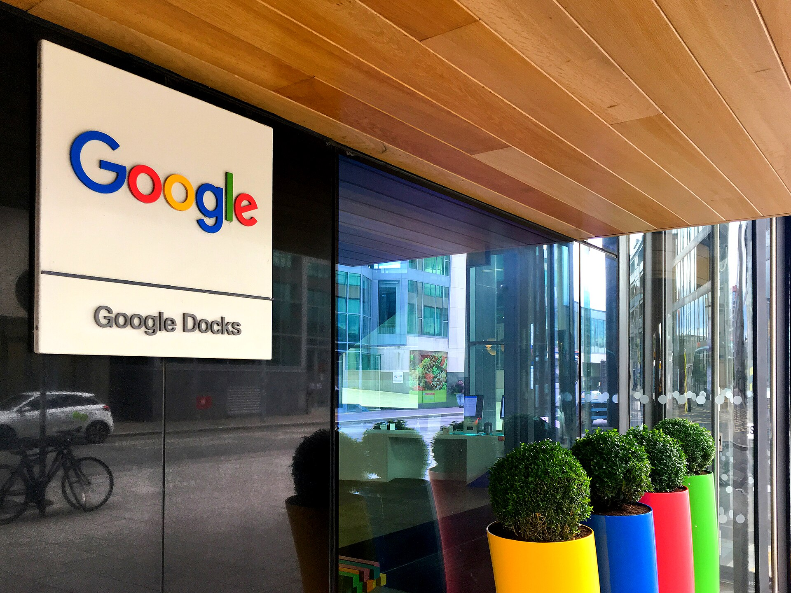

רכישת חברת הסייבר הישראלית **וויז** (Wiz) בידי **גוגל** תמורת סכום המוערך בכ-32 מיליארד דולר היא האקזיט הגדול ביותר בתולדות ההייטק הישראלי, ואירוע פורץ דרך עבור ענף אבטחת הענן כולו. עסקת וויז-גוגל אינה רק שיא כספי — היא איתות עוצמתי לכך שהאקוסיסטם הישראלי מסוגל לייצר חברות בקנה מידה עולמי בתוך שנים ספורות בלבד.

## מה בעצם קרה בעסקת וויז-גוגל?

וויז, שנוסדה ב-2020 בידי ארבעה יזמים ישראלים בראשות אסף רפפורט, הודיעה על הסכם להירכש בידי אלפאבית, חברת האם של גוגל. מדובר במהלך שיצרף את וויז לחטיבת הענן של הענקית, **גוגל קלאוד**, ויחזק את יכולות אבטחת הענן שלה מול מתחרים כמו מיקרוסופט ואמזון.

החברה פיתחה פלטפורמה לניהול סיכוני אבטחה בסביבות ענן, המאפשרת לארגונים לזהות פרצות וחשיפות בזמן אמת. תוך זמן קצר גייסה וויז לקוחות מבין חברות ה"פורצ'ן 500" והגיעה להכנסות שנתיות חוזרות בהיקף מרשים.

## מדוע זו נקודת מפנה עבור ההייטק הישראלי?

האקזיט של וויז שובר את התקרה הקודמת שנקבעה ברכישת מובילאיי בידי אינטל בשנת 2017, שעמדה על כ-15 מיליארד דולר. מעבר לסכום עצמו, המשמעות הרחבה נוגעת לשלושה מישורים:

- **הזרמת הון חזרה לאקוסיסטם:** יזמים, עובדים ומשקיעים מוקדמים צפויים לממש רווחים משמעותיים, שחלקם יזרים חזרה לסטארטאפים חדשים כאנג'לים ומשקיעים.
- **מיתוג ישראל כמעצמת סייבר:** העסקה מחזקת את מעמדה של ישראל כמוקד עולמי לחדשנות באבטחת מידע.
- **אפקט השראה:** הצלחה כזו מעודדת דור חדש של יזמים לכוון גבוה ולסרב להצעות רכישה מוקדמות.

## איך משתווה העסקה לאקזיטים הגדולים בישראל?

הטבלה הבאה ממחישה את מקומה של עסקת וויז-גוגל בשורת האקזיטים ההיסטוריים של ההייטק המקומי:

| חברה | רוכשת | היקף מוערך | תחום |
|------|--------|-------------|-------|
| וויז | גוגל / אלפאבית | כ-32 מיליארד דולר | אבטחת ענן |
| מובילאיי | אינטל | כ-15 מיליארד דולר | ראייה ממוחשבת לרכב |
| מלאנוקס | אנבידיה | כ-7 מיליארד דולר | תשתיות רשת |
| אנוביס (Anobit) | אפל | כ-0.4 מיליארד דולר | טכנולוגיית זיכרון |

## מה המשמעות למשקיעים ולבורסה בתל אביב?

למרות שוויז היא חברה פרטית ואינה נסחרת בבורסה, לעסקה השפעה עקיפה על השוק המקומי. גל מימושים בסדר גודל כזה עשוי לחזק את קרנות ההון סיכון הישראליות ולהגדיל את זרימת ההשקעות לסטארטאפים בשלבים מוקדמים. חברות סייבר ציבוריות הנסחרות בתל אביב ובנאסד"ק, כמו **סייברארק** ו**צ'ק פוינט**, עשויות ליהנות מ"אפקט הילה" של עלייה בעניין המשקיעים בתחום.

עם זאת, חשוב לזכור כי השלמת העסקה כפופה לאישורים רגולטוריים בארצות הברית, ובראשם בחינת רשויות ההגבלים העסקיים. בעבר נסוגה וויז מהצעה מוקדמת של גוגל, בין היתר על רקע חששות מהליכי אנטי-טראסט ממושכים.

## מה צפוי הלאה?

אם וכאשר תושלם, העסקה צפויה להשאיר את מרכז הפיתוח של וויז בישראל ולהמשיך את גיוסי העובדים המקומיים. עבור ענף הסייבר הישראלי — שכבר מהווה נתח מרכזי מהיצוא הטכנולוגי — מדובר בהוכחה נוספת ליכולת לייצר ערך עצום בזמן שיא. השאלה המרכזית שתעסיק את השוק בחודשים הקרובים היא האם וויז תהפוך לקטר שיוביל גל אקזיטים נוסף, או שתישאר חריגה יוצאת דופן בנוף.
