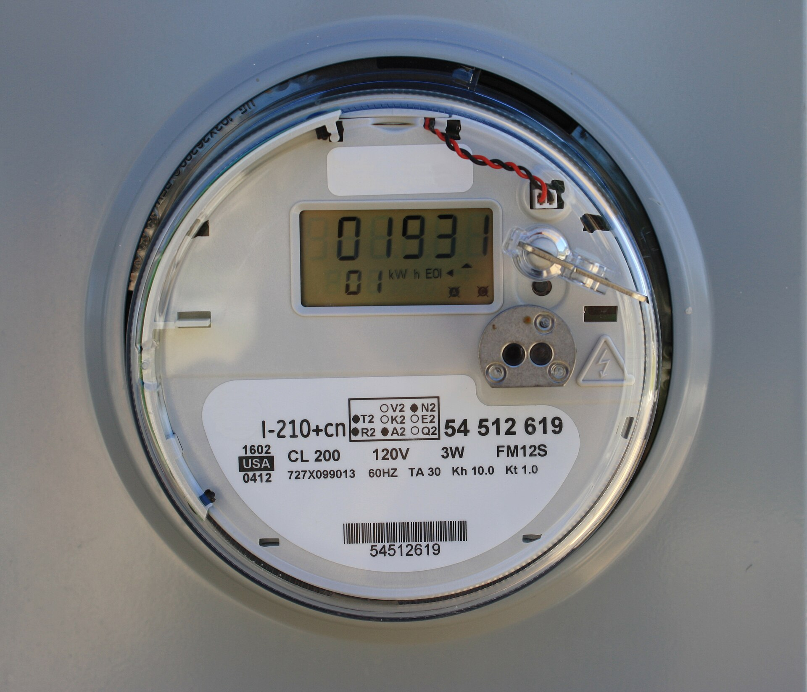

מחירי החשמל בישראל ממשיכים לטפס, ותעריף הצרכן הביתי עודכן שוב כלפי מעלה — מהלך שמעמיס עשרות שקלים נוספים בחודש על משק בית ממוצע, בעיקר בחודשי החורף והקיץ שבהם הצריכה מזנקת. ההתייקרות נובעת משילוב של עליית מחירי הדלקים, עלויות הקמה ותחזוקה של רשת ההולכה, והשקעות כבדות במעבר לאנרגיות מתחדשות. השורה התחתונה לצרכן: החשבון הדו-חודשי מרשות החשמל וחברת החשמל צפוי להיות גבוה יותר — אך יש דרכים מעשיות לצמצם אותו.

## מדוע מחירי החשמל מתייקרים?

תעריף החשמל בישראל נקבע על ידי רשות החשמל, ומורכב ממספר רכיבים: עלות ייצור האנרגיה, דמי הולכה וחלוקה, וכן היטלים והשקעות במערכת. בשנים האחרונות פועלים כמה כוחות שדוחפים את התעריף מעלה בו-זמנית:

- **מחירי הדלקים** — הגז הטבעי והפחם שמזינים את תחנות הכוח מושפעים ממחירי האנרגיה העולמיים ומשער הדולר-שקל.
- **השקעות ברשת** — שדרוג תשתיות ההולכה והחלוקה, שחלקן ותיקות, דורש הון עתק.
- **מעבר לאנרגיה מתחדשת** — יעדי האנרגיה הסולרית של המשק מחייבים השקעות באגירה ובגמישות ייצור.
- **ביקוש שיא** — התחממות האקלים והתרחבות השימוש במיזוג מגדילים את צריכת השיא בקיץ.

התוצאה היא מגמת התייקרות רב-שנתית, שבה כל עדכון תעריף מוסיף כמה אחוזים לחשבון הביתי.

## כמה באמת עולה החשמל למשק בית ישראלי?

משק בית ממוצע בישראל צורך מאות קילוואט-שעה בחודש, כשהחשבון הדו-חודשי נע לרוב בין כמה מאות לאלף שקלים ויותר — בהתאם לעונה, לגודל הדירה ולהרגלי הצריכה. הנתח הגדול ביותר מגיע ממיזוג האוויר וממערכות החימום, ואחריהם דוד המים החמים, המקרר והמייבש.

הטבלה הבאה מציגה חלוקה מקורבת של צריכת החשמל הביתית לפי שימוש עיקרי:

| שימוש | נתח מוערך מהחשבון | פוטנציאל חיסכון |
|---|---|---|
| מיזוג וחימום | כ-40%-50% | גבוה |
| דוד חשמלי / מים חמים | כ-15%-20% | בינוני-גבוה |
| מקרר ומקפיא | כ-10%-15% | בינוני |
| תאורה ומכשירי חשמל | כ-10%-15% | בינוני |
| כביסה, ייבוש ומדיח | כ-10% | בינוני |

המשמעות ברורה: מי שרוצה לחתוך את החשבון צריך למקד את המאמץ במיזוג, בחימום ובחימום המים — שם מרוכז עיקר הבזבוז.

## מהי רפורמת ספקי החשמל הפרטיים?

אחד השינויים המשמעותיים בשוק הצרכני הוא פתיחת המשק לתחרות. במקום לרכוש חשמל אך ורק דרך המערך הממשלתי, צרכנים ביתיים יכולים כיום לעבור לספקי חשמל פרטיים המציעים **הנחה של כמה אחוזים** על מרכיב האנרגיה בחשבון, לעיתים עם הטבות המותנות בשעות צריכה מסוימות.

המעבר עצמו פשוט, נעשה באמצעות מונה חכם ואינו כרוך בניתוק פיזי או בשינוי איכות האספקה — הרשת נותרת של חברת החשמל. חשוב לקרוא את התנאים: חלק מהמסלולים מציעים הנחה קבועה, ואחרים מתגמלים על העברת הצריכה לשעות הלילה או הצהריים.

## איך חוסכים בפועל מאות שקלים בשנה?

מעבר לבחירת ספק, ההתייעלות האנרגטית בבית היא המנוף המשמעותי ביותר לצמצום ההוצאה. כמה צעדים מעשיים:

1. **מיזוג נכון** — הגדרת המזגן ל-24-25 מעלות בקיץ ומעבר למזגני אינוורטר חוסכים אנרגיה משמעותית לעומת מזגנים ישנים.
2. **דוד שמש וטיימר** — שימוש בדוד שמש והפעלת החימום החשמלי רק לזמן קצר, מונעים בזבוז יקר.
3. **תאורת לד** — החלפת נורות ישנות בנורות לד מפחיתה את צריכת התאורה במידה ניכרת.
4. **ניתוק מכשירים בכוננות** — טלוויזיות, ממירים ומטענים צורכים חשמל גם כבויים; מפצל עם מתג חוסך את ה"צריכת הרפאים".
5. **ניצול תעריפי שעות** — למי שעבר לספק פרטי עם מסלול מדורג, כדאי להפעיל מכונות כביסה ומדיח בשעות הזולות.

חישוב מצטבר מראה שמשק בית שמיישם את הצעדים הללו יכול לחסוך מאות שקלים בשנה — סכום שהופך למשמעותי במיוחד בתקופה של יוקר מחיה מתמשך.

## מה צפוי בהמשך?

המגמה ארוכת הטווח בשוק החשמל הישראלי היא של מעבר הדרגתי לאנרגיה מתחדשת ולמערכות אגירה, לצד המשך תלות בגז הטבעי לייצור מרכזי. בטווח הקרוב, מחירי החשמל צפויים להישאר תחת לחץ כלפי מעלה, בהתאם למחירי האנרגיה העולמיים ולהיקף ההשקעות ברשת. עבור הצרכן הישראלי, המשמעות היא שהחשבון לא צפוי להתגמד — ולכן דווקא עכשיו כדאי לבחון מעבר לספק מתחרה ולאמץ הרגלי צריכה חסכוניים.
