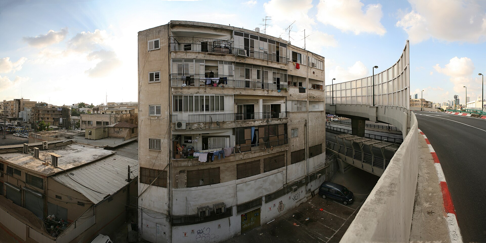

שכר הדירה בישראל ממשיך לטפס בקצב מהיר, ובשנה החולפת עלו מחירי השכירות ברוב אזורי הביקוש בשיעור הגבוה מהאינפלציה הכללית במשק. השילוב של ריבית גבוהה שמקפיאה רוכשים פוטנציאלים, מחסור מתמשך בהיצע דירות חדשות, וביקושים גואים — יוצר לחץ מתמשך כלפי מעלה על השוכרים, בעיקר במרכז הארץ.

## מדוע שכר הדירה בישראל ממשיך לעלות?

הסיבה המרכזית לעליית שכר הדירה בישראל היא כלכלית פשוטה: הביקוש עולה על ההיצע. הריבית הגבוהה שקבע בנק ישראל בשנתיים האחרונות ייקרה משמעותית את המשכנתאות, ורבים שתכננו לרכוש דירה נאלצו לדחות את הרכישה ולהישאר בשוק השכירות. התוצאה — לחץ ביקושים כבד על מלאי הדירות להשכרה.

במקביל, צד ההיצע נחלש. משבר כוח האדם בענף הבנייה, שהחריף בעקבות המלחמה והפחתת מספר העובדים הזרים והפלסטינים באתרים, האט את קצב התחלות הבנייה. פרויקטים רבים נדחו או התעכבו, וכך מלאי הדירות החדשות שאמור היה להיכנס לשוק הצטמצם.

## היכן שכר הדירה עלה בצורה החדה ביותר?

הפער בין אזור המרכז לפריפריה נותר משמעותי, אך המגמה כללית. בתל אביב, שם מחירי השכירות היו גבוהים מלכתחילה, נרשמו עליות נוספות, בעיקר בדירות קטנות המבוקשות על ידי צעירים וסטודנטים. גם ערים כמו רמת גן, גבעתיים והרצליה חוות ביקושים חזקים.

התופעה המעניינת יותר היא ההתייקרות בערים שנחשבו בעבר ל"זולות". שוכרים שנדחקו מהמרכז בשל המחירים חיפשו חלופות בערים כמו באר שבע, חיפה, ואזורי השרון המרוחקים — מה שהעלה את הביקוש והמחירים גם שם.

### טבלת השוואה: שכר דירה חודשי ממוצע לדירת 3-4 חדרים (הערכה)

| אזור | טווח שכר דירה חודשי | מגמה בשנה החולפת |
|------|---------------------|-------------------|
| תל אביב | גבוה מאוד | עלייה מתמשכת |
| גוש דן (רמת גן, גבעתיים) | גבוה | עלייה |
| ירושלים | בינוני-גבוה | עלייה מתונה |
| חיפה והצפון | בינוני | עלייה |
| באר שבע והדרום | נמוך-בינוני | עלייה בולטת |

*הנתונים מובאים כהערכת מגמות בלבד ואינם מחירים מדויקים.*

## האם ההשקעה בדירה להשכרה עדיין משתלמת?

זו אחת השאלות המרתקות בשוק כיום. למרות שמחירי השכירות עולים, תשואת השכירות ברוב הערים בישראל נותרה נמוכה יחסית — לרוב בטווח של שלושה עד ארבעה אחוזים ברוטו בשנה. מנגד, הריבית חסרת הסיכון על פיקדונות ואיגרות חוב ממשלתיות טיפסה משמעותית בעקבות מדיניות בנק ישראל.

כך נוצר מצב שבו משקיע יכול לקבל תשואה דומה או אף גבוהה יותר על השקעה סולידית ונזילה, ללא כאב הראש הכרוך בניהול נכס. עובדה זו מצננת את הביקוש של משקיעים לדירות, אך אינה מספיקה כדי להוריד את המחירים — שכן הביקוש למגורים בפועל נותר איתן.

## מה צפוי לשוק השכירות בשנה הקרובה?

התחזיות זהירות. כל עוד ריבית בנק ישראל נותרת גבוהה והמחסור בהיצע נמשך, קשה לראות ירידה בשכר הדירה בישראל. אם הריבית תרד באופן משמעותי, ייתכן שחלק מהשוכרים יחזרו לשוק הרכישה — מה שיפחית מעט את הלחץ על השכירות, אך במקביל עלול להזרים ביקושים חדשים לשוק הקנייה.

גורם משמעותי נוסף הוא קצב שיקום ענף הבנייה. ככל שיוזרמו יותר עובדים ואתרי הבנייה יחזרו לפעילות מלאה, כך יגדל בטווח הבינוני היצע הדירות החדשות. עד אז, השוכרים הישראלים ימשיכו כנראה להרגיש את הלחץ בכיס.

## מה יכולים לעשות השוכרים?

בסביבה של מחירים עולים, כדאי לשוכרים לבחון מספר צעדים: לחתום על חוזי שכירות ארוכים יותר כדי לקבע את המחיר, לשקול אזורים מתפתחים עם נגישות תחבורתית טובה, ולנהל משא ומתן על תנאי החוזה — לא רק על המחיר, אלא גם על סעיפי הצמדה ותיקונים. בשוק לחוץ, מידע והיערכות מוקדמת הם היתרון המרכזי של השוכר.
