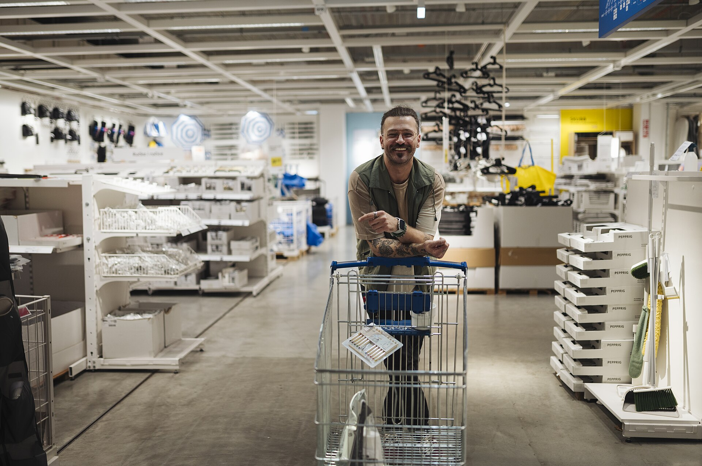

ה**מותג הפרטי** הפך בשנים האחרונות מכלי שולי למנוע הצמיחה המרכזי של רשתות המזון בישראל, ולאחד מכלי החיסכון המשמעותיים ביותר לצרכן הישראלי הנאבק ביוקר המחיה. מוצרים הנושאים את שם הרשת — ולא את שם היצרן המוכר — מציעים היום מחיר נמוך בממוצע ב-20% עד 40%, ותופסים נתח הולך וגדל מעגלת הקניות. התוצאה: מהפכה שקטה בהרגלי הצריכה ליד המדף.

## מהו מותג פרטי ולמה הוא זול יותר?

מותג פרטי הוא מוצר שהרשת הקמעונאית מוכרת תחת השם המסחרי שלה, אך מייצר אותו מפעל חיצוני — לעיתים אותו יצרן שמייצר גם את המותג המוביל. המחיר הנמוך נובע ממספר גורמים: היעדר הוצאות פרסום ושיווק כבדות, כוח קנייה עצום של הרשת שמאפשר לה לסחוט מחירים נמוכים מהספקים, ומדיניות תמחור שנועדה לבדל את הרשת ולמשוך אליה לקוחות.

בישראל, שבה סל הקניות יקר יחסית למדינות מפותחות אחרות, הפער הזה מתורגם לחיסכון של מאות שקלים בחודש למשפחה ממוצעת הרוכשת חלק ניכר ממוצרי היסוד שלה במותג הפרטי.

## מי מובילות את המהלך?

כל הרשתות הגדולות נכנסו למירוץ. **שופרסל**, הרשת הגדולה בישראל, מפעילה קו מותג פרטי רחב הכולל מוצרי מזון, ניקיון וטואלטיקה, ואף שדרוגים פרימיום. **רמי לוי** בנתה מותג פרטי כחלק מזהותה כרשת דיסקאונט, ו**ויקטורי** ו**יינות ביתן** הרחיבו אף הן את ההיצע. גם רשתות קטנות יותר, ובראשן רשתות ההוזלה, נשענות במידה גוברת על המותג הפרטי כדי לשמור על תדמית זולה.

המגמה מחזקת את כוח המיקוח של הרשתות מול היצרנים הגדולים — כמו שטראוס, אסם-נסטלה, תנובה ויוניליוור — שנאלצים להתמודד עם מתחרה שיושב על אותו מדף במחיר נמוך משמעותית.

## טבלת השוואה: מותג פרטי מול מותג מוביל

| קטגוריה | מותג מוביל (מחיר ממוצע) | מותג פרטי (מחיר ממוצע) | חיסכון משוער |
|---|---|---|---|
| קמח לבן 1 ק"ג | סביב 6-7 ₪ | סביב 3-4 ₪ | כ-40% |
| שימורי טונה | סביב 9-11 ₪ | סביב 6-7 ₪ | כ-30% |
| נייר טואלט (מארז) | סביב 30-35 ₪ | סביב 20-24 ₪ | כ-30% |
| חלב עמיד ליטר | סביב 6-7 ₪ | סביב 5-6 ₪ | כ-15% |
| אבקת כביסה | סביב 40-50 ₪ | סביב 28-34 ₪ | כ-30% |

*המחירים להמחשה בלבד ומשקפים טווחים והערכות מגמה, לא מחירים רשמיים.*

## האם האיכות פוגעת בכיף?

התפיסה שלפיה מותג פרטי משמעו איכות ירודה הולכת ומתפוגגת. בקטגוריות רבות — קמח, סוכר, שימורים, מוצרי נייר וניקיון — כמעט אין הבדל מורגש, שכן מדובר במוצרים סטנדרטיים. עם זאת, האיכות אינה אחידה: במוצרים שבהם המרכיב הטעמי או המרקם קריטי, כמו קפה, שוקולד או חטיפים, חלק מהצרכנים עדיין מעדיפים את המותג המוכר.

העצה הצרכנית הפשוטה: להתחיל במוצרי היסוד, שבהם הפער במחיר גדול והסיכון לאכזבה נמוך, ולבחון קטגוריה-קטגוריה.

### כך תנצלו את המגמה לחיסכון

- **החליפו את מוצרי היסוד תחילה** — קמח, סוכר, שימורים ומוצרי ניקיון.
- **השוו מחיר ליחידה** ולא רק מחיר לאריזה, כדי לזהות חיסכון אמיתי.
- **בדקו את המפעל היצרן** — לעיתים המותג הפרטי מיוצר באותו קו ייצור של המותג המוביל.
- **התנסו בהדרגה** — קנו יחידה אחת לבדיקת טעם לפני מעבר מלא.

## מה הלאה?

ככל שיוקר המחיה נותר בכותרות ורגישות הצרכן הישראלי למחיר גוברת, צפוי המותג הפרטי להמשיך ולכבוש נתחי שוק. עבור הרשתות זהו אפיק רווחי במיוחד, ועבור הצרכן — כלי מוחשי לקיצוץ בהוצאה החודשית. השאלה הפתוחה היא עד כמה יצרני המזון הגדולים יצליחו להגן על מעמדם, או שייאלצו להוריד מחירים כדי לשמור על מקומם בעגלה.
