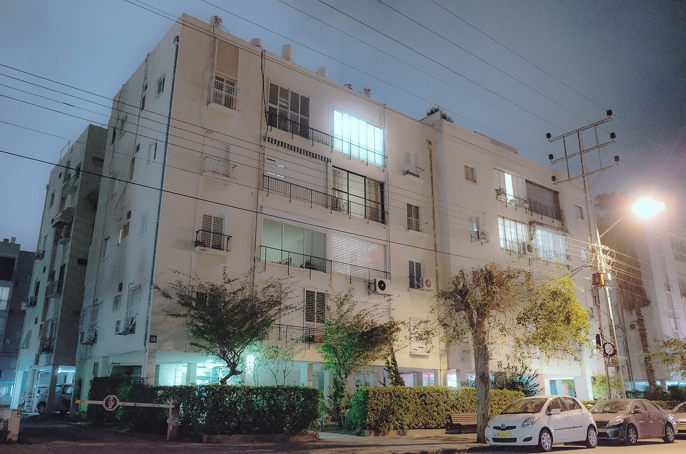

## מדוע שכר הדירה בישראל ממשיך לעלות?

שכר הדירה בישראל ממשיך לטפס, ומעמיק את מצוקת הדיור של מאות אלפי משקי בית. מדד מחירי השכירות רשם בשנה החולפת עלייה ריאלית ניכרת, בהובלת גוש דן, ירושלים ואזורי הביקוש במרכז הארץ. שילוב של ריבית גבוהה, מחסור בהיצע ועלייה בביקוש יצר לחץ מתמשך כלפי מעלה — כזה שאינו צפוי להתמתן במהירות.

הסיבה המרכזית לעליית שכר הדירה נעוצה במשוואת ההיצע והביקוש. מצד אחד, קצב התחלות הבנייה נחלש, בין היתר בשל מחסור בעובדים בענף הבנייה ועיכובים ברישוי. מצד שני, הביקוש לשכירות דווקא מתחזק — משקי בית רבים שהתכוונו לרכוש דירה נותרים בשוק השכירות לאור הריבית הגבוהה.

## כיצד הריבית של בנק ישראל דוחפת את השכירות?

הריבית הגבוהה שקבע בנק ישראל בשנתיים האחרונות ייקרה משמעותית את המשכנתאות. ההחזר החודשי על הלוואת דיור ממוצעת זינק, מה שהוציא זוגות צעירים רבים ממעגל הרוכשים הפוטנציאליים. במקום לרכוש, הם נשארים בשכירות — וכך גדל הביקוש לדירות להשכרה בדיוק כשההיצע מוגבל.

התוצאה היא מעגל קסמים שלילי מבחינת השוכרים: ככל שיותר משקי בית נדחקים לשוק השכירות, כך עולה התחרות על כל דירה פנויה, ובעלי הנכסים מנצלים זאת להעלאת דמי השכירות. בערים מרכזיות דירות מתפנות ומושכרות מחדש בפער מחירים ניכר לעומת החוזה הקודם.

## אילו ערים מובילות את התייקרות שכר הדירה?

הפערים הגאוגרפיים בשוק השכירות בולטים. תל אביב נותרה היקרה ביותר, אך דווקא בערי הלוויין ובפריפריה נרשמות לעיתים עליות אחוזיות חדות יותר, ככל שהשוכרים מחפשים חלופות זולות ומגלים שגם הן מתייקרות.

| אזור | רמת שכר דירה יחסית | מגמה בשנה החולפת |
|---|---|---|
| תל אביב והמרכז | גבוהה מאוד | עלייה מתונה-מתמשכת |
| ירושלים | גבוהה | עלייה ניכרת |
| חיפה והצפון | בינונית | עלייה מואצת |
| ערי הפריפריה | נמוכה יחסית | עלייה חדה באחוזים |

*הנתונים מייצגים מגמות כלליות ולא מחירים מדויקים.

## מה המשמעות עבור המשקיעים?

לכאורה, עליית שכר הדירה היא בשורה טובה למשקיעי הנדל"ן. בפועל, התמונה מורכבת יותר. תשואת השכירות בערים המרכזיות נותרה נמוכה יחסית — סביב 3% עד 4% בשנה — משום שמחירי הדירות עצמם עלו במקביל, ולעיתים אף מהר יותר משכר הדירה.

בנוסף, הריבית הגבוהה ייקרה את מימון רכישת דירות להשקעה, וכרסמה בכדאיות. משקיעים רבים בוחנים כיום את הפער בין התשואה השוטפת מהשכירות לבין עלות המימון והחלופות הסולידיות בשוק ההון, כמו אג"ח ופיקדונות.

### האם ההשכרה המוסדית תרגיע את השוק?

אחד הפתרונות שצוברים תאוצה הוא שוק הדיור להשכרה לטווח ארוך, שבו גופים מוסדיים מקימים ומנהלים בנייני מגורים שלמים המיועדים להשכרה בלבד. מודל זה, המקובל בארצות הברית ובאירופה, מציע לשוכרים יציבות וחוזים ארוכי טווח. עם זאת, היקפו בישראל עדיין קטן מכדי לשנות מהותית את מאזן הכוחות בשוק.

## כיצד השוכרים יכולים להיערך?

עבור השוכרים, המשמעות המיידית היא נטל הולך וגדל על התקציב המשפחתי. מומחים ממליצים לנעול חוזי שכירות ארוכים ככל האפשר בתקופה של עליות מחירים, ולכלול בהם מנגנון הצמדה מוגדר וברור מראש. כמו כן, כדאי לבחון הרחבת מעגל החיפוש הגאוגרפי ולשקול אזורים מתפתחים עם קווי תחבורה משתפרים.

בשורה התחתונה, שוק השכירות הישראלי נמצא בעיצומו של גל התייקרויות שנשען על יסודות מבניים עמוקים — מחסור בהיצע וריבית גבוהה. עד שקצב הבנייה יתאושש ובנק ישראל יתחיל להוריד את הריבית, הלחץ על שכר הדירה צפוי להימשך.
