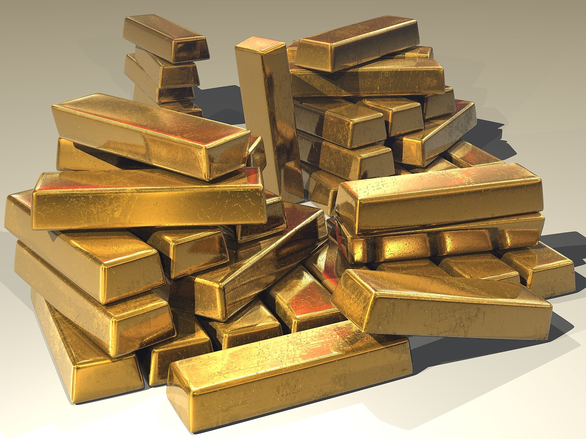

מחיר הזהב רשם בשנה החולפת סדרת שיאים היסטוריים וחצה רמות מחיר שלא נראו מעולם, מגמה שהחזירה את המתכת היקרה למרכז תשומת הלב של המשקיעים בישראל ובעולם. הראלי, שנשען על שילוב של אי-ודאות גיאופוליטית, ציפיות לירידת ריבית ורכישות אגרסיביות של בנקים מרכזיים, הפך את הזהב שוב ל"נכס המקלט" המבוקש. השאלה שמעסיקה כעת משקיעים רבים: האם עדיין כדאי להיכנס, או שמא השיא כבר מאחורינו.

## מה מניע את הזינוק במחיר הזהב?

זהב נחשב מסורתית ל"ביטוח" מפני משברים. בתקופות של מתיחות גיאופוליטית, אינפלציה או חוסר יציבות בשווקים, משקיעים נוהרים אליו כאל עוגן. בשנה האחרונה התכנסו כמה כוחות שדחפו את המחיר כלפי מעלה בו-זמנית.

- **מדיניות הריבית:** ככל שהפדרל ריזרv האמריקאי מתקרב להורדות ריבית, נחלשת האטרקטיביות של אג"ח ופיקדונות נושאי ריבית — והזהב, שאינו מניב תשואה שוטפת, הופך מפתה יותר.
- **חולשת הדולר:** הזהב מתומחר בדולרים, וכשהמטבע האמריקאי נחלש מחירו נוטה לעלות.
- **רכישות בנקים מרכזיים:** בנקים מרכזיים ברחבי העולם, ובראשם במדינות מתעוררות, הגדילו משמעותית את רכישות הזהב כחלק מגיוון היתרות והפחתת התלות בדולר.
- **מתיחות גיאופוליטית:** מלחמות ומוקדי חיכוך גלובליים מזרימים ביקוש ל"נמל מבטחים".

## איך הישראלי הממוצע משקיע בזהב?

בניגוד לדימוי של מטילים בכספת, רוב המשקיעים הישראלים אינם רוכשים זהב פיזי. הדרך הנפוצה והנזילה ביותר היא דרך הבורסה — באמצעות תעודות סל וקרנות סל העוקבות אחר מחיר הזהב או אחר מדדי חברות כרייה. אפיקים אלה נסחרים בקלות, אינם דורשים אחסון או ביטוח, ומאפשרים חשיפה בסכומים קטנים.

חשוב לזכור: השקעה בזהב הנקובה בדולרים חושפת את המשקיע הישראלי גם לתנודות בשער הדולר-שקל. התחזקות השקל עלולה לקזז חלק מהרווח הדולרי, ולהפך.

### טבלת השוואה: דרכים להשקיע בזהב

| אפיק | נזילות | עלויות | חשיפה מטבעית |
|------|--------|---------|----------------|
| תעודות/קרנות סל בבורסה | גבוהה | דמי ניהול נמוכים | חשיפה לדולר |
| זהב פיזי (מטילים/מטבעות) | נמוכה | פרמיה, אחסון, ביטוח | ישירה לדולר |
| מניות חברות כרייה | גבוהה | עמלות מסחר | תלוי בחברה |
| חוזים עתידיים | גבוהה | מורכב, ממונף | גבוהה |

## האם עדיין כדאי להיכנס עכשיו?

זו השאלה שאין עליה תשובה חד-משמעית. מצד אחד, הכוחות שהניעו את הראלי — הורדות ריבית צפויות ורכישות בנקים מרכזיים — עדיין בעינם. מצד שני, לאחר עלייה חדה כל כך, הסיכון לתיקון כלפי מטה גובר, וכניסה בשיא עלולה להיות מסוכנת.

אנליסטים רבים ממליצים להתייחס לזהב לא כאפיק להתעשרות מהירה אלא ככלי לגידור ופיזור סיכונים. הנחת העבודה המקובלת היא הקצאה של אחוזים בודדים מהתיק — לרוב בטווח של 5%–10% — כדי לרכך זעזועים בעתות משבר, מבלי לוותר על פוטנציאל הצמיחה של אפיקים אחרים.

**נקודה חשובה:** בשונה ממניות דיבידנד או מאג"ח, זהב אינו מייצר תזרים. הוא אינו משלם ריבית או דיבידנד, וכל הרווח נובע אך ורק מעליית מחירו. משמעות הדבר היא ש"עלות ההחזקה" בזהב — הוויתור על תשואה שוטפת שהיה ניתן להשיג באפיקים אחרים — עולה כשהריביות גבוהות.

## זהב מול הבורסה בתל אביב

בזמן שהזהב זינק, גם מדד ת"א 35 רשם עליות נאות, מה שמעורר את השאלה היכן עדיף להשקיע. אלא שהשוואה זו מפספסת את הנקודה: מטרתו של הזהב אינה להתחרות במניות אלא לאזן אותן. כאשר שוקי המניות צונחים בעתות משבר, הזהב נוטה דווקא לעלות או לשמור על ערכו — וזו בדיוק תרומתו לתיק מאוזן.

עבור המשקיע הישראלי, שכבר חשוף למניות מקומיות, לנדל"ן ולשקל, תוספת קטנה של זהב יכולה לשמש כרכיב מייצב. עם זאת, ההחלטה צריכה להתקבל בהתאם לפרופיל הסיכון, לאופק ההשקעה וליעדים האישיים — ורצוי בהתייעצות עם גורם מקצועי.

השורה התחתונה: הראלי במחיר הזהב משקף עולם רווי אי-ודאות, והוא ממחיש מדוע המתכת הצהובה שומרת על מעמדה כנכס מקלט גם בעידן הדיגיטלי. אך כמו בכל השקעה, כניסה בשיא מחייבת זהירות, ראייה ארוכת-טווח והבנה שהזהב הוא כלי לגידור — לא קיצור דרך לעושר.
