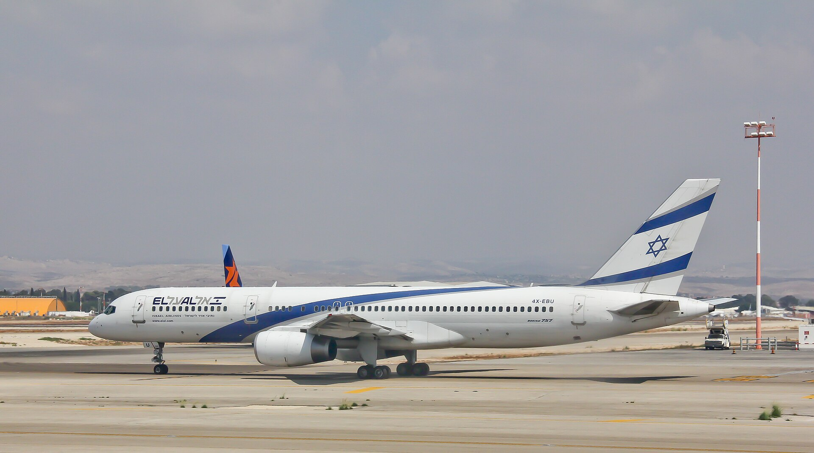
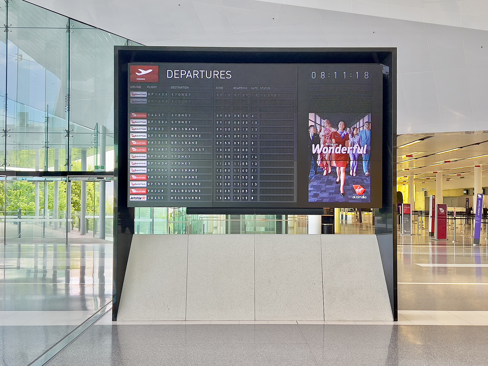

מחירי הטיסות מישראל נותרו גבוהים משמעותית לעומת התקופה שלפני המלחמה, כשכרטיס ממוצע לחו"ל התייקר בעשרות אחוזים. הסיבה המרכזית: עזיבת חברות תעופה זרות רבות את נתב"ג בזמן הלחימה, שהותירה את השוק דל בתחרות ואפשרה לחברות שנותרו — ובראשן אל על — להעלות מחירים בקווים מבוקשים.

## למה מחירי הטיסות מישראל כל כך יקרים?

השוק הישראלי חווה בשנתיים האחרונות טלטלה חריפה. עשרות חברות תעופה זרות, בהן ענקיות כמו לופטהנזה, איזיג'ט ודלתא, השהו או צמצמו טיסות לתל אביב בשל המצב הביטחוני. התוצאה הייתה ירידה חדה בהיצע המושבים, בעוד הביקוש של ישראלים לטיסות — לעסקים, למשפחות בחו"ל ולתיירות — נותר גבוה.

כאשר ההיצע מצטמצם והביקוש נשאר יציב, המחיר עולה. אל על, שהמשיכה להפעיל את מרבית טיסותיה גם בשיא הלחימה, נהנתה ממעמד כמעט מונופוליסטי בחלק מהקווים המרכזיים לאירופה ולצפון אמריקה, והדבר השתקף היטב בדוחות הכספיים שלה ובמחיר המניה שזינק בבורסה בתל אביב.

### הגורמים המרכזיים לעליית המחירים

- **ריכוזיות בשוק:** נתח שוק גבוה לחברות הישראליות, בראשן אל על, בהיעדר תחרות זרה.
- **עלויות ביטוח וסיכון:** פרמיות ביטוח גבוהות יותר לטיסות אל וממדינה במצב מלחמה.
- **מחירי דלק סילוני:** תנודתיות במחירי הנפט שמתגלגלת לצרכן.
- **עומס בנתב"ג:** הגבלות תפעוליות וזמינות מוגבלת של חלונות המראה ונחיתה.

## כמה באמת התייקר כרטיס טיסה?

אף שהמחירים משתנים לפי יעד, עונה ומועד הזמנה, המגמה הכללית ברורה. הטבלה הבאה ממחישה את פערי המחירים המוערכים בין התקופה שלפני המלחמה להיום, בקווים פופולריים (מחירי הלוך-ושוב בכלכלה, הערכה):

| יעד | לפני המלחמה (הערכה) | היום (הערכה) | שינוי |
|------|------|------|------|
| אתונה | כ-250 ש"ח | כ-500 ש"ח | פי 2 |
| רומא | כ-400 ש"ח | כ-800 ש"ח | פי 2 |
| לונדון | כ-700 ש"ח | כ-1,300 ש"ח | +85% |
| ניו יורק | כ-2,500 ש"ח | כ-4,500 ש"ח | +80% |

חשוב לזכור כי מדובר בטווחים ובהערכות בלבד — המחירים בפועל תלויים במועד ההזמנה, בגמישות התאריכים ובזמינות המקומות.

## מתי צפויה הקלה במחירי הטיסות?

החדשות הטובות: השוק נמצא במגמת התאוששות. עם רגיעה ביטחונית, חברות זרות רבות מחדשות בהדרגה את פעילותן בנתב"ג. חברות הלואו-קוסט האירופיות, ובהן וויזאייר וריינאייר, מהוות גורם מרכזי בהחזרת התחרות — שכן דווקא הן מפעילות לחץ מחירים כלפי מטה ביעדים הקרובים באירופה.

ככל שיותר חברות ישובו למסלול הישראלי ויגדילו את מספר הטיסות, כך צפוי היצע המושבים לגדול והמחירים למתן. עם זאת, גורמים בענף מעריכים כי חזרה מלאה לרמות המחירים שלפני המלחמה תארך זמן, ותלויה ביציבות ביטחונית מתמשכת.

## איך לחסוך בכרטיס הטיסה הבא?

גם בשוק יקר יש דרכים לצמצם את ההוצאה:

- **הזמינו מוקדם:** ככלל, הזמנה של חודשים מראש זולה יותר, במיוחד בעונות השיא.
- **היו גמישים בתאריכים:** טיסות באמצע השבוע ובשעות פחות נוחות זולות משמעותית.
- **השוו בין מנועי חיפוש:** בדקו כמה פלטפורמות והשוו גם מול אתרי החברות עצמן.
- **שקלו יעדים חלופיים:** לעיתים טיסה ליעד סמוך והמשך ברכבת או בטיסה פנימית זול יותר.
- **הצטרפו למועדוני נוסע מתמיד:** צבירת נקודות עשויה להשתלם למי שטס לעיתים קרובות.

השורה התחתונה: מחירי הטיסות מישראל עדיין גבוהים, אך התחרות חוזרת בהדרגה. צרכן חכם, שמזמין מראש ומשווה מחירים, יכול לחסוך מאות שקלים גם בתקופה מאתגרת זו.
