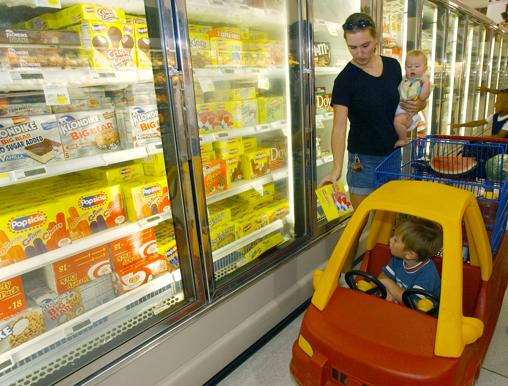

על רקע גל התייקרויות מתמשך בסל הקניות, **המותג הפרטי** הפך למנוע החיסכון המשמעותי ביותר של משקי הבית בישראל. מדובר במוצרים הנושאים את שם הרשת (או מותג ייעודי שלה) במקום מותג יצרן מוכר, ונמכרים בפער מחיר של עשרות אחוזים — לעיתים תוך שמירה על איכות דומה למדי. עבור משפחה ממוצעת, מעבר חלקי למותג פרטי יכול לחסוך מאות שקלים בחודש.

## מהו מותג פרטי ולמה הוא כל כך זול?

מותג פרטי הוא מוצר שהרשת מזמינה מיצרן — לרוב אותו יצרן שמייצר גם את מותגי הדגל — וממתגת בשמה. מכיוון שהרשת חוסכת את עלויות השיווק, הפרסום והמיתוג היקרות של המותג המקורי, המחיר לצרכן יורד משמעותית. הפער נובע מעלויות שיווק, לא בהכרח מפער איכותי.

בישראל, הרשתות הגדולות — **שופרסל**, **רמי לוי**, **ויקטורי** ו**יינות ביתן** — הרחיבו בשנים האחרונות בצורה אגרסיבית את סדרות המותג הפרטי שלהן, מקמח וסוכר ועד חטיפים, מוצרי ניקיון ומזון מוכן. המהלך משרת את שני הצדדים: הרשת נהנית משולי רווח גבוהים יותר, והצרכן נהנה ממחיר נמוך.

## כמה באמת חוסכים? השוואת מחירים

הפער בין מותג פרטי למותג דגל משתנה לפי קטגוריה, אך בממוצע נע בין 20% ל-40%. בקטגוריות בסיסיות הוא יכול להגיע גם למעל 50%. הטבלה הבאה ממחישה את סדר הגודל של החיסכון האופייני (הערכות כלליות, המחירים בפועל משתנים בין רשתות ומבצעים):

| קטגוריה | מותג דגל (מחיר יחסי) | מותג פרטי (מחיר יחסי) | חיסכון מוערך |
|---|---|---|---|
| חלב וגבינות בסיסיות | גבוה | בינוני | 15%-30% |
| מוצרי נייר וטואלטיקה | גבוה | נמוך | 30%-50% |
| קטניות, אורז ופסטה | בינוני | נמוך | 25%-45% |
| חטיפים ומשקאות | גבוה | בינוני | 20%-40% |
| מוצרי ניקיון | גבוה | נמוך | 30%-50% |

המסקנה ברורה: ככל שהמוצר בסיסי יותר ופחות תלוי בטעם או במרכיב סודי, כך פוטנציאל החיסכון גדול יותר והסיכון האיכותי קטן יותר.

## איפה משתלם להתפשר — ואיפה כדאי להיזהר?

לא כל מותג פרטי נולד שווה. בקטגוריות מסוימות ההבדל האיכותי זניח, ובאחרות הוא מורגש.

### הימור בטוח
- **מוצרי נייר**: נייר טואלט, מגבות וטישו — הבדל מזערי, חיסכון גדול.
- **קטניות ודגנים**: עדשים, אורז, קמח וסוכר — מוצר גנרי כמעט לחלוטין.
- **מוצרי ניקיון בסיסיים**: אקונומיקה, סבון כלים ונוזל כביסה.

### כדאי לבדוק לפני
- **מוצרי חלב**: לעיתים יש הבדל בטעם ובמרקם בין יצרנים.
- **חטיפים וממתקים**: כאן הטעם והזיהוי המותגי משחקים תפקיד גדול.
- **קפה ושוקולד**: מוצרי פרימיום שבהם ההבדל האיכותי עשוי להיות משמעותי.

## למה בישראל עדיין יש פוטנציאל חיסכון גדול?

למרות הצמיחה המהירה, נתח המותג הפרטי בישראל עדיין נמוך משמעותית מהמקובל במדינות מערב אירופה, שם הוא חוצה לא פעם את רף ה-40% מסך המכירות ברשתות. באירופה, רשתות דיסקאונט כמו לידל ואלדי בנו את כל המודל העסקי שלהן סביב מותג פרטי איכותי וזול.

הפער הזה מסמן שני דברים לצרכן הישראלי: ראשית, מרחב החיסכון עדיין גדול ולא מוצה; ושנית, ככל שהתחרות בין הרשתות תתחזק, צפויה הרחבה נוספת של הסדרות והורדת מחירים. הכניסה הצפויה של שחקנים בינלאומיים ולחץ המחירים המתמשך רק יאיצו את המגמה.

## שורה תחתונה לצרכן

מעבר מושכל למותג פרטי הוא ככל הנראה הצעד הצרכני היעיל ביותר להקטנת הוצאות המזון כרגע — יעיל אף יותר מרדיפה אחר מבצעים נקודתיים. ההמלצה המעשית: התחילו מהקטגוריות הבסיסיות שבהן הסיכון האיכותי אפסי, בדקו את המוצרים הרגישים לטעם בנפרד, והשוו את מחיר ליחידה (100 גרם/ליטר) ולא רק את מחיר האריזה. כך תזהו במדויק היכן החיסכון אמיתי — והיכן זהו רק מיתוג.
