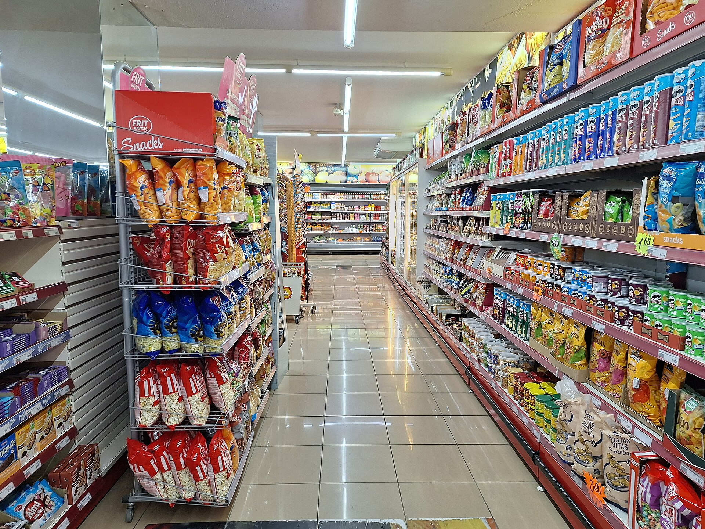

שרינקפלציה — הקטנה סמויה של כמות המוצר באריזה תוך שמירה על מחיר זהה או דומה — הפכה בשנה החולפת לאחת התופעות הבולטות בסל הקניות הישראלי. בפועל, הצרכן משלם אותו סכום אך מקבל פחות: שקית חטיף שהצטמצמה בכמה גרמים, מארז יוגורט שירד ביחידה, או טבלת שוקולד דקה יותר. הרשתות והיצרנים מרוויחים מהעלאת מחיר שאינה נראית על המדף, ומדד המחירים לצרכן לא תמיד לוכד את מלוא ההתייקרות.

## מהי שרינקפלציה ולמה היא כה נפוצה עכשיו?

המונח משלב את המילים האנגליות "התכווצות" ו"אינפלציה". במקום להעלות את המחיר הנקוב — מהלך שהצרכן מזהה מיד — היצרן מקטין את תכולת האריזה. התוצאה: המחיר ליחידה או ל-100 גרם מזנק, אך תג המחיר על המדף נראה יציב.

התופעה מתגברת בתקופות של לחצי עלויות — התייקרות חומרי גלם כמו קקאו וקפה, עליית מחירי האנרגיה וההובלה, ושחיקת שער השקל מול הדולר והאירו. עבור היצרנים, הקטנת אריזה נתפסת כדרך "עדינה" יותר לשמור על שולי הרווח מבלי להבריח לקוחות.

## אילו מוצרים נפגעים במיוחד?

השרינקפלציה בולטת בעיקר בקטגוריות שבהן קשה לצרכן לזכור את הכמות המדויקת:

- **חטיפים ומתוקים** — הפחתה של כמה גרמים בשקית שנראית זהה.
- **מוצרי חלב** — מעבר ממארז של שש יחידות לחמש, או הקטנת נפח.
- **שוקולד וקפה** — קטגוריות שספגו קפיצה חדה במחירי חומרי הגלם העולמיים.
- **מוצרי ניקיון וטואלטיקה** — הקטנת נפח בקבוק או מספר יחידות בגליל.

## איך מזהים שרינקפלציה על המדף?

הכלי היעיל ביותר הוא **המחיר ליחידת מידה** — לרוב ל-100 גרם, לליטר או ליחידה — המופיע בתווית המדף לצד המחיר הכולל. גם אם המחיר הנקוב לא השתנה, זינוק במחיר ליחידה חושף את ההתכווצות. שווה גם לצלם אריזות של מוצרים קבועים ולהשוות תכולה לאורך זמן.

| דרך התייקרות | מה רואה הצרכן | ההשפעה על המחיר ליחידה |
|---|---|---|
| העלאת מחיר גלויה | תג מחיר גבוה יותר | עולה, וגלוי מיד |
| שרינקפלציה | מחיר דומה, אריזה קטנה | עולה, אך סמוי |
| "סקימפפלציה" (הורדת איכות) | מחיר וכמות דומים | עולה יחסית לאיכות |

## מה ניתן לעשות כדי להגן על סל הקניות?

הצרכן הישראלי אינו חסר אונים מול השרינקפלציה. כמה צעדים פשוטים מצמצמים את הפגיעה:

1. **השוו לפי המחיר ליחידת מידה**, לא לפי התג הכולל.
2. **שקלו מותגים פרטיים** של הרשתות, שלרוב זולים יותר ליחידה.
3. **השתמשו באתרי ואפליקציות השוואת מחירים** ובכלי השקיפות של משרד הכלכלה.
4. **קנו באריזות גדולות** כשהמחיר ליחידה נמוך יותר, אם הצריכה מצדיקה זאת.

## הרגולציה מדביקה את הפער

ברחבי העולם מתחזקת המגמה לחייב יצרנים ורשתות לסמן במפורש מוצרים שכמותם הוקטנה. גם בישראל עולה הדרישה להגברת השקיפות, בין היתר באמצעות חובת פרסום ברור של המחיר ליחידת מידה והחמרת הפיקוח על שינויי אריזה. ככל שהמודעות הציבורית גוברת, כך קטן התמריץ של היצרנים לצמצם אריזות בשקט. בינתיים, נטל הזיהוי נותר בעיקר על כתפי הצרכן — והמחיר ליחידה נותר הנשק היעיל ביותר במלחמה על יוקר המחיה.
