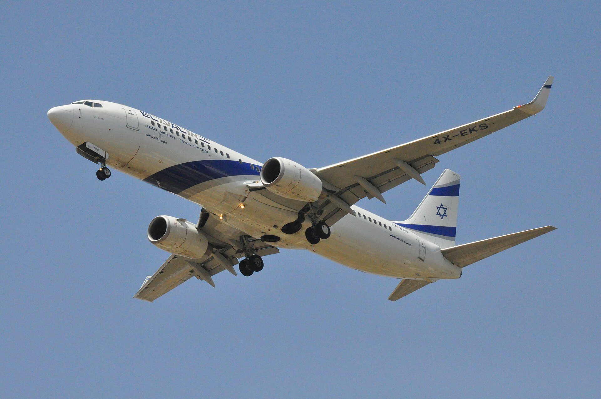

מחירי הטיסות לחו"ל, שהפכו בשנתיים האחרונות לאחד הסמלים הבולטים של יוקר המחיה עבור הצרכן הישראלי, עשויים סוף-סוף להתחיל לרדת. הסיבה המרכזית: חזרתן ההדרגתית של חברות התעופה הזרות לנמל התעופה בן-גוריון, שמחזירה את התחרות לשמי ישראל אחרי תקופה שבה חברות מקומיות, ובראשן אל על, נהנו משליטה כמעט בלעדית בקווים מרכזיים.

בתקופת השיא של המשבר הביטחוני נטשו עשרות חברות זרות את נתב"ג, ומספר המושבים הזמינים צנח. התוצאה הייתה זינוק חד במחירים — בחלק מהיעדים הפופולריים באירופה ובארצות הברית עלו המחירים בעשרות אחוזים, ולעיתים אף הוכפלו לעומת רמתם טרם המשבר.

## למה מחירי הטיסות לחו"ל זינקו כל כך?

שוק התעופה פועל על פי היגיון פשוט של היצע וביקוש. כאשר עשרות חברות זרות השהו את פעילותן בישראל, ההיצע התכווץ בחדות בעוד שהביקוש — במיוחד של ישראלים שביקשו לצאת לחופשות — נותר גבוה. הפער הזה תורגם ישירות למחירים.

גורם נוסף היה עלייה בעלויות התפעול של חברות התעופה בכל העולם: מחירי הדלק, עלויות הביטוח לטיסות מעל אזורים מוגדרים כבעלי סיכון, ותוספות שכר. כל אלה התגלגלו אל כרטיס הטיסה של הנוסע.

### כמה עלה להטיס משפחה?

עבור משפחה ישראלית ממוצעת, עלות הטיסה הפכה לרכיב המשמעותי ביותר בתקציב החופשה — לעיתים יקר יותר מהלינה עצמה. משפחה בת ארבע נפשות הנוסעת ליעד אירופי בתקופת שיא נדרשה לא אחת להוציא סכומים שהיו בעבר שמורים לטיסות ליעדים רחוקים בהרבה.

## חזרת החברות הזרות: התפנית מתחילה

בחודשים האחרונים ניכרת מגמה ברורה של חזרה. חברות אירופיות גדולות מחדשות את פעילותן בנתב"ג, ולצידן נכנסות גם חברות לואו-קוסט שמתמחות במחירים אגרסיביים. ככל שמספר החברות והמושבים יגדל, כך צפוי לחץ כלפי מטה על המחירים — במיוחד בקווים הצפופים לאירופה.

התחרות המתחדשת מציבה אתגר לחברות הישראליות. אל על, שרשמה תוצאות כספיות חזקות בזכות מעמדה הדומיננטי, תיאלץ להגמיש את מדיניות התמחור שלה כדי לשמר נתח שוק מול השחקניות החוזרות.

## השוואת מחירים ליעדים נפוצים

הטבלה הבאה ממחישה את כיוון המגמה במחירי טיסה הלוך-חזור לנוסע בודד, כטווחי הערכה בלבד:

| יעד | מחיר בשיא המשבר (הערכה) | מחיר עם התחדשות התחרות (הערכה) |
|------|------------------------|-------------------------------|
| ערים באירופה (קרובות) | כ-1,200–1,800 ₪ | כ-700–1,200 ₪ |
| בירות מערב אירופה | כ-1,800–2,800 ₪ | כ-1,200–2,000 ₪ |
| ארצות הברית (חוף מזרחי) | כ-4,000–6,000 ₪ | כ-2,800–4,500 ₪ |
| יעדים במזרח הרחוק | כ-4,500–7,000 ₪ | כ-3,000–5,500 ₪ |

*הנתונים הם טווחי הערכה כלליים ומשתנים לפי מועד, ביקוש ומדיניות החברות.*

## איך הצרכן הישראלי יכול לחסוך?

גם בתקופת מעבר, יש כלים שמאפשרים לנוסע לצמצם את ההוצאה על כרטיס הטיסה:

- **הזמנה מוקדמת:** ככלל, ככל שמזמינים מוקדם יותר, כך המחיר נמוך יותר — במיוחד בעונות השיא.
- **גמישות בתאריכים:** טיסה באמצע השבוע או מחוץ לחגים ולחופשות זולה משמעותית.
- **השוואת מחירים:** שימוש במנועי חיפוש והשוואה חושף פערים גדולים בין החברות.
- **מעקב אחר חברות לואו-קוסט:** הכניסה המחודשת שלהן לישראל מזרימה מבצעים אגרסיביים.
- **קשב לעלויות נלוות:** מזוודות, בחירת מושב וארוחות עשויים להפוך כרטיס "זול" ליקר בפועל.

## מה צפוי בהמשך?

המגמה הכללית חיובית לצרכן, אך אינה מיידית ואינה אחידה. ככל שהיציבות הביטחונית תישמר וחברות נוספות יחזרו, כך צפוי ההיצע להתרחב והמחירים להמשיך להתמתן. עם זאת, גורמים גלובליים כמו מחירי הדלק ועלויות הביטוח ימשיכו להשפיע, ולכן לא סביר שהמחירים יחזרו במהירות לרמות שהיו נהוגות לפני המשבר.

השורה התחתונה עבור הנוסע הישראלי: שוק התעופה נכנס לשלב של התאוששות תחרותית, וזו בשורה טובה למי שמתכנן חופשה. מי שיהיה גמיש, סבלני וישווה מחירים — צפוי ליהנות ראשון מהוזלת מחירי הטיסות לחו"ל.
