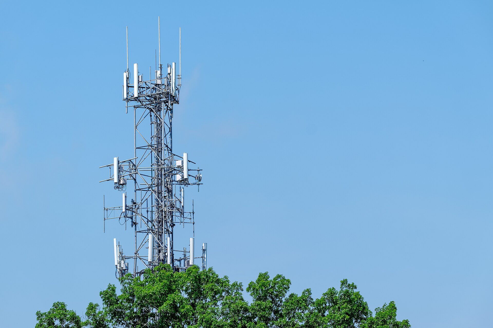

מלחמת הסלולר בישראל חזרה למרכז הבמה, והפעם הצרכנים הם המנצחים הגדולים: חבילות הכוללות שיחות בלתי מוגבלות וגלישה של עשרות ג'יגה נמכרות כיום בעשרות שקלים בודדים בלבד. מי שלא בדק את חשבון הסלולר שלו בשנים האחרונות, כמעט בוודאות משלם הרבה יותר ממה שהוא צריך.

ישראל נחשבת כבר שנים לאחד השווקים הזולים בעולם בכל הנוגע לתעריפי סלולר. הרפורמה שפתחה את השוק לתחרות בתחילת העשור הקודם, לצד כניסת מפעילים וירטואליים, שחקה את הרווחיות של החברות הוותיקות – אך הפכה את השיחות והגלישה למוצר זול במיוחד עבור הצרכן הישראלי.

## מדוע מלחמת הסלולר בישראל מתחדשת דווקא עכשיו?

השוק הישראלי מחולק כיום בין כמה שחקניות מרכזיות: **פלאפון**, **סלקום** ו**פרטנר** מצד אחד, מול מפעילים כמו **הוט מובייל**, **גולן טלקום** ו-**רמי לוי תקשורת** מצד שני. הלחץ התחרותי דוחף את כולן להוזיל מחירים ולהילחם על כל לקוח.

המגמה הבולטת בשנה החולפת היא השקת "מותגי לחימה" – מותגים משניים וזולים שהחברות הגדולות מקימות כדי להתחרות במפעילים הווירטואליים בלי לפגוע במותג הראשי. כך נוצר מצב שבו אותה חברה מוכרת חבילה יקרה תחת המותג הוותיק, וחבילה זולה בהרבה תחת מותג חדש.

במקביל, המעבר לרשתות הדור החמישי (5G) הפך לזירת שיווק מרכזית. החברות מבטיחות מהירויות גלישה גבוהות ומשתמשות בכך כדי למשוך לקוחות, גם אם בפועל רוב הצרכנים אינם מנצלים את מלוא היכולות.

## כמה באמת עולה חבילת סלולר בישראל?

כדי להבין את גודל הפער, כדאי להשוות את סוגי החבילות הנפוצות בשוק. הטבלה שלהלן מציגה טווחי מחירים אופייניים – חשוב לזכור שהמחירים משתנים תדיר ותלויים במבצעים.

| סוג חבילה | טווח מחיר חודשי | למי מתאים |
|---|---|---|
| בסיסית (גלישה מוגבלת + שיחות) | כ-10 עד 20 ש"ח | משתמשים חסכנים, מכשיר שני |
| סטנדרטית (עשרות ג'יגה + 5G) | כ-20 עד 35 ש"ח | רוב הצרכנים |
| פרימיום (גלישה גבוהה + הטבות) | כ-40 עד 70 ש"ח | גולשים כבדים, משפחות |
| חבילה ותיקה ללא עדכון | כ-80 עד 150 ש"ח | לקוחות שלא בדקו שנים |

הפער בין השורה השנייה לשורה האחרונה מספר את כל הסיפור: לקוח שנשאר עם חבילה ישנה עלול לשלם פי ארבעה ואף יותר מלקוח חדש שמצטרף היום למבצע.

## למה כל כך הרבה ישראלים משלמים יותר מדי?

התשובה נעוצה בעצלות צרכנית ובמנגנון הנקרא "אפקט ההיצמדות". חברות הסלולר מהמרות על כך שלקוחות ותיקים לא יטרחו לבדוק ולעבור. חבילות שנחתמו לפני שנים, לעיתים בתקופת רכישת מכשיר, ממשיכות להתגלגל בתעריף גבוה גם שנים אחרי שהמכשיר שולם במלואו.

גורם נוסף הוא בלבול מכוון: מבצעים ל"תקופה מוגבלת" שקופצים אוטומטית למחיר גבוה בתום שנה, תוספות זעירות שנצברות בחשבון, ושירותים נלווים שהלקוח שכח שרכש.

### כך תבדקו אם אתם משלמים יותר מדי

- בדקו בדף החשבון האחרון מהו הסכום החודשי המדויק שאתם משלמים.
- השוו את החבילה שלכם למחירים המפורסמים כיום באתרי החברות ובאתרי השוואה.
- בררו אם המבצע המקורי "קפץ" למחיר גבוה יותר.
- זכרו: מעבר בין חברות הוא חינמי, מיידי, ושומר על מספר הטלפון.

## האם משתלם לעבור מפעיל?

ברוב המקרים – כן, וההליך פשוט מתמיד. חוק ניוד המספרים מאפשר לעבור בין מפעילים בתוך שעות ספורות, בלי לאבד את המספר ובלי קנסות יציאה בחבילות ללא התחייבות. די בשיחה או בהצטרפות מקוונת אצל המפעיל החדש, והוא זה שמטפל בניתוק מהחברה הישנה.

עם זאת, לפני מעבר כדאי לוודא כמה נקודות: איכות הקליטה באזור המגורים והעבודה, האם החבילה כוללת גלישה בחו"ל אם אתם נוסעים, והאם קיימת התחייבות שקשורה למכשיר שנרכש בתשלומים.

עצה נוספת: לפני שעוברים, שווה להתקשר למחלקת השימור של החברה הנוכחית. במקרים רבים היא תציע להתאים את המחיר למבצעי השוק כדי למנוע את עזיבתכם – מהלך שיכול לחסוך מאות שקלים בשנה במינימום מאמץ.

## מה צפוי בשוק הסלולר הישראלי?

המגמה הכללית צפויה להימשך: תחרות מחירים חריפה, לצד השקעה גוברת בתשתיות הדור החמישי ובשירותים משולבים כמו אינטרנט ביתי וטלוויזיה. עבור החברות מדובר במשחק רווחיות מאתגר, אך עבור הצרכן הישראלי זו הזדמנות להמשיך וליהנות מאחד השווקים הזולים בעולם – בתנאי שיטרח לבדוק, להשוות ולהחליף.
