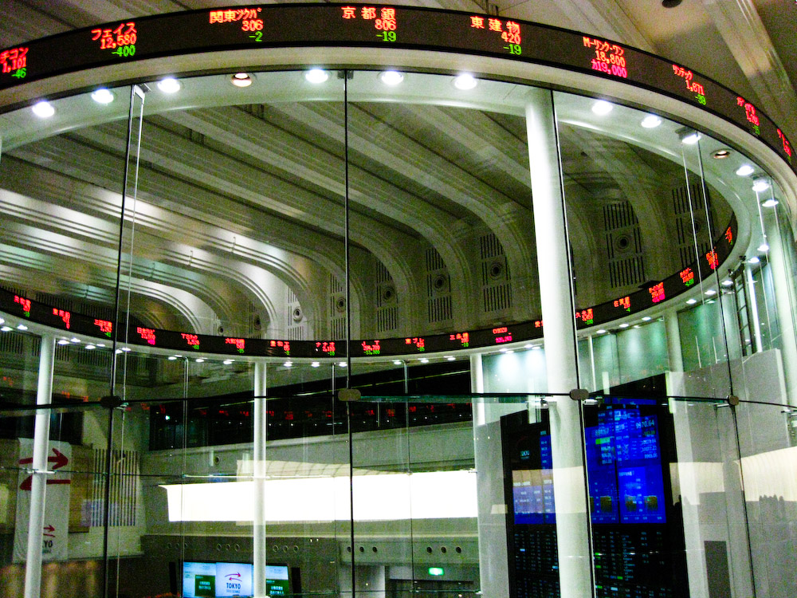

מדד ת"א 35, מדד הדגל של הבורסה בתל אביב, נסחר בחודשים האחרונים סביב רמות שיא היסטוריות, לאחר ראלי חד שהפתיע חלק מהאנליסטים. הזינוק, המבוסס בעיקר על מניות הבנקים והחברות הביטחוניות, משקף שילוב של ירידה בפרמיית הסיכון הגאופוליטית, תוצאות עסקיות חזקות וחזרה הדרגתית של משקיעים זרים לשוק המקומי. השאלה שמעסיקה כעת רבים היא האם מדובר בתחילתו של מחזור עליות ארוך, או בשיא שלפני תיקון.

## מה מניע את הראלי במדד ת"א 35?

ההסבר המרכזי לעוצמת מדד ת"א 35 טמון במשקל הגבוה של הסקטור הפיננסי במדד. מניות הבנקים — לאומי, הפועלים, מזרחי טפחות ודיסקונט — נהנו מסביבת ריבית גבוהה יחסית ששמרה על מרווחי אשראי רחבים ורווחיות שיא. במקביל, חלוקות דיבידנד נדיבות ותוכניות רכישה עצמית של מניות תמכו בביקושים.

מנוע שני הוא הסקטור הביטחוני. חברות כמו אלביט מערכות רשמו צבר הזמנות שיא על רקע הגידול העולמי בתקציבי הביטחון, מה שהפך אותן לאחת הקטגוריות החזקות בבורסה.

## מדוע חוזרים המשקיעים הזרים?

במשך תקופה ארוכה נמנעו משקיעים מוסדיים זרים מהשוק הישראלי, בין היתר בשל אי-הוודאות הביטחונית והפוליטית. ירידה בעוצמת האירועים הגאופוליטיים והתייצבות מסוימת בזירה תרמו לצמצום פרמיית הסיכון שדרשו המשקיעים על נכסים ישראליים.

התוצאה ניכרת גם בשוק המט"ח: השקל נטה להתחזק מול הדולר בתקופות של אופטימיות בשוק ההון, בעוד שער הדולר-שקל שיקף את זרימת ההון הזרה חזרה לנכסים מקומיים. חיזוק השקל, בתורו, מגדיל את התשואה הדולרית של משקיע זר ומעודד כניסה נוספת — מעגל חיובי שתומך בעליות.

## האם מדד ת"א 35 עדיין זול?

למרות העליות החדות, מכפילי הרווח בבורסה בתל אביב נותרו נמוכים יחסית בהשוואה בינלאומית. בעוד מדדי וול סטריט, ובראשם נאסד"ק, נסחרים במכפילים גבוהים על רקע גל הבינה המלאכותית, השוק הישראלי נחשב עדיין לזול יחסית — טיעון מרכזי בפי התומכים בהמשך הראלי.

| פרמטר | מדד ת"א 35 | נאסד"ק 100 | הערה |
|---|---|---|---|
| הרכב מוביל | בנקים וביטחוניות | טכנולוגיה ובינה מלאכותית | ריכוזיות סקטוריאלית |
| מכפיל רווח | נמוך-בינוני | גבוה | תמחור אטרקטיבי יחסית |
| רגישות מרכזית | ריבית וגאופוליטיקה | צמיחת טכנולוגיה | מקורות סיכון שונים |
| תשואת דיבידנד | גבוהה יחסית | נמוכה | יתרון למשקיעי דיבידנד |

עם זאת, חשוב לזכור כי ה"זול" הזה משקף גם סיכון: ריכוזיות גבוהה במספר מצומצם של מניות פיננסיות וביטחוניות הופכת את המדד לרגיש במיוחד לזעזועים בסקטורים אלה.

## אילו סיכונים מאיימים על ההמשך?

מספר גורמים עלולים לקטוע את הראלי. ראשית, שינוי בכיוון הריבית של בנק ישראל: הפחתות ריבית עשויות אמנם לתמוך בכלכלה הרחבה, אך גם ללחוץ על מרווחי הבנקים. שנית, כל הסלמה גאופוליטית עלולה להחזיר את פרמיית הסיכון ולהבריח את ההון הזר שחזר. שלישית, תלות בשווקים הגלובליים — תיקון חד בוול סטריט יקרין כמעט תמיד גם על תל אביב.

### מה זה אומר למשקיע הישראלי?

- **פיזור הוא מפתח:** ריכוזיות המדד מחייבת שילוב אפיקים ומדדים נוספים.
- **אופק ארוך:** כניסה בשיא דורשת סבלנות והיערכות לתנודתיות.
- **מכשירים עוקבים:** קרנות סל וקרנות מחקות מאפשרות חשיפה זולה למדד ללא בחירת מניות בודדות.

## שורה תחתונה

מדד ת"א 35 נהנה מרוח גבית מצד הבנקים, הביטחוניות והמשקיעים הזרים, ותמחורו היחסי עדיין נראה אטרקטיבי מול שווקים מפותחים אחרים. יחד עם זאת, שיאים היסטוריים אינם ערובה להמשך, והריכוזיות הגבוהה מחייבת זהירות. עבור המשקיע הישראלי, המסקנה המרכזית היא לשלב אופטימיות זהירה עם משמעת של פיזור ואופק השקעה ארוך.
