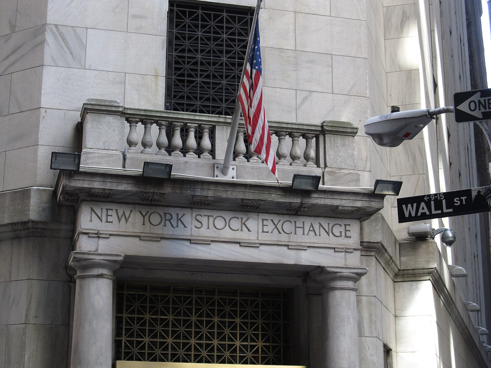

שוק ה**רכב האוטונומי** ניצב בצומת דרכים, ובלב המרוץ העולמי עומדת חברה ישראלית: מובילאיי מירושלים. לאחר שנים של הבטחות גדולות, שאלת המפתח שמעסיקה משקיעים ויצרניות רכב היא האם טכנולוגיית הנהיגה האוטונומית סוף סוף מבשילה למוצר מסחרי רחב היקף — או שמדובר בעוד אופק שנדחה. התשובה הקצרה: הטכנולוגיה מתקדמת בקצב מרשים, אך הדרך לרכב אוטונומי מלא בכבישים ארוכה, יקרה ומלווה בזהירות רגולטורית.

## מה מצב מובילאיי כיום?

מובילאיי, שנרכשה בידי אינטל בשנת 2017 בכ-15 מיליארד דולר והונפקה מחדש בנאסד"ק בסוף 2022, נותרה שחקנית מובילה בתחום מערכות הסיוע לנהג (מה שמכונה בענף ADAS). המצלמות והשבבים שלה מותקנים בעשרות מיליוני כלי רכב ברחבי העולם, מרכב פרטי ועד משאיות.

עם זאת, השנה החולפת לא היתה קלה. האטה בביקוש לשבבי רכב, בעיקר על רקע עודפי מלאי אצל היצרניות בסין ובאירופה, פגעה בהכנסות ולחצה את המניה כלפי מטה. מובילאיי נדרשה לעדכן תחזיות, והמשקיעים למדו שגם חברת דגל טכנולוגית אינה חסינה למחזוריות של תעשיית הרכב.

### מדוע האטת שוק הרכב פגעה כל כך?

חלק ניכר מהכנסות מובילאיי נשען על מכירת שבבי EyeQ ליצרניות רכב. כאשר היצרניות מצמצמות ייצור או מרוקנות מלאים, ההזמנות יורדות בחדות. בנוסף, כניסת מתחרות אגרסיביות מגבירה את הלחץ על המחירים ועל נתחי השוק.

## מי מתחרה על שוק הנהיגה האוטונומית?

הזירה הפכה צפופה. אנבידיה מציעה פלטפורמת מחשוב עוצמתית ליצרניות רכב, קוואלקום נכנסה בכוח לתחום הרכב הדיגיטלי, ובמקביל יצרניות כמו טסלה מפתחות פתרונות פנימיים ומסרבות להסתמך על ספק חיצוני. התוצאה: מובילאיי נדרשת להאיץ את מעבר הלקוחות למוצרים המתקדמים והרווחיים יותר שלה.

| שחקנית | תחום מרכזי | יתרון בולט |
|---|---|---|
| מובילאיי | מצלמות ושבבים לנהיגה אוטונומית | ניסיון, נתחי שוק ומאגר נתונים עצום |
| אנבידיה | פלטפורמות מחשוב לרכב | עוצמת עיבוד וקשרים בתעשייה |
| קוואלקום | קוקפיט דיגיטלי ורכב מחובר | חדירה מהירה ותמחור תחרותי |
| טסלה | פיתוח פנימי מלא | שליטה מקצה לקצה בנתונים |

## האם המסחור באמת מתקרב?

מובילאיי מקדמת שורת מוצרים שאמורים להוביל את הקפיצה הבאה — מערכות המאפשרות נהיגה "ללא ידיים" בכבישים מהירים, ובהמשך פתרונות אוטונומיים מלאים לצי רכב ולמוניות ללא נהג. חלק מהמוצרים כבר נכנסים לרכבי סדרה של יצרניות גדולות, אך המעבר ההמוני צפוי בהדרגה ולאורך שנים.

האתגר אינו רק טכנולוגי אלא גם כלכלי ורגולטורי. עלות המערכות המתקדמות עדיין גבוהה, והרגולטורים בארה"ב ובאירופה נוקטים משנה זהירות באישור רכב ללא מעורבות נהג. לכן, במקום מהפכה חדה, הענף צועד באבולוציה: שכבות בטיחות ואוטונומיה נוספות בהדרגה לרכבים הנמכרים בפועל.

## מה זה אומר למשקיע הישראלי?

מובילאיי היא אחת מחברות ההיי-טק הישראליות הבולטות הנסחרות בנאסד"ק, והביצועים שלה נחשבים למדד לבריאות תחום ה**רכב האוטונומי** כולו. שלושה גורמים ראויים למעקב:

- **תלות באינטל:** אינטל נותרה בעלת המניות הדומיננטית, ומהלכים למכירת חלקים מהחזקתה עלולים ליצור לחץ על המניה בטווח הקצר.
- **קצב אימוץ המוצרים המתקדמים:** ככל שיותר יצרניות יאמצו את המערכות היקרות יותר, כך ישתפרו השוליים והרווחיות.
- **התחרות:** מהלכי אנבידיה וקוואלקום עשויים לכרסם בנתחי שוק ולהשפיע על התמחור.

עבור המשקיע, מובילאיי מגלמת סיכון וסיכוי גם יחד: מצד אחד, טכנולוגיה מובילה בשוק ענק שצומח; מצד שני, תלות במחזוריות תעשיית הרכב ובתחרות עזה. כמו במגזרי טכנולוגיה רבים, הסבלנות והפיזור הם שם המשחק.

## שורה תחתונה

הרכב האוטונומי אינו עוד חזון מדע בדיוני, אך גם אינו מציאות של "מחר בבוקר". מובילאיי נמצאת בעמדה מצוינת להוביל את המעבר, אך תיאלץ להוכיח שהיא מסוגלת לתרגם יתרון טכנולוגי לרווחיות עקבית מול מתחרות עתירות משאבים. עבור המשק הישראלי, הצלחתה תמשיך להיות סמל ליכולת של ההיי-טק המקומי להתחרות בליגה העולמית.
