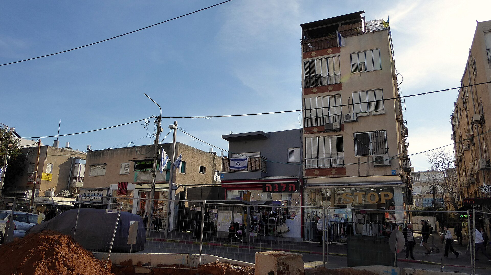

מלאי הדירות הלא מכורות בישראל טיפס בשנה החולפת לרמות שיא היסטוריות, כשעשרות אלפי דירות חדשות ממתינות לקונה על מדפי הקבלנים. התוצאה: שוק שבו המוכרים לחוצים, הקונים מהוססים, והשאלה המרכזית — האם המחירים סוף סוף יירדו — נותרת פתוחה. הצטברות **מלאי דירות לא מכורות** בהיקף כזה היא אחד הסימנים הבולטים למתח שמאפיין את שוק הנדל"ן המקומי.

## מדוע נערם מלאי דירות לא מכורות כה גדול?

שילוב של כמה כוחות דחף את השוק למצב הנוכחי. ראשית, קצב התחלות הבנייה בשנים האחרונות היה גבוה, כך שכמות דירות משמעותית הושלמה או נמצאת בשלבי בנייה מתקדמים. שנית, סביבת הריבית הגבוהה שקבע בנק ישראל ייקרה משמעותית את המשכנתאות, וצמצמה את כושר הרכישה של משקי בית רבים.

רוכשי דירה ראשונה, שנדרשים להון עצמי גדול יותר ולהחזרים חודשיים כבדים, דוחים את ההחלטה. במקביל, המשקיעים — שבעבר בלעו נתח נכבד מהדירות החדשות — נסוגו מהשוק בשל התשואה הנמוכה מהשכרה יחסית לעלות המימון, ובשל העלאות המיסוי על בעלי דירות מרובות.

### היכן המלאי הכי כבד?

העודף בולט במיוחד באזורי בנייה חדשים ובפריפריה, שם היצע הדירות גדל במהירות אך הביקוש מוגבל יותר. באזורי הביקוש המרכזיים — גוש דן, השרון והערים הגדולות — המלאי מצטבר לאט יותר, אך גם שם ניכרת האטה ברורה בקצב המכירות לעומת שנות הגאות.

## איך מגיבים הקבלנים?

כדי להזיז את המלאי, חברות הבנייה חוזרות למבצעי מימון אגרסיביים. הבולט שבהם הוא מודל **20-80**: הרוכש משלם כ-20% מהמחיר בחתימת החוזה, והיתרה משולמת רק במסירת המפתח. כך נדחית עיקר ההוצאה ונחסך לרוכש תשלום כפול של שכר דירה ומשכנתא בתקופת הבנייה.

בנק ישראל, מצידו, הביע חשש שמבצעים אלה מסתירים את מחיר הדירה האמיתי ומעודדים נטילת סיכון עודף, ולכן הידק את הפיקוח עליהם. לצד מבצעי המימון, קבלנים רבים מציעים בשקט הנחות מחיר, שדרוגים בדירה או הטבות נלוות — ובלבד שלא לפרסם ירידת מחירים גלויה שתפגע בערך יתר הפרויקט.

## האם מלאי גדול מבשר ירידת מחירים?

כאן טמון הפרדוקס של השוק. בהיגיון כלכלי בסיסי, היצע עודף אמור ללחוץ את המחירים כלפי מטה. בפועל, מדד מחירי הדירות טרם רשם ירידה חדה — בין היתר משום שהמבצעים מאפשרים לקבלנים לשמור על "מחיר מחירון" גבוה, גם כשההנחה האפקטיבית ניכרת.

הטבלה הבאה ממחישה את הכוחות המנוגדים הפועלים בשוק:

| גורם | כיוון ההשפעה על המחירים | עוצמה |
|---|---|---|
| מלאי דירות לא מכורות בשיא | לחץ כלפי מטה | גבוהה |
| ריבית בנק ישראל גבוהה | לחץ כלפי מטה (מצד הביקוש) | גבוהה |
| מבצעי מימון 20-80 | תמיכה במחיר הנקוב | בינונית |
| עלויות בנייה ומחסור בעובדים | לחץ כלפי מעלה | בינונית-גבוהה |
| מחסור כרוני בהיצע בערי הביקוש | לחץ כלפי מעלה | גבוהה |

המסקנה: המלאי הגדול אינו מתורגם אוטומטית לירידת מחירים רוחבית, אלא בעיקר להאטה, לפערי מיקוח ולהתמתנות קצב העלייה.

## מה זה אומר לרוכשים ולמשקיעים?

עבור רוכשי דירה למגורים, המצב הנוכחי פותח חלון הזדמנות. קבלן שלוחץ להוריד מלאי ולשפר תזרים מזומנים גמיש הרבה יותר במשא ומתן — הן על המחיר והן על תנאי התשלום. כדאי לבחון פרויקטים עם מלאי גדול, להשוות מבצעים, ולזכור שריבית משכנתא גבוהה מייקרת את העסקה גם כשמחיר הדירה נראה אטרקטיבי.

עבור משקיעים, התמונה מורכבת יותר: התשואה מהשכרה נשחקת מול עלות המימון, אך ירידה עתידית בריבית עשויה לשנות את המשוואה. מי שמאמין בהוזלת ריבית ב-2025 עשוי לראות בחלון הנוכחי נקודת כניסה, בעוד הזהירים ימתינו לאיתות ברור יותר.

## לסיכום

שוק הנדל"ן הישראלי נמצא בנקודת מתח: מצד אחד מלאי דירות לא מכורות בשיא ולחץ מכירות אמיתי על הקבלנים, ומצד שני מחסור מבני בהיצע וריבית שמדכאת ביקוש. הרוכשים נהנים לראשונה זה זמן רב מיתרון מיקוח, אך ירידת מחירים דרמטית ורוחבית עדיין אינה על השולחן. ההתפתחות המכרעת תהיה מסלול הריבית של בנק ישראל בחודשים הקרובים.
