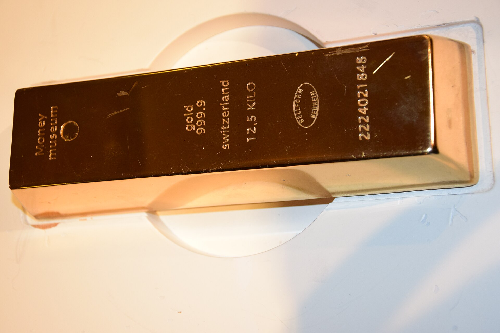

מחיר הזהב טיפס בשנה החולפת בעשרות אחוזים ונע סביב שיאים היסטוריים, ומשקיעים ישראלים רבים חוזרים אל מתכת המקלט הבטוח. **השקעה בזהב** הפכה שוב למילת מפתח בקרב חוסכים המחפשים הגנה מפני אי-ודאות, אינפלציה ותנודתיות בשווקים. הראלי במחיר המתכת מונע משילוב של ריבית יורדת, מתחים גיאופוליטיים גלובליים ורכישות שיא של בנקים מרכזיים ברחבי העולם.

## מדוע מחיר הזהב מזנק דווקא עכשיו?

כמה כוחות פועלים בו-זמנית. ראשית, הציפייה להורדות ריבית בארצות הברית ובאירופה מפחיתה את האטרקטיביות של אג"ח ופיקדונות — וזהב, שאינו מניב ריבית, נעשה מפתה יותר בסביבה כזו. שנית, בנקים מרכזיים, ובראשם בסין ובשווקים מתפתחים, רוכשים זהב בהיקפים חסרי תקדים כדי לגוון את יתרות המט"ח שלהם ולהפחית תלות בדולר.

הגורם השלישי הוא הביקוש למקלט. בעתות מלחמה, מתחים מסחריים ואי-יציבות פוליטית, משקיעים נוהרים אל נכסים שנתפסים כבטוחים. עבור המשקיע הישראלי, שחווה בשנתיים האחרונות תנודתיות חדה בשקל ובבורסה בתל אביב, הזהב מציע תחושת ביטחון פסיכולוגית שקשה לכמת.

## איך משקיעים בזהב בישראל?

בניגוד לתפיסה הרווחת, אין צורך לקנות מטילים ולהחביא אותם בכספת. הדרך הנפוצה והנזילה ביותר היא דרך שוק ההון:

- **תעודות וקרנות סל על זהב** — נסחרות בבורסות בעולם ומאפשרות חשיפה למחיר המתכת בעמלות נמוכות.
- **קרנות סל ישראליות** העוקבות אחר מדדי סחורות או מחיר הזהב, זמינות דרך חשבון מסחר רגיל.
- **מניות של חברות כרייה** — חשיפה ממונפת יותר, אך תנודתית ותלויה גם בניהול החברה.
- **זהב פיזי** — מטילים ומטבעות, הכרוכים בעלויות אחסון, ביטוח ופער קנייה-מכירה.

## טבלת השוואה: דרכי חשיפה לזהב

| אפיק | נזילות | עלויות | מתאים ל |
|------|--------|--------|---------|
| קרן סל / תעודת סל | גבוהה | נמוכות | רוב המשקיעים |
| מניות כרייה | גבוהה | בינוניות | מחפשי מינוף וסיכון |
| זהב פיזי | נמוכה | גבוהות | שמרנים במיוחד |
| חוזים עתידיים | גבוהה | מורכבות | סוחרים מנוסים |

## מהם הסיכונים באפיק המקלט?

חשוב לזכור שהזהב רחוק מלהיות נכס חסר סיכון. הוא **אינו מניב תשואה שוטפת** — אין דיבידנד ואין ריבית, וכל הרווח תלוי אך ורק בעליית המחיר. בעבר ידע הזהב תקופות ארוכות של דשדוש ואף ירידות של עשרות אחוזים, שנמשכו שנים.

בנוסף, עבור המשקיע הישראלי קיים סיכון מטבע: הזהב נסחר בדולרים, ולכן התחזקות של השקל מול הדולר עלולה לקזז חלק מהרווח גם כשמחיר המתכת עולה. מי שמשקיע דרך מוצרים לא מגודרים חשוף לתנודות בשער הדולר-שקל.

## כמה זהב כדאי להחזיק בתיק?

יועצי השקעות רבים ממליצים על חשיפה מדודה — לרוב אחוזים בודדים מהתיק ולא יותר. התפקיד של הזהב הוא **פיזור וגידור**, לא החלפת רכיב המניות שמניב לאורך זמן את התשואה העיקרית. בתקופות משבר הזהב נוטה לנוע בכיוון הפוך למניות, ולכן מעט ממנו יכול לרכך ירידות חדות בשאר התיק.

העלייה החדה במחיר בשנה האחרונה מחייבת זהירות: כניסה בשיא מגדילה את הסיכון לתיקון. מומחים ממליצים להיכנס בהדרגה, לפזר את נקודות הקנייה על פני זמן, ולהתייחס לזהב כאל ביטוח ארוך טווח ולא כאל השקעה ספקולטיבית לטווח קצר.
