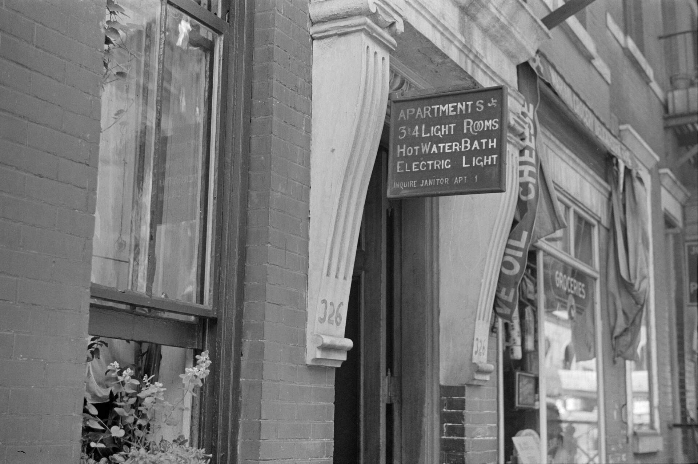

שוק השכירות בישראל הפך בשנתיים האחרונות לאחת הזירות הכואבות ביותר עבור משקי הבית: דמי השכירות בערי הביקוש עלו בשיעור דו-ספרתי מצטבר, בעוד ההיצע נותר מוגבל. התוצאה היא לחץ גובר על השוכרים, שנתח הולך וגדל מהכנסתם החודשית מופנה לתשלום שכר הדירה. במקביל, הריבית הגבוהה של בנק ישראל דוחקת רוכשים פוטנציאליים אל שוק השכירות ומעצימה את הביקוש.

## מה מניע את העלייה בדמי השכירות?

התשובה טמונה בשילוב של כמה כוחות שפועלים בו-זמנית. ראשית, **הריבית הגבוהה**: העלאות הריבית של בנק ישראל בשנתיים האחרונות ייקרו את המשכנתאות באלפי שקלים בחודש, ורבים שדחו רכישת דירה נותרו בשוק השכירות. הביקוש המוגבר נתקל בהיצע נוקשה.

שנית, **צד ההיצע**. האטה בהתחלות הבנייה, לצד מחסור בעובדים בענף ועיכובים בפרויקטים, צמצמו את זרם הדירות החדשות המגיעות לשוק. משקיעים, שהיו בעבר ספקי הדירות המרכזיים להשכרה, נרתעו מרכישות חדשות בשל עלויות המימון והמיסוי, מה שהקטין את מלאי הדירות הפנויות להשכרה.

שלישית, **גלגול עלויות**. בעלי דירות שמימנו את הנכס במשכנתה נושאת ריבית משתנה ראו את ההחזר החודשי מזנק, ורבים גלגלו חלק מהעלייה הזו אל השוכרים בעת חידוש החוזה.

## היכן העליות חדות במיוחד?

הלחץ מורגש בעיקר באזורי הביקוש — תל אביב, גוש דן, ירושלים וערי הלוויין. בפריפריה קצב העליות מתון יותר, אך מגמת התייקרות ניכרת גם שם, בין היתר בשל תנועת אוכלוסייה וביקוש מצד סטודנטים וזוגות צעירים שנדחקו החוצה מהמרכז היקר.

### חלק השכירות מההכנסה

הנטל הכספי הולך וגדל. במשפחות רבות באזורי הביקוש שכר הדירה חוצה את רף ה-30% מההכנסה הפנויה — סף שנחשב מקובל בעולם כגבול העומס הסביר. שוכרים נאלצים להתפשר על דירות קטנות יותר, לעבור לפריפריה, או לחלוק דירה עם שותפים בגיל מבוגר יותר מבעבר.

## שכירות מול רכישה: מה משתלם?

השאלה אם עדיף לשכור או לקנות מורכבת מתמיד. הריבית הגבוהה מייקרת את הרכישה, אך גם ההשכרה מתייקרת. הטבלה הבאה ממחישה את השיקולים המרכזיים:

| פרמטר | שכירות | רכישה עם משכנתה |
|---|---|---|
| עלות חודשית | דמי שכירות בלבד | החזר משכנתה + ארנונה + אחזקה |
| גמישות מעבר | גבוהה | נמוכה |
| חשיפה לריבית | עקיפה (דרך המשכיר) | ישירה ומיידית |
| בניית הון עצמי | אין | כן, לאורך זמן |
| הגנה מפני עליית מחירים | חלקית | מלאה |

המסקנה תלויה בטווח הזמן, ביציבות התעסוקתית ובגובה ההון העצמי. עבור מי שצפוי להישאר באזור מסוים שנים רבות, הרכישה עדיין עשויה להשתלם בטווח הארוך; עבור מי שזקוק לגמישות, השכירות נותרת פתרון הגיוני חרף ההתייקרות.

## האם הדיור להשכרה המוסדי יבלום את המגמה?

אחד הפתרונות שקודמו בשנים האחרונות הוא **דיור להשכרה מוסדי** — פרויקטים בבעלות גופים גדולים המשכירים דירות לטווח ארוך בתנאים יציבים. יתרונם המרכזי הוא ודאות לשוכר: חוזים ארוכים והגנה מפני העלאות פתאומיות. אלא שהיקף הפרויקטים הללו עדיין קטן ביחס לגודל השוק, ולכן השפעתם על ריסון המחירים מוגבלת בשלב זה.

## מה צפוי בהמשך?

כיוון הריבית הוא המשתנה המכריע. אם בנק ישראל יתחיל במחזור הפחתות ריבית, חלק מהרוכשים הפוטנציאליים ישובו לשוק הרכישה, מה שעשוי להקל מעט על הלחץ בשוק השכירות. עם זאת, כל עוד מצוקת ההיצע נמשכת — עם התחלות בנייה שאינן מדביקות את גידול האוכלוסייה — קשה לצפות לירידה משמעותית בדמי השכירות בטווח הקרוב.

מומחי נדל"ן מעריכים כי בהיעדר גידול חד בהיצע, דמי השכירות ימשיכו לטפס, גם אם בקצב מתון יותר. עבור השוכרים, המשמעות היא שתכנון פיננסי זהיר — כולל חתימה על חוזים ארוכים ובחינת אזורים חלופיים — הופך לכלי מרכזי בהתמודדות עם השוק הלוהט.
