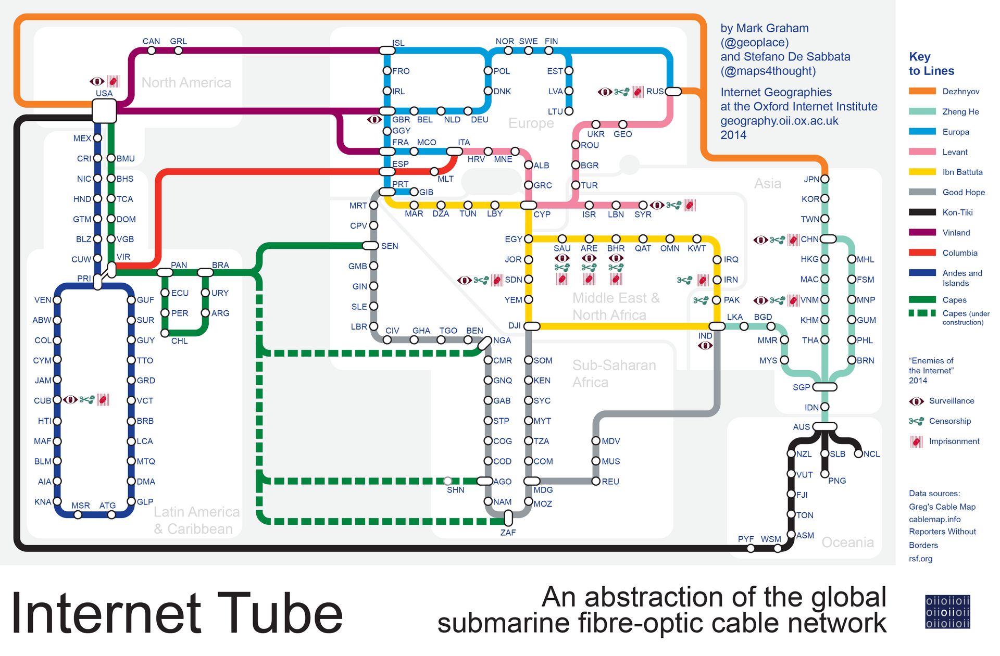

שוק התקשורת הישראלי, שנשלט שנים ארוכות בידי בזק, הוט, סלקום ופרטנר, עומד בפני מתחרה מסוג חדש: **סטארלינק בישראל**. השירות הלווייני של חברת ספייס אקס, בבעלות אילון מאסק, מאפשר גישה לאינטרנט מהיר בכל נקודה — גם ללא כבל, סיב אופטי או אנטנה סלולרית בקרבת מקום. השאלה כבר אינה אם השירות יגיע, אלא מתי, באיזה מחיר, ומי ייפגע ממנו.

## מה זה בעצם סטארלינק?

סטארלינק היא רשת של אלפי לוויינים קטנים המקיפים את כדור הארץ במסלול נמוך (כ-550 קילומטרים). בניגוד ללוויינים מסורתיים שמוצבים גבוה בהרבה, הקִרבה למשתמש מאפשרת השהיה (latency) נמוכה יחסית ומהירויות גלישה גבוהות. המשתמש מתקין צלחת קטנה שמתקשרת ישירות עם הלוויינים החולפים מעליו, ללא צורך בתשתית קרקעית.

היתרון המרכזי ברור: **כיסוי בכל מקום**. אזורים כפריים, ישובים מרוחקים, חוות חקלאיות, כלי שיט וזירות חירום — כולם יכולים לקבל חיבור אינטרנט איכותי גם היכן שחברות התקשורת המסורתיות מעולם לא הגיעו.

## סטארלינק בישראל: איפה זה עומד?

הכניסה של סטארלינק בישראל תלויה בשורה של אישורים רגולטוריים ממשרד התקשורת, וכן בשיקולים ביטחוניים ייחודיים למדינת ישראל. שירות המשדר ומקבל אותות בכל שטח המדינה מחייב תיאום מול גופי הביטחון, בין היתר סביב הקצאת תדרים ומניעת שיבושים.

במדינות רבות באירופה, בצפון אמריקה ובאפריקה השירות כבר פעיל ומונה מיליוני מנויים. בישראל, הלחצים לאישור גברו במיוחד לאחר אירועי החירום של השנים האחרונות, שבהם התברר עד כמה חיבור עצמאי לאינטרנט — שאינו תלוי בתשתית קרקעית שעלולה להיפגע — הוא נכס אסטרטגי.

### מי צפוי להרוויח מהשירות?

- **תושבי הפריפריה** ואזורים ללא תשתית סיבים אופטיים
- **המגזר החקלאי** הזקוק לחיבור בשטחים פתוחים
- **גופי חירום וביטחון** הזקוקים לרשת גיבוי עצמאית
- **עסקים מבודדים** וכלי שיט לאורך החופים

## כמה זה יעלה, ואיך זה מול המתחרים?

המודל העסקי של סטארלינק כולל בדרך כלל תשלום חד-פעמי משמעותי על ערכת הציוד (הצלחת והנתב), ולצידו מנוי חודשי קבוע. במרבית המדינות המחיר החודשי גבוה מחבילת סיבים אופטיים ביתית ממוצעת, מה שהופך אותו לפחות אטרקטיבי במרכזי הערים — אך למשתלם מאוד היכן שאין חלופה.

הטבלה הבאה ממחישה את ההבדלים העקרוניים בין האפיקים (הנתונים הם הערכות מגמה ואינם מחירון רשמי):

| פרמטר | סטארלינק | סיבים אופטיים | אינטרנט סלולרי |
|---|---|---|---|
| כיסוי גיאוגרפי | כמעט מלא | ערים ומרכזים | רחב אך משתנה |
| מהירות טיפוסית | גבוהה | גבוהה מאוד | בינונית-גבוהה |
| עלות ציוד ראשונית | גבוהה | נמוכה | נמוכה |
| מחיר חודשי | גבוה | בינוני | בינוני |
| תלות בתשתית קרקעית | אין | מלאה | חלקית |

## איך זה משפיע על בזק, הוט וסלקום?

בטווח הקצר, סטארלינק אינה מאיימת על נתח השוק העיקרי של חברות התקשורת במרכז הארץ, שם פרוסה תשתית סיבים אופטיים מהירה וזולה יחסית. עם זאת, בפריפריה ובאזורים מרוחקים — שם רווחיות פריסת הסיבים נמוכה — השירות הלווייני עלול לגזול לקוחות ולהאיץ תחרות.

ההשפעה העקיפה עשויה להיות משמעותית אף יותר: עצם קיומה של חלופה עצמאית מפעיל לחץ על החברות הוותיקות לשפר שירות, להוזיל מחירים ולהרחיב פריסה. עבור הצרכן הישראלי, זו לכאורה בשורה — יותר תחרות משמעה בדרך כלל מחירים נוחים יותר ואיכות שירות גבוהה יותר.

## הזירה הגלובלית: לא רק מאסק

חשוב לזכור שסטארלינק אינה השחקנית היחידה בזירת האינטרנט הלווייני. אמזון מקדמת את פרויקט קייפר (Kuiper) שאמור להתחרות ישירות, וגופים נוספים באירופה ובסין פועלים לשיגור מערכי לוויינים משלהם. התוצאה: תחרות עולמית שצפויה להוזיל מחירים ולשפר את השירות בשנים הקרובות.

עבור המשקיע הישראלי, המגמה מחדדת עד כמה תחום החלל המסחרי הופך למנוע צמיחה טכנולוגי מרכזי — ומגלמת הזדמנויות גם לחברות ישראליות בתחום התקשורת, האנטנות והרכיבים הלווייניים.

## שורה תחתונה

סטארלינק בישראל אינה תחליף גורף לתשתית הקיימת, אלא רובד משלים בעל ערך אסטרטגי — בעיקר בפריפריה, בחקלאות ובמצבי חירום. אם וכאשר יינתנו האישורים הרגולטוריים, השוק הישראלי יזכה בשחקן חדש ורב-עוצמה, שעשוי לחולל תזוזה במחירים ובאיכות השירות של כל חברות התקשורת הוותיקות.
