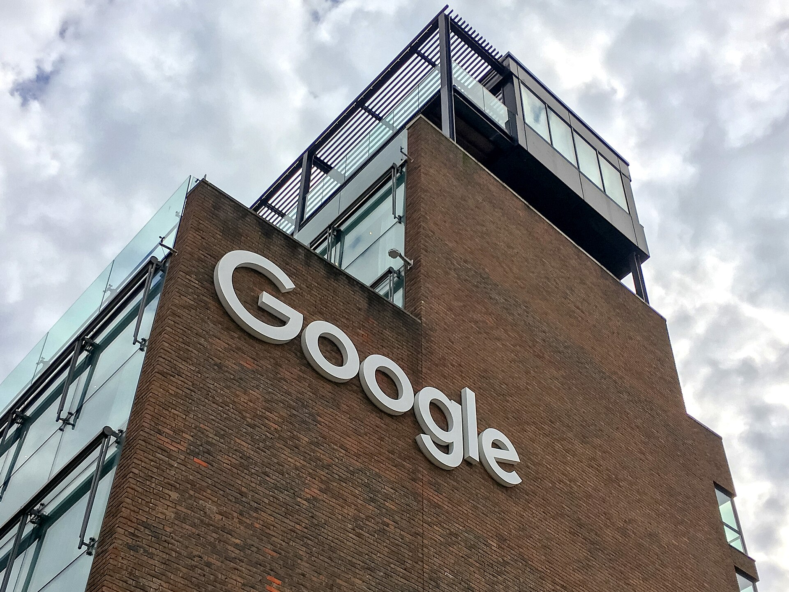

רכישת חברת הסייבר הישראלית **וויז** (Wiz) בידי ענקית הטכנולוגיה גוגל, בעסקה המוערכת בכ-32 מיליארד דולר, היא האקזיט הגדול בתולדות ההיי-טק הישראלי — ואירוע שמסמן קפיצת מדרגה של ממש עבור **הסייבר הישראלי**. מדובר בעסקה שממצבת מחדש את מקומה של ישראל כמעצמת אבטחת מידע עולמית, ומשגרת אות עידוד לכל האקוסיסטם המקומי בתקופה של אי-ודאות כלכלית.

## מהי וויז ומדוע גוגל משלמת סכום עתק?

וויז הוקמה בשנת 2020 בידי צוות יזמים ישראלי בראשות אסף רפפורט, שמכר בעבר את חברת אדאלום (Adallom) למיקרוסופט. החברה התמחתה באבטחת סביבות ענן — תחום שהפך קריטי ככל שארגונים מעבירים את התשתיות שלהם לפלטפורמות כמו אמזון, מיקרוסופט אז'ור וגוגל קלאוד.

בתוך שנים ספורות בלבד הפכה וויז לאחת מחברות התוכנה הצומחות מהר בהיסטוריה, עם הכנסות שנתיות חוזרות שנאמדו במאות מיליוני דולרים. הצמיחה המהירה הזו, לצד המומחיות הטכנולוגית והבסיס הרחב של לקוחות ארגוניים, הם שהצדיקו בעיני גוגל את התג הגבוה.

### מה גוגל מקבלת בעסקה?

עבור גוגל, הרכישה נועדה לחזק את חטיבת הענן שלה במאבק מול אמזון ומיקרוסופט. אבטחת ענן היא אחד השדות החמים בשוק המחשוב הארגוני, והטמעת הטכנולוגיה של וויז אמורה להעניק לגוגל קלאוד יתרון תחרותי ביכולת להגן על נכסי הלקוחות.

## למה זה חשוב לסייבר הישראלי כולו?

העסקה חורגת הרבה מעבר לסיפור של חברה אחת. ה**סייבר הישראלי** מהווה זה שנים את אחד מקטרי הצמיחה המרכזיים של ההיי-טק המקומי, וישראל מושכת נתח לא פרופורציונלי מהשקעות ההון סיכון העולמיות בתחום. אקזיט בסדר גודל כזה משפיע על כל השרשרת:

- **החזר הון למשקיעים** — קרנות ההון סיכון שהשקיעו בוויז רושמות תשואה חריגה, מה שמזין סבב השקעות חדש בחברות צעירות.
- **עושר חדש ליזמים ולעובדים** — מאות עובדים שמחזיקים אופציות הופכים לבעלי הון, וחלקם צפויים להקים חברות משלהם.
- **חיזוק המותג הישראלי** — עסקה כזו ממצבת את ישראל כיעד רכישה מועדף עבור ענקיות הטכנולוגיה.

## השוואה: אקזיטים בולטים בתחום הסייבר הישראלי

הטבלה שלהלן ממחישה כיצד עסקת וויז מתעלה על אקזיטים היסטוריים בענף (הנתונים הם הערכות מקובלות בשוק):

| חברה | רוכשת | היקף מוערך | תחום |
|------|--------|-------------|-------|
| וויז | גוגל | כ-32 מיליארד דולר | אבטחת ענן |
| מלאנוקס | אנבידיה | כ-7 מיליארד דולר | רשתות ותקשורת |
| סייברארק (הנפקה) | נאסד"ק | שווי של מיליארדים | ניהול הרשאות |
| אדאלום | מיקרוסופט | כ-320 מיליון דולר | אבטחת ענן |

## האם העסקה תעבור את הרגולטורים?

למרות ההתלהבות, השלמת העסקה אינה מובנת מאליה. רשויות ההגבלים העסקיים בארה"ב ובאירופה בחנו בשנים האחרונות בקפדנות רכישות ענק של חברות הטכנולוגיה הגדולות. גוגל, שנמצאת ממילא תחת עינה הבוחנת של הרגולציה, תצטרך להוכיח שהעסקה אינה פוגעת בתחרות בשוק הענן. תהליך האישור עשוי להימשך חודשים ארוכים.

## מה המשמעות לבורסה בתל אביב ולמשקיע הישראלי?

רוב הפעילות של וויז מתנהלת מחוץ למסחר הציבורי, כך שהמשקיע הפרטי בבורסה בתל אביב אינו נחשף אליה ישירות. עם זאת, ההשלכות העקיפות משמעותיות: גל של הון חוזר לאקוסיסטם עשוי לתמוך בחברות היי-טק ישראליות נסחרות, ולחזק את האמון של משקיעים זרים בשוק המקומי. בנוסף, כניסת דולרים בהיקף כזה עשויה להשפיע גם על שער הדולר-שקל בטווח הבינוני.

בשורה התחתונה, עסקת וויז-גוגל היא נקודת ציון היסטורית עבור ה**סייבר הישראלי**. היא מוכיחה שגם בתקופה מאתגרת, החדשנות הישראלית מסוגלת להוליד חברות ברמה עולמית — ולמשוך את הכיסים העמוקים ביותר בעמק הסיליקון.
