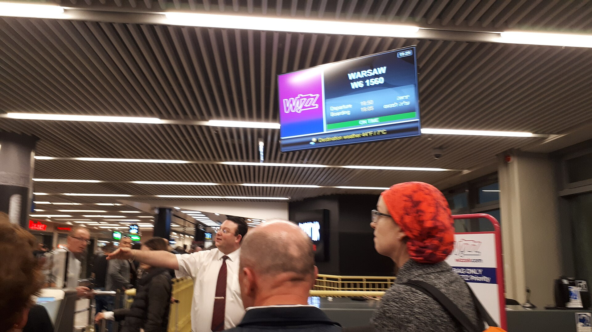

מחירי הטיסות לחו"ל מישראל נותרו גבוהים באופן ניכר ביחס לשנים שלפני המגפה, וזאת למרות פתיחת השמיים מחדש וחזרתן ההדרגתית של חברות תעופה זרות לנמל התעופה בן-גוריון. הסיבות המרכזיות הן ביקוש ער לצד היצע מטוסים מוגבל, עלויות דלק ותפעול גבוהות, ותקופות של צמצום פעילות מצד מובילות זרות. עבור המשפחה הישראלית הממוצעת, המשמעות היא שחופשה בחו"ל הפכה להוצאה כבדה משהיתה.

## מדוע מחירי הטיסות עדיין גבוהים?

כמה גורמים מרכזיים דוחפים את מחירי הטיסות כלפי מעלה. ראשית, הביקוש של הישראלים לטוס נותר גבוה מאוד, בעוד ההיצע — כלומר מספר המושבים הזמינים בשוק — עדיין לא חזר במלואו לרמות של פעם. שנית, עלויות התפעול של חברות התעופה, ובראשן מחירי הדלק וההוצאות הביטחוניות, נותרו גבוהות ומגולגלות אל הנוסע.

גורם נוסף הוא רמת התחרות. בתקופות שבהן חברות זרות צמצמו את פעילותן בקו לישראל, נותרה **אל על** דומיננטית בחלק מהיעדים, מה שאיפשר תמחור גבוה יותר. ככל שחברות כמו לופטהנזה, וויז אייר, ריינאייר ואחרות מרחיבות חזרה את הפעילות, כך גוברת התחרות והלחץ להורדת מחירים בקווים פופולריים.

## מתי הכי משתלם להזמין טיסה?

הטעות הנפוצה של צרכנים היא הזמנה ברגע האחרון או, לחלופין, מוקדם מדי. עבור רוב היעדים באירופה, חלון ההזמנה המשתלם נע סביב 6 עד 10 שבועות לפני מועד הטיסה. ליעדים רחוקים יותר, כמו צפון אמריקה או המזרח הרחוק, כדאי להקדים ולהזמין מספר חודשים מראש.

גמישות בתאריכים היא המנוף המשמעותי ביותר לחיסכון. טיסה באמצע השבוע זולה לרוב מטיסה בסופי שבוע, וטיסה מחוץ לחגים ולחופשות בתי הספר יכולה להוזיל את הכרטיס בעשרות אחוזים. שימוש בכלי השוואת מחירים וב"התראות מחיר" מאפשר לזהות ירידות מחיר בזמן אמת.

### לואו-קוסט מול חברות מסורתיות

כרטיס זול בחברת תעופה נמוכת-עלות אינו תמיד עסקה משתלמת. התוספות — מזוודה, בחירת מושב, מזון וכבודת יד גדולה — עלולות להכפיל את המחיר הבסיסי. חשוב לחשב את **העלות הכוללת** של הטיסה, ולא רק את מחיר הכרטיס המפרסם.

## טבלת השוואה: סוגי כרטיסים וחיסכון

| פרמטר | חברה מסורתית | לואו-קוסט |
|---|---|---|
| מחיר בסיס | גבוה יותר | נמוך מאוד |
| מזוודה נלווית | לרוב כלולה | בתשלום נפרד |
| בחירת מושב | לרוב כלולה | בתשלום נפרד |
| גמישות בשינויים | גבוהה יותר | נמוכה |
| התאמה לטיסה קצרה | בינונית | גבוהה |

## כיצד חוסכים מאות שקלים לנוסע?

מעבר לתזמון ההזמנה, ישנם כמה כלים פרקטיים להוזלת מחירי הטיסות:

- **גמישות ביעד ובשדה התעופה**: לעיתים טיסה לשדה משני באותה מדינה זולה משמעותית.
- **פירוק המסלול**: הזמנת טיסת קונקשן בנפרד עשויה להוזיל, אך מגבירה סיכון בעיכובים.
- **ניצול נקודות ומועדוני נוסע מתמיד**: צבירת נקודות בכרטיסי אשראי ובמועדונים יכולה לממן חלק מהכרטיס.
- **השוואת מחירים בין מטבעות ואתרים**: לעיתים אותה טיסה מתומחרת שונה באתרים שונים.
- **הימנעות מתוספות מיותרות**: אריזה חכמה שמסתפקת בכבודת יד חוסכת עשרות עד מאות שקלים.

מומחי צרכנות ממליצים גם לבדוק את מדיניות הביטול והשינוי לפני הרכישה. כרטיס זול שאינו ניתן לשינוי עלול להפוך ליקר מאוד אם התוכניות משתנות.

## מה צפוי בהמשך?

ההערכה בענף היא שהמשך חזרתן של חברות התעופה הזרות והרחבת מספר הקווים יגבירו את התחרות ויתרמו למיתון מחירי הטיסות בקווים מסוימים, בעיקר לאירופה. עם זאת, כל עוד הביקוש הישראלי נותר חזק ועלויות התפעול גבוהות, לא צפויה חזרה מהירה למחירים של העשור הקודם. עבור הצרכן, המסקנה ברורה: תכנון מוקדם, גמישות והשוואה שיטתית הם המפתח לחופשה משתלמת.
