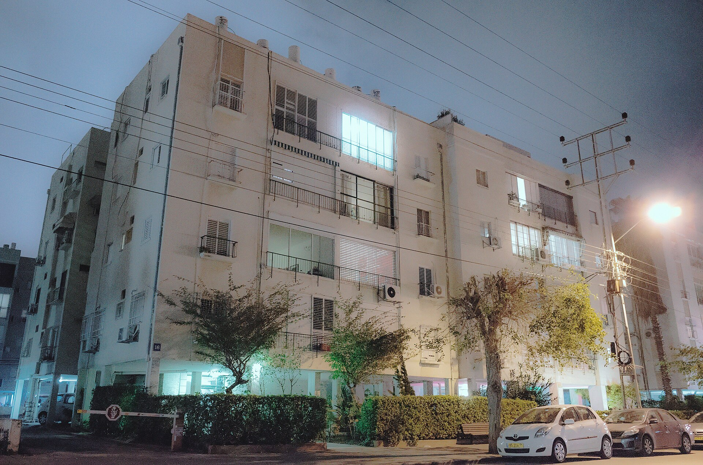

שכר הדירה בישראל ממשיך לטפס, וההערכות בשוק מצביעות על עליות דו-ספרתיות בחלק מאזורי הביקוש בשנה החולפת. הצירוף של מחסור מתמשך בהיצע דירות חדשות, ריבית גבוהה שמרתיעה רוכשים פוטנציאליים, ותנועת אוכלוסייה אל מרכזי התעסוקה — יצר לחץ מתמשך על שוק השכירות והפך אותו לאחד הנושאים הצרכניים הבוערים ביותר עבור משקי הבית הישראליים.

## מדוע שכר הדירה עולה?

הגורם המרכזי לעליית שכר הדירה הוא פער מתמשך בין היצע לביקוש. קצב התחלות הבנייה נותר נמוך ביחס לצורכי האוכלוסייה, בין היתר בשל מחסור בעובדים בענף הבנייה, התייקרות עלויות התשומות וההאטה שנגרמה מהמלחמה. במקביל, הריבית הגבוהה של בנק ישראל ייקרה משמעותית את המשכנתאות, ודחפה זוגות צעירים ומשפחות רבות לוותר על רכישה — ולהישאר בשוק השכירות לתקופה ארוכה יותר.

התוצאה: יותר שוכרים מתחרים על אותו מלאי דירות מוגבל, מה שמעניק ליד העליונה לבעלי הנכסים ומאפשר להם להעלות מחירים.

### הקשר בין מחירי הרכישה לשכירות

כאשר מחירי הדירות למכירה מזנקים, גדל מספר משקי הבית שנאלצים להישאר בשכירות. הביקוש המוגבר הזה מתגלגל ישירות אל שכר הדירה. בנוסף, משקיעי נדל"ן שרכשו דירות בריבית גבוהה מגלגלים חלק מעלויות המימון אל השוכרים, בדמות דמי שכירות גבוהים יותר.

## אילו ערים מובילות את ההתייקרות?

אזורי הביקוש הגדולים — גוש דן, השרון ומרכזי תעסוקה נוספים — מובילים את עליות שכר הדירה. עם זאת, גם ערים פריפריאליות שנהנות מהגירה פנימית או מקרבה לצירי תחבורה מהירים רשמו עליות ניכרות. הטבלה הבאה ממחישה מגמות כלליות בשוק (הערכות, לא נתונים רשמיים):

| אזור | מגמת שכר דירה בשנה החולפת | גורם מוביל |
|---|---|---|
| תל אביב והמרכז | עלייה חדה | ביקוש גבוה, היצע נמוך |
| השרון | עלייה בינונית-גבוהה | קרבה לתעסוקה |
| ירושלים | עלייה מתונה | ביקוש יציב |
| חיפה והצפון | עלייה מתונה | הגירה ומחירים נמוכים יחסית |
| הדרום | עלייה משתנה | השפעות ביטחוניות ותנועת אוכלוסייה |

## מה אומרים הנתונים הרשמיים?

מדד מחירי הדירות ומדד שכר הדירה של הלשכה המרכזית לסטטיסטיקה מצביעים על מגמת התייקרות עקבית. רכיב הדיור מהווה נתח משמעותי ממדד המחירים לצרכן, ולכן עליות שכר הדירה תורמות ישירות לאינפלציה — נתון שבנק ישראל עוקב אחריו מקרוב בבואו לקבוע את הריבית.

כל עוד הריבית נשארת גבוהה, סביר שהלחץ על שוק השכירות יימשך: פחות רוכשים, יותר שוכרים, והיצע שמתקשה להדביק את הביקוש.

## כיצד השוכרים יכולים להתמודד?

למרות שהמגמה הרחבה אינה בשליטת הדייר הבודד, קיימים כמה צעדים מעשיים שיכולים לצמצם את הנטל:

- **חוזים ארוכי טווח:** חוזה לשנתיים או שלוש עם מנגנון הצמדה מוגדר מראש מקטין את אי-הוודאות ומגן מפני קפיצות מחיר חדות.
- **גמישות גיאוגרפית:** בחינת שכונות סמוכות או ערים מרוחקות מעט ממוקד הביקוש עשויה לחסוך אלפי שקלים בשנה.
- **שותפות בדיור:** מגורים משותפים או יחידות דיור קטנות יותר מפזרים את העלות.
- **מיקוח מושכל:** בחלק מהאזורים, בעיקר בתקופות מעבר, לבעלי הנכסים יש אינטרס לשמר דייר טוב במקום להתמודד עם תקופת ריק.

## מה צופן העתיד לשוק השכירות?

התמונה קדימה תלויה בעיקר בשני משתנים: קצב התחדשות ההיצע ומסלול הריבית. אם בנק ישראל יתחיל להוריד ריבית, חלק מהשוכרים יחזרו לשוק הרכישה — מה שעשוי להקל מעט על הביקוש לשכירות. מנגד, כל עוד הבנייה נותרת מאחור, המחסור המבני יישאר. 

מהלכים ממשלתיים כמו עידוד דיור להשכרה ארוכת טווח ("דירה להשכיר") נועדו להגדיל את ההיצע המוסדי, אך השפעתם על השוק כולו עדיין מוגבלת. בשורה התחתונה, שכר הדירה צפוי להישאר נושא מרכזי באג'נדה הכלכלית של משקי הבית הישראליים בשנים הקרובות.
