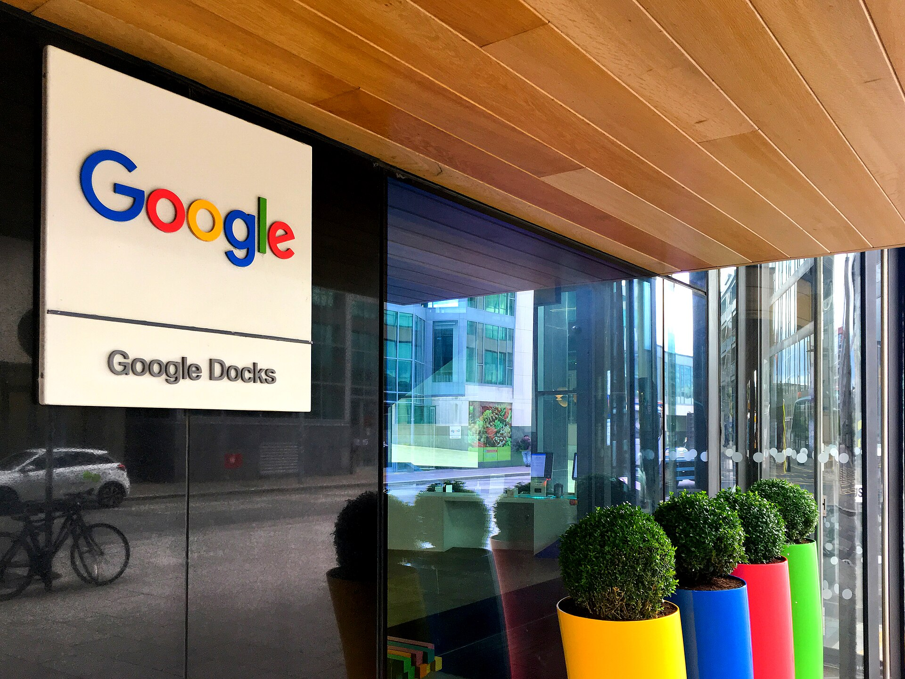

רכישת חברת הסייבר הישראלית **וויז (Wiz)** בידי ענקית הטכנולוגיה **גוגל**, בעסקה שהוערכה בכ-32 מיליארד דולר, היא האקזיט הגדול בתולדות ההייטק הישראלי. **עסקת וויז** אינה רק שיא כספי — היא מסמנת את הבשלתו של ענף הסייבר הישראלי לכדי עוגן מרכזי בכלכלה, ומאותתת שהמשקיעים הגלובליים ממשיכים להמר על החדשנות הביטחונית-דיגיטלית שמגיעה מישראל.

## מה כוללת עסקת וויז ומדוע היא כה חריגה?

וויז הוקמה ב-2020 בידי צוות של יזמים ישראלים, בהם ותיקי חברת אדאלום שנמכרה בעבר למיקרוסופט. החברה פיתחה פלטפורמה לאבטחת סביבות ענן, שמאפשרת לארגונים לזהות פרצות וסיכונים במערכות המחשוב שלהם בענן. תוך זמן קצר יחסית הפכה וויז לאחת מחברות התוכנה שצמחו במהירות הגבוהה ביותר בהיסטוריה, עם הכנסות שנתיות חוזרות שנאמדות במאות מיליוני דולרים.

החריגות של **עסקת וויז** נובעת משלושה גורמים: הסכום העצום, מהירות הצמיחה של החברה, והעובדה שההנהלה בחרה בעבר לדחות הצעות רכישה מוקדמות — כולל הצעה נמוכה יותר מגוגל עצמה — כדי להמשיך ולבנות עצמאות. בסופו של דבר, ההצעה המשופרת שיקפה את ההערכה שוויז יכולה להפוך לזרוע הסייבר המרכזית של גוגל קלאוד מול מיקרוסופט ואמזון.

## למה הסייבר הפך לכתר של ההייטק הישראלי?

ענף הסייבר הישראלי נהנה משילוב ייחודי של הון אנושי — בוגרי יחידות טכנולוגיות בצה"ל — לצד מערכת אקדמית חזקה ואקוסיסטם בוגר של קרנות הון סיכון. הסייבר מהווה נתח מהותי מיצוא שירותי ההייטק של ישראל, ומושך חלק ניכר מהשקעות ההון סיכון במדינה.

המשמעות רחבה מעבר לוויז עצמה. אקזיט בסדר גודל כזה מזרים הון חזרה למערכת: מייסדים ועובדים הופכים למשקיעים ויזמים חדשים, וקרנות שרשמו תשואה גבוהה מגייסות כספים נוספים. כך נוצר מעגל שמזין את גל הסטארטאפים הבא.

## איך משתווה עסקת וויז לאקזיטים הישראליים הגדולים?

הטבלה הבאה ממקמת את עסקת וויז מול חלק מהעסקאות הבולטות בתולדות ההייטק הישראלי (הנתונים מעוגלים ומייצגים הערכות שוק מקובלות):

| חברה | רוכשת | היקף מוערך (מיליארד דולר) | תחום |
|------|--------|--------------------------|------|
| וויז | גוגל | כ-32 | אבטחת ענן |
| מובילאיי | אינטל | כ-15 | ראייה ממוחשבת לרכב |
| אנוביס (הצעה) | סאפ / אחרות | משתנה | תוכנה |
| אדאלום | מיקרוסופט | כ-0.3 | אבטחת ענן |

ההשוואה ממחישה קפיצת מדרגה: בעוד אקזיטים גדולים בעבר נעו סביב מיליארדים בודדים עד כ-15 מיליארד דולר, עסקת וויז הכפילה כמעט את הרף העליון.

## מה המשמעות למשקיעים ולבורסה בתל אביב?

חשוב להבהיר: וויז היא חברה פרטית, כך שהמשקיע הישראלי מהרחוב אינו נהנה ישירות מהעסקה דרך **הבורסה בתל אביב**. עם זאת, לעסקה השפעות עקיפות משמעותיות:

- **חיזוק המותג הלאומי:** אקזיט ענק מגביר את האמון של משקיעים זרים בהייטק הישראלי בכללותו.
- **הזרמת מזומנים לכלכלה:** תקבולים למייסדים ולעובדים עשויים לזלוג לצריכה, לנדל"ן ולהשקעות מקומיות.
- **הכנסות מס:** אקזיטים גדולים מייצרים גביית מס רווחי הון משמעותית למדינה.

עבור מי שרוצה חשיפה לענף, האלטרנטיבות בבורסה כוללות חברות סייבר וטכנולוגיה נסחרות, או קרנות סל העוקבות אחר מדדי טכנולוגיה גלובליים כמו נאסד"ק.

## האם זו הבשורה שההייטק הישראלי חיכה לה?

השנתיים האחרונות היו מאתגרות לענף ההייטק — האטה בגיוסים, פיטורים וירידה בהשקעות ההון סיכון. עסקת וויז מגיעה כזריקת עידוד: היא מוכיחה שחברות ישראליות עדיין מסוגלות להגיע לפסגה העולמית, ושהתיאבון של הענקיות לרכישות טכנולוגיות ישראליות נותר גבוה.

עם זאת, יש גם קול זהיר. חלק מהמומחים מזהירים מפני "תלות באקזיטים" — כלומר, נטייה של יזמים למכור מוקדם במקום לבנות חברות ענק עצמאיות שיישארו בישראל לטווח ארוך ויעסיקו אלפי עובדים. השאלה האמיתית היא האם הדור הבא של היזמים, שיצמח מהעסקה הזו, יבחר לבנות את גוגל או האנבידיה הישראלית הבאה — או שימכור שוב.

כך או כך, עסקת וויז כבר נחקקה בהיסטוריה של ההייטק הישראלי כרגע מכונן, שממחיש עד כמה החדשנות הישראלית בתחום הסייבר הפכה לנכס אסטרטגי בזירה הגלובלית.
