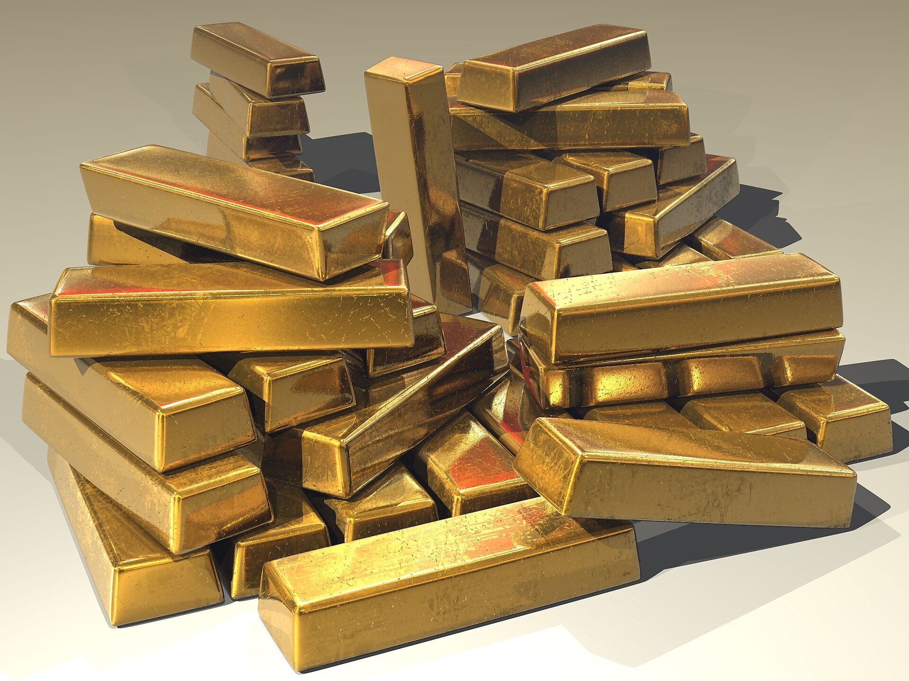

מחיר הזהב שבר בשנה החולפת שיאים היסטוריים וחזר למרכז תשומת הלב של המשקיעים בעולם ובישראל. אחרי שנים שבהן נחשב אפיק "משעמם", המתכת הצהובה הפכה לאחד הנכסים החמים בשווקים — כשהעליות נתמכות בשילוב נדיר של הורדות ריבית צפויות, מתחים גיאופוליטיים וביקושים חסרי תקדים מצד בנקים מרכזיים. השאלה שמעסיקה כעת משקיעים רבים היא האם עדיין כדאי להיכנס, או שהראלי כבר מיצה את עצמו.

## מדוע מחיר הזהב מזנק דווקא עכשיו?

הזהב נחשב מזה דורות ל"נכס מקלט" (Safe Haven) — נכס שאליו נוהרים משקיעים בעיתות אי-ודאות. כמה כוחות פועלים כיום בו-זמנית ומזינים את העליות:

- **מדיניות הריבית**: כאשר הבנק המרכזי האמריקאי (הפדרל ריזרב) מאותת על מגמת הורדות ריבית, נחלשת האטרקטיביות של אפיקים סולידיים נושאי תשואה כמו פיקדונות ואיגרות חוב. הזהב, שאינו מניב ריבית, נעשה יחסית מושך יותר.
- **רכישות בנקים מרכזיים**: בשנים האחרונות מגדילים בנקים מרכזיים ברחבי העולם, ובראשם במדינות מתפתחות, את מלאי הזהב שלהם — כחלק ממגמת פיזור סיכונים והפחתת התלות בדולר האמריקאי.
- **אי-ודאות גיאופוליטית**: מלחמות, מתיחות מסחרית בין המעצמות וחששות אינפלציוניים מגבירים את הביקוש לנכס שנתפס כשומר ערך לטווח ארוך.
- **היחלשות אמון בכסף "נייר"**: בסביבה של גירעונות תקציביים גדולים וחוב ממשלתי מתנפח, חלק מהמשקיעים רואים בזהב הגנה מפני שחיקת ערך המטבעות.

## כיצד משקיע ישראלי נחשף לזהב?

בניגוד לתפיסה הרווחת, אין צורך לקנות מטבעות או מטילים פיזיים כדי ליהנות מעליית מחיר הזהב. לרוב המשקיעים הפרטיים בישראל קיימות כמה דרכים נגישות:

### 1. קרנות סל (ETF) על זהב
הדרך הפופולרית ביותר. קרנות סל העוקבות אחר מחיר הזהב נסחרות בבורסות בעולם, וניתן לרכוש אותן דרך חשבון מסחר בבנק או בבית השקעות. היתרון: נזילות גבוהה, עלויות נמוכות יחסית ואין צורך באחסון פיזי.

### 2. מניות של חברות כרייה
השקעה במניות של חברות המפיקות זהב מספקת חשיפה ממונפת למחיר המתכת, אך מוסיפה סיכון עסקי-תפעולי של החברה הספציפית.

### 3. זהב פיזי
מטילים ומטבעות. מתאים למי שמחפש החזקה מוחשית, אך כרוך בעלויות אחסון, ביטוח ופערי קנייה-מכירה גבוהים.

## זהב מול מניות: השוואת אפיקים

כדי להבין את מקומו של הזהב בתיק ההשקעות, כדאי להשוות אותו לאפיקים המרכזיים המוכרים למשקיע הישראלי:

| פרמטר | זהב | מניות (ת"א 35 / נאסד"ק) | אג"ח ממשלתי |
|---|---|---|---|
| תשואה שוטפת | אין (לא מחלק ריבית/דיבידנד) | דיבידנדים אפשריים | ריבית קבועה |
| רגישות לאינפלציה | הגנה טובה יחסית | תלוי בענף | פגיעות גבוהה |
| תנודתיות | בינונית-גבוהה | גבוהה | נמוכה |
| התנהגות במשבר | לרוב עולה (מקלט) | לרוב יורדת | יציב יחסית |
| נזילות | גבוהה (בקרנות סל) | גבוהה | גבוהה |

## האם מאוחר מדי להצטרף לראלי?

זו שאלת המיליון. מצד אחד, המנועים שהניעו את העליות — הורדות ריבית וביקושי בנקים מרכזיים — עדיין בעינם, וחלק מהאנליסטים מעריכים שהמגמה עשויה להימשך. מצד שני, לאחר זינוק חד, הסיכון לתיקון מטה גובר, והיסטורית הזהב ידע תקופות ארוכות של דשדוש ואף ירידות.

חשוב לזכור שני עקרונות מרכזיים:

1. **הזהב אינו מייצר הכנסה שוטפת**. הרווח היחיד ממנו הוא עליית מחיר. משכך, אין לו "רצפה" כלכלית ברורה כמו למניה מחלקת דיבידנד או לאיגרת חוב.
2. **תזמון שוק הוא משימה קשה**. במקום לנסות "לתפוס את התחתית", גישה מקובלת היא הקצאת רכיב מוגבל מהתיק לזהב (לרוב מדובר בשיעור חד-ספרתי) כרכיב מגוון להקטנת התנודתיות הכוללת.

## שורה תחתונה למשקיע

מחיר הזהב בשיא משקף חששות עמוקים בשווקים לצד ציפיות למדיניות מוניטרית מקלה. עבור המשקיע הישראלי, הזהב יכול לשמש ככרית ביטחון ומרכיב פיזור בתיק — אך לא כתחליף לאפיקים היצרניים. מי ששוקל להיכנס כעת צריך לעשות זאת בעיניים פקוחות, מתוך הבנה שמדובר בנכס תנודתי, ותוך התאמה לפרופיל הסיכון וליעדים האישיים. כמו בכל השקעה, פיזור ומשמעת ארוכת-טווח עדיפים על רדיפה אחר טרנד חם.
