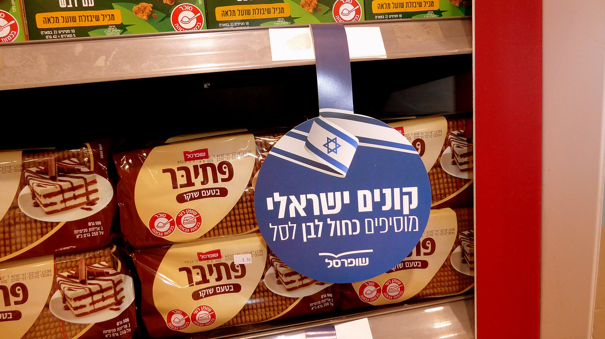

המותג הפרטי הפך בשנים האחרונות לאחד הכלים המרכזיים של הצרכן הישראלי בהתמודדות עם יוקר המחיה וגל ההתייקרויות בסל הקניות. מדובר במוצרים שרשתות המזון משווקות תחת המותג שלהן עצמן — לרוב במחיר נמוך בעשרות אחוזים מהמותגים המובילים — והנתח שלהם בעגלת הקניות הממוצעת נמצא במגמת עלייה עקבית. במילים אחרות: יותר ויותר ישראלים מגלים שהמוצר הזול על המדף אינו בהכרח נחות באיכותו.

## מהו מותג פרטי ולמה הוא זול יותר?

מותג פרטי (Private Label) הוא מוצר שמיוצר עבור רשת קמעונאית ונושא את שמה המסחרי, במקום את שם היצרן. הרשתות — ובהן שופרסל, רמי לוי, יוחננוף, טיב טעם, ויקטורי ומחסני השוק — מזמינות את הייצור ממפעלים קיימים ומוכרות את התוצר ישירות לצרכן.

המחיר הנמוך נובע ממספר גורמים: חיסכון עצום בהוצאות שיווק ופרסום, ויתור על מרווח הרווח של המותג המוביל, וכוח קנייה גדול של הרשתות המאפשר להן להוריד עלויות ייצור. התוצאה היא פער מחירים שיכול לנוע בין כ-20% ל-40% לעומת המוצר המקביל של המותג המוכר.

## כמה באמת חוסכים בסל הקניות?

החיסכון תלוי מאוד בסוג המוצר. במוצרי יסוד בסיסיים — כמו קמח, סוכר, אורז, שימורים, נייר טואלט וחומרי ניקוי — הפער בין המותג הפרטי למותג המוביל הוא לרוב הגדול ביותר, ולעיתים המחיר נמוך כמעט בחצי. לעומת זאת, במוצרים בעלי מרכיב מיתוגי חזק או מתכון ייחודי, החיסכון קטן יותר.

הטבלה הבאה ממחישה את הפערים האופייניים בין הקטגוריות (הערכות מגמה, לא מחירים מדויקים):

| קטגוריית מוצר | פער מחיר אופייני | רמת החיסכון |
|---|---|---|
| מוצרי יסוד (קמח, סוכר, אורז) | 30%-45% | גבוהה מאוד |
| חומרי ניקוי ונייר | 25%-40% | גבוהה |
| מוצרי חלב בסיסיים | 15%-30% | בינונית-גבוהה |
| חטיפים ומשקאות | 15%-25% | בינונית |
| מוצרים ממותגים ייחודיים | 5%-15% | נמוכה |

עבור משפחה ישראלית ממוצעת, מעבר חלקי למותג פרטי בקטגוריות המתאימות יכול להסתכם בחיסכון של מאות שקלים בחודש — סכום משמעותי בתקופה שבה מחירי המזון ממשיכים לעלות.

## האם האיכות באמת נמוכה יותר?

זו התפיסה הרווחת, אך היא לא תמיד מדויקת. חלק ניכר מהמותגים הפרטיים מיוצרים באותם מפעלים שבהם מיוצרים המותגים המובילים, ולעיתים על אותו פס ייצור ממש. במקרים כאלה ההבדל העיקרי הוא באריזה ובמיתוג — לא בתוכן.

עם זאת, אין להכליל. במוצרים מסוימים קיים פער ברור בטעם, במרקם או באיכות חומרי הגלם, במיוחד כשמדובר במתכון סודי של מותג ותיק. ההמלצה הצרכנית הפרקטית: לבדוק מוצר-מוצר, ולא להניח מראש שהזול נחות או שהיקר בהכרח שווה את מחירו.

### מה מרוויחות הרשתות?

עבור הרשתות, המותג הפרטי הוא הרבה מעבר לכלי לגיוס לקוחות רגישי מחיר. הוא מגדיל את שולי הרווח, מחזק את נאמנות הלקוחות — שכן המוצר זמין רק אצלן — ומעניק להן כוח מיקוח מול היצרנים הגדולים. זו הסיבה שרשתות מרחיבות בהתמדה את המגוון, ממאות מוצרים בסיסיים ועד קווי פרימיום שלמים.

## המגמה מתרחבת: לאן זה הולך?

בשוק המזון הישראלי, נתח המותגים הפרטיים עדיין נמוך מזה שבמדינות מערב אירופה, שם הוא מגיע במקרים מסוימים לשליש ויותר מסך המכירות. הפער הזה מסמן פוטנציאל צמיחה משמעותי, במיוחד ככל שהמודעות הצרכנית לחיסכון גוברת ורגישות המחיר עולה.

המהלך הזה אינו נטול השלכות רחבות: התחזקות המותגים הפרטיים מגבירה את התחרות מול היצרנים הגדולים, לוחצת מחירים כלפי מטה ומשנה את מאזן הכוחות בין הרשתות לספקים. עבור הצרכן, המשמעות היא בעיקר חדשות טובות — יותר אפשרויות, ומחירים תחרותיים יותר על המדף.
