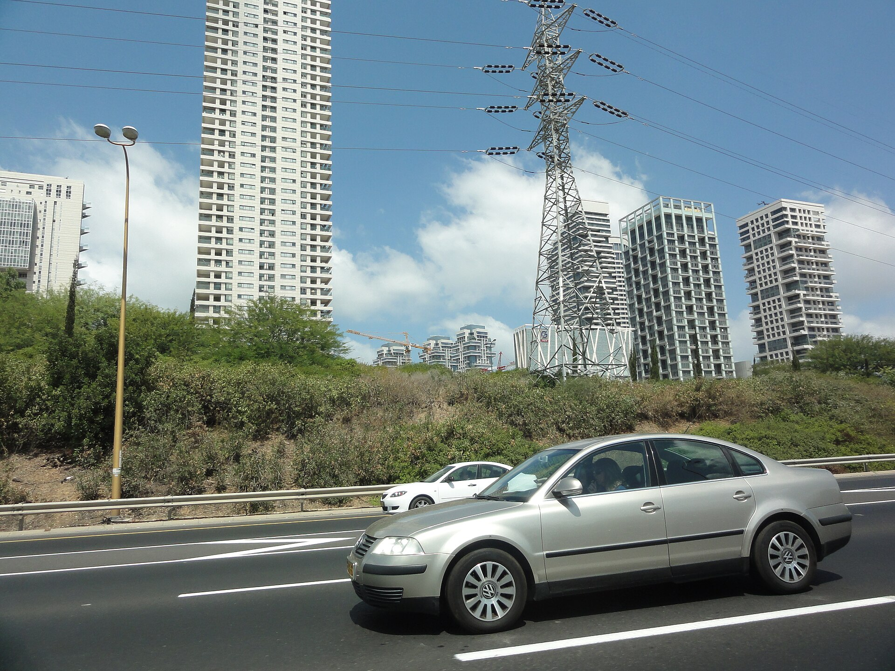

תעריף החשמל בישראל ממשיך לטפס, ומשקי הבית חשים זאת ישירות בחשבון הדו-חודשי. העלייה נובעת בעיקר מהתייקרות מרכיב הייצור, מחירי הדלקים בשוק העולמי והשקעות נרחבות בשדרוג רשת ההולכה והחלוקה. לצרכן הישראלי הממוצע המשמעות היא הוצאה שנתית גבוהה יותר על אנרגיה — אך בניגוד למחירי המזון או הדלק, כאן יש מרחב פעולה אמיתי לחיסכון.

רשות החשמל מעדכנת את התעריף מעת לעת בהתאם לעלויות הייצור, וחברת החשמל גובה אותו מכלל הצרכנים. מאז פתיחת שוק החשמל לתחרות נכנסו לתמונה ספקים פרטיים, המציעים מסלולי הנחה שמשנים את כללי המשחק עבור הצרכן המודע.

## מדוע תעריף החשמל מתייקר?

מחיר החשמל מורכב ממספר רכיבים: עלות הייצור, ההולכה, החלוקה ושירותי המערכת. המרכיב המשמעותי ביותר הוא הייצור, התלוי במחירי הגז הטבעי והפחם. כאשר מחירי האנרגיה בעולם עולים, או כאשר השקל נחלש מול הדולר, עלויות הייצור מתייקרות ומגולגלות לצרכן.

גורם נוסף הוא גל ההשקעות בתשתיות. ישראל נמצאת בעיצומו של מעבר לאנרגיות מתחדשות ולהרחבת רשת החשמל, כדי לעמוד בביקוש הגובר — בין היתר בשל ריבוי הרכבים החשמליים ומרכזי הנתונים הצומחים בענף ההיי-טק. השקעות אלה חיוניות, אך הן מגולגלות בחלקן אל התעריף.

## כמה באמת עולה החשמל למשק בית?

משק בית ישראלי ממוצע צורך כמות משמעותית של חשמל, במיוחד בחודשי הקיץ והחורף שבהם המזגנים פועלים ברציפות. ההוצאה החודשית נעה לרוב בין כמה מאות שקלים, כאשר הצרכנים הגדולים ביותר בבית הם המזגן, דוד החימום החשמלי, המקרר והמייבש.

הבנה של פילוח הצריכה היא הצעד הראשון לחיסכון. לפניכם השוואה כללית של צרכני החשמל העיקריים בבית:

| מכשיר | נתח מהצריכה הביתית | פוטנציאל חיסכון |
|---|---|---|
| מזגן | גבוה מאוד | הגדרת טמפרטורה חכמה, תחזוקה |
| דוד חימום חשמלי | גבוה | שעון שבת, דוד שמש |
| מקרר ומקפיא | בינוני-גבוה | דירוג אנרגטי יעיל |
| מייבש כביסה | בינוני | ייבוש בחבל, שימוש ממוקד |
| תאורה ומכשירים בכוננות | נמוך-בינוני | נורות לד, ניתוק מהחשמל |

## איך לחתוך את חשבון החשמל?

הדרך המהירה ביותר להוזלה אינה דורשת ויתור על נוחות, אלא בחירה נכונה. הנה הצעדים המרכזיים:

- **מעבר לספק חשמל פרטי:** בעקבות רפורמת פתיחת השוק לתחרות, ספקים פרטיים מציעים מסלולי הנחה של בין 5% ל-15% על מרכיב הייצור. המעבר מתבצע באופן דיגיטלי ואינו כרוך בהחלפת תשתיות.
- **ניצול מסלולי שעות:** חלק מהמסלולים מציעים הנחה משמעותית בשעות הלילה או בסופי שבוע — יתרון למי שמפעיל מכונת כביסה, דוד או טעינת רכב חשמלי בשעות אלה.
- **ייעול המזגן:** הגדרת טמפרטורה של כ-24 מעלות בקיץ, ניקוי מסננים וסגירת חלונות חוסכים אחוזים ניכרים מהצריכה.
- **דוד שמש ושעון שבת:** חימום מים הוא מהצרכנים הגדולים. שימוש בדוד שמש והגבלת זמני ההפעלה של הדוד החשמלי חוסכים מאות שקלים בשנה.
- **מעבר למכשירים בדירוג אנרגטי גבוה:** מקרר או מזגן בדירוג יעיל צורכים פחות באופן ניכר לאורך זמן.

## האם כדאי להתקין פאנלים סולאריים?

יותר ויותר משקי בית בישראל פונים להתקנת מערכות סולאריות ביתיות, המאפשרות לייצר חשמל עצמאית ולמכור עודפים לרשת. ככל שתעריף החשמל עולה, ההחזר על ההשקעה בפאנלים מתקצר. עבור בעלי בתים פרטיים או דירות עם גג פרטי, זהו פתרון לטווח ארוך שמקבע את עלות החשמל ומגן מפני התייקרויות עתידיות.

עם זאת, ההשקעה הראשונית אינה זניחה, וכדאי לבחון היטב את התנאים הכלכליים, גודל הגג וזמן ההחזר הצפוי לפני קבלת החלטה.

## שורה תחתונה לצרכן

תעריף החשמל צפוי להמשיך ולהתעדכן בהתאם למחירי האנרגיה העולמיים ולהשקעות בתשתיות. בניגוד למוצרים אחרים בסל הצריכה, כאן הצרכן אינו פסיבי: בחירת ספק נכון, שינוי הרגלים פשוט ובחינת פתרונות סולאריים יכולים להסתכם בחיסכון של מאות עד אלפי שקלים בשנה. בעידן שבו כל רכיב בסל הקניות מתייקר, חשבון החשמל הוא אחד המקומות הבודדים שבהם עדיין אפשר להשתלט על ההוצאה.
