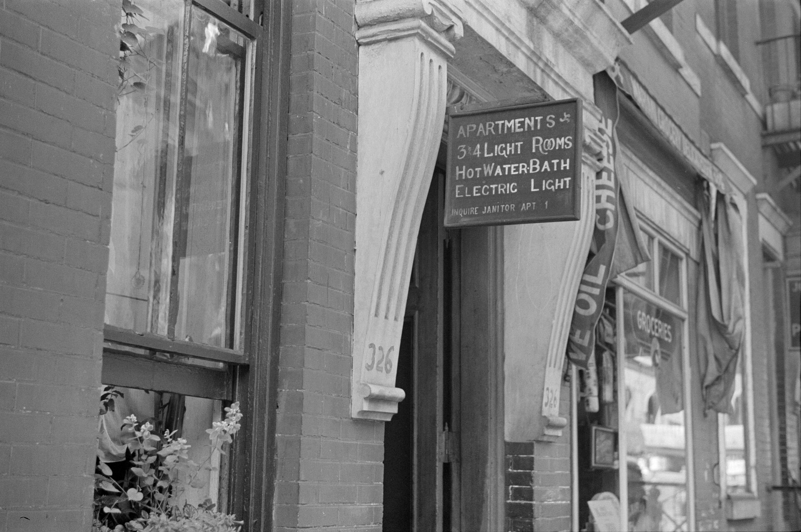

שוק השכירות בישראל נמצא בלחץ מתמשך: **דמי השכירות** בערים המרכזיות רשמו בשנתיים האחרונות עליות בקצב דו-ספרתי, והפערים בין הביקוש להיצע רק מתרחבים. התשובה הקצרה לשאלה מדוע דירה להשכרה יקרה מתמיד נעוצה בשילוב של שלושה גורמים: ריבית גבוהה שמרחיקה רוכשים פוטנציאליים, מחסור חמור בהיצע דירות חדשות, וגידול דמוגרפי ועירוני שמזין את הביקוש.

## מדוע דמי השכירות ממשיכים לעלות?

הגורם המרכזי הוא פשוט: יותר אנשים מחפשים לשכור, ופחות דירות זמינות. כאשר הריבית של בנק ישראל נותרה גבוהה לאורך זמן, המשכנתאות התייקרו משמעותית, וזוגות צעירים רבים דחו את רכישת הדירה. התוצאה — הם נותרו בשוק השכירות, והגדילו את הביקוש בדיוק בתקופה שבה ההיצע מצטמצם.

במקביל, בעלי הדירות שרכשו נכס להשקעה במימון בנקאי מגלגלים את עלויות המימון הגבוהות אל השוכרים. ככל שהחזר המשכנתא של המשקיע גבוה יותר, כך הוא מנסה לתמחר את דמי השכירות בהתאם, במיוחד באזורי ביקוש כמו תל אביב, רמת גן, גבעתיים והערים הגדולות במרכז.

### מחסור בהיצע: הבעיה שמחריפה

ענף הבנייה הישראלי מתמודד עם ירידה בהתחלות הבנייה ועם מחסור בעובדים, מה שמעכב את אכלוס הפרויקטים החדשים. כל דירה שלא נבנית היום היא דירה שחסרה בשוק השכירות בעוד שנתיים-שלוש. מצב זה יוצר לחץ מובנה כלפי מעלה על **דמי השכירות**, שכן ההיצע אינו מדביק את קצב גידול האוכלוסייה והעיור.

## כמה באמת עלה שכר הדירה?

על פי נתוני הלשכה המרכזית לסטטיסטיקה, סעיף הדיור במדד המחירים לצרכן — שמשקף במידה רבה את דמי השכירות — היה בין המובילים בעליות המחירים בשנה החולפת. חשוב לזכור שרוב חוזי השכירות בישראל צמודים למדד, כך שגם שוכר שחתם על חוזה רב-שנתי מגלה שהתשלום החודשי שלו מטפס מדי שנה.

| פרמטר | שוק השכירות | רכישת דירה |
|---|---|---|
| עלות חודשית התחלתית | נמוכה יחסית | גבוהה (הון עצמי + משכנתא) |
| חשיפה לעליית ריבית | עקיפה (דרך בעל הדירה) | ישירה ומיידית |
| הצמדה למדד | כן, ברוב החוזים | חלקית (חלק מהמשכנתא) |
| גמישות מגורים | גבוהה | נמוכה |
| בניית הון עצמי | אין | יש (הנכס) |

הטבלה ממחישה מדוע רבים "נתקעים" בשכירות: הכניסה לרכישה דורשת הון עצמי משמעותי שרק הולך וגדל ככל שמחירי הדירות עולים, בעוד שכר הדירה — למרות העלייה — נותר חסם כניסה נמוך יותר בטווח המיידי.

## מי נפגע יותר מכולם?

הפגיעה הקשה ביותר היא במעמד הביניים ובצעירים בתחילת דרכם. משפחה צעירה שאינה יכולה לגייס הון עצמי לדירה מוצאת את עצמה משלמת דמי שכירות גבוהים, שמקשים עליה לחסוך לרכישה עתידית — מעגל שמנציח את התלות בשוק השכירות. גם סטודנטים ושוכרים בערים האקדמיות, כמו ירושלים, חיפה ובאר שבע, חשים את העלייה בחדות.

## אילו פתרונות קיימים?

המדינה מנסה להתמודד עם המשבר באמצעות כמה כלים:

- **השכירות המוסדית ארוכת הטווח** — פרויקטים של חברת "דירה להשכיר" הממשלתית, שמציעים חוזים יציבים יותר למספר שנים.
- **עידוד בנייה להשכרה** — הטבות מס ליזמים שבונים מתחמים שלמים המיועדים להשכרה בלבד.
- **הגדלת היצע הקרקעות** — שיווק מואץ של קרקעות לבנייה כדי להרחיב את ההיצע העתידי.

עם זאת, היקף הדירות בשכירות המוסדית עדיין קטן מכדי לשנות את התמונה הכוללת. כל עוד ההיצע הכללי מוגבל, קשה לראות כיצד **דמי השכירות** יירדו בטווח הקרוב.

## מה צפוי בשנה הקרובה?

התרחיש המרכזי הוא התייצבות המחירים ברמה גבוהה, ולא ירידה. אם בנק ישראל יחל להוריד את הריבית, חלק מהשוכרים עשויים לחזור לשוק הרכישה ולהקל במעט על הביקוש לשכירות. אך כל עוד קצב הבנייה אינו מתאושש, הלחץ המבני על מחירי השכירות צפוי להישאר. עבור השוכר הישראלי הממוצע, המשמעות ברורה: תכנון תקציבי קפדני והבנה שהדיור ימשיך לנגוס בנתח הולך וגדל מההכנסה הפנויה.
