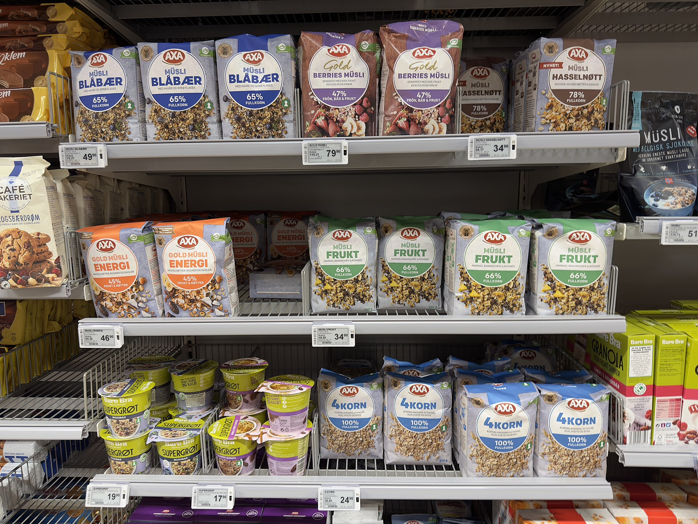

**שרינקפלציה** — צירוף המילים "כיווץ" (shrink) ו"אינפלציה" — הפכה בשנה החולפת לאחת התופעות הצרכניות הבולטות בסל הקניות הישראלי. במקום להעלות את המחיר על המדף, יצרניות רבות בוחרות להקטין בשקט את כמות המוצר באריזה — פחות גרמים בחפיסת השוקולד, פחות יחידות בחבילת החיתולים, פחות מיליליטרים בבקבוק — תוך שמירה על אותו תג מחיר. התוצאה היא ייקור סמוי שהצרכן הממוצע כמעט ואינו מבחין בו.

בעידן שבו יוקר המחיה עומד במרכז השיח הציבורי, ובזמן שרשתות כמו שופרסל, רמי לוי ויינות ביתן מתחרות על כל שקל בעגלה, השרינקפלציה הפכה לדרך "מכובדת" יחסית עבור היצרניות להגן על שולי הרווח שלהן מול התייקרות חומרי הגלם, האנרגיה וההובלה.

## מה זה שרינקפלציה ולמה היא עובדת

ההיגיון מאחורי התופעה הוא פסיכולוגי במהותו. מחקרי צרכנות מראים שאנחנו רגישים הרבה יותר לשינוי במחיר מאשר לשינוי בכמות. העלאת מחיר של חפיסת שוקולד מ-6 ל-7 שקלים קופצת מיד לעין וגוררת תגובה, אך הקטנה של החפיסה מ-100 ל-85 גרם — באותו מחיר — חומקת כמעט תמיד מתחת לרדאר.

היצרניות מסתמכות על כך שרוב הקונים זוכרים את "המחיר" של המוצר, אך כמעט אף אחד לא זוכר את משקלו המדויק. שינוי קל בעיצוב האריזה, שיטוח של תחתית הבקבוק או העמקה של ה"גומה" בתחתית צנצנת — כל אלה מאפשרים להקטין נפח בלי שהצרכן ירגיש.

### איפה זה קורה הכי הרבה

התופעה בולטת במיוחד במוצרים שבהם קשה לעקוב אחר הכמות המדויקת: חטיפים, ופלים, שוקולד, קפה נמס, גלידות, נייר טואלט, חיתולים ומוצרי ניקיון. דווקא במוצרים שנמכרים לפי משקל ברור — כמו קמח או סוכר באריזת קילוגרם — קשה יותר ליצרן "להתחבא".

## איך מזהים שרינקפלציה בזמן אמת

הכלי החשוב ביותר שעומד לרשות הצרכן הוא **המחיר ליחידת מידה** — אותו מספר קטן שמופיע בתווית המדף לצד המחיר הכולל, ומציין כמה עולה המוצר ל-100 גרם, לקילוגרם או לליטר. זהו המדד האמיתי להשוואה, והוא חסין לטריקים של גודל אריזה.

הנה כמה כללי אצבע מעשיים:

- **השוו תמיד מחיר ליחידת מידה**, לא את המחיר על האריזה.
- **שימו לב למשקל המודפס** — אם חפיסה מוכרת ירדה מ-100 ל-85 גרם, זהו סימן מובהק.
- **חשדו באריזות ב"עיצוב חדש"** — לעיתים זהו כיסוי להקטנת כמות.
- **עקבו אחר מותגים פרטיים** של הרשתות, שלרוב שקופים יותר במחיר ליחידה.

## השוואה: ייקור גלוי מול ייקור סמוי

הטבלה הבאה ממחישה את ההבדל בין העלאת מחיר רגילה לבין שרינקפלציה, בדוגמה היפותטית של חפיסת שוקולד:

| פרמטר | מצב התחלתי | ייקור גלוי | שרינקפלציה |
|---|---|---|---|
| מחיר לאריזה | כ-6 שקלים | כ-7 שקלים | כ-6 שקלים |
| משקל האריזה | 100 גרם | 100 גרם | 85 גרם |
| מחיר ל-100 גרם | 6 שקלים | 7 שקלים | כ-7.05 שקלים |
| תחושת הצרכן | — | "התייקר" | "אותו מחיר" |

כפי שרואים, האפקט על הכיס זהה כמעט לחלוטין — אך רק בייקור הגלוי הצרכן מודע לו.

## מה עושים הרגולטור והרשתות

התופעה אינה ייחודית לישראל. באירופה, ובמיוחד בצרפת, נכנסו לתוקף חוקים המחייבים את הרשתות לסמן באופן בולט על המדף מוצרים שכמותם הוקטנה בעוד המחיר נותר דומה. בישראל, הרשות להגנת הצרכן ומשרד הכלכלה מגבירים את תשומת הלב לנושא, והדרישה לסימון ברור של מחיר ליחידת מידה — שכבר קיימת בחוק — נאכפת ביתר שאת.

עם זאת, כל עוד אין חובת סימון ייעודית של "אריזה שהצטמקה", האחריות נותרת בעיקר על כתפי הצרכן. ארגוני הצרכנים ממליצים לנהל רשימת מחירים אישית למוצרים הקבועים בסל, ולהיעזר באפליקציות השוואת מחירים שמציגות מחיר ליחידת מידה בין רשתות.

## שורה תחתונה לצרכן הישראלי

השרינקפלציה היא תזכורת לכך שהמחיר על המדף מספר רק חצי מהסיפור. בתקופה של לחצי יוקר מחיה מתמשכים, הצרכן המיומן הוא זה שמסתכל על הגרמים לא פחות מאשר על השקלים. ההרגל הפשוט של בדיקת המחיר ליחידת מידה עשוי לחסוך מאות שקלים בשנה — ולהחזיר לידי הקונה את השליטה שאבדה לו במעבר בין המדפים.
