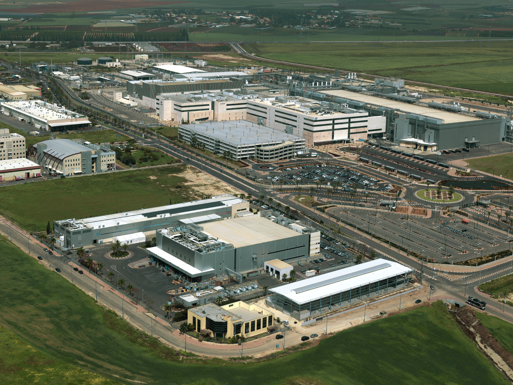

משבר אינטל בישראל הפך בשנה החולפת לאחד הסיפורים המדאיגים ביותר בתעשיית ההייטק המקומית. ענקית השבבים האמריקאית, שנחשבה במשך עשורים לעוגן של תעשיית הסמיקונדקטורים הישראלית ולאחת המעסיקות הפרטיות הגדולות במשק, מתמודדת עם צניחה ברווחיות, עיכובים בהשקעות ענק ושחיקה במעמדה הטכנולוגי מול מתחרות כמו אנבידיה וטיוואן סמיקונדקטור. התוצאה: אי-ודאות כבדה סביב אלפי עובדים ישראלים ומפעל הדגל בקריית גת.

## מדוע אינטל כה חשובה לכלכלה הישראלית?

אינטל פועלת בישראל משנת 1974, והפכה עם השנים לאחת מאבני היסוד של ההייטק המקומי. לחברה מרכזי פיתוח מהמתקדמים בעולם, בהם נולדו טכנולוגיות מעבדים מרכזיות, לצד מפעלי ייצור. המשמעותי שבהם הוא מפעל השבבים בקריית גת, המכונה "פאב 28", שמעסיק אלפי עובדים ומזרים פעילות כלכלית נרחבת לכל הדרום.

מעבר למספר העובדים הישיר, לאינטל השפעה עמוקה על **שרשרת הספקים הישראלית** — מחברות קבלן, דרך יצרני ציוד ועד שירותי לוגיסטיקה. היצוא של אינטל מישראל נחשב שנים לאחד הגדולים במשק, ולכן כל רעידה בחברה האם מורגשת היטב בירושלים ובמשרד האוצר.

## מה בעצם השתבש אצל אינטל?

המשבר של אינטל אינו ישראלי במקורו — הוא גלובלי. החברה, שהובילה את עולם המעבדים במשך עשרות שנים, פספסה את מהפכת **הבינה המלאכותית** ואיבדה את הבכורה לטובת אנבידיה, שהפכה לאחת החברות היקרות בעולם בזכות מעבדים גרפיים לעיבוד נתונים. במקביל, אינטל נותרה מאחור במרוץ הייצור המתקדם מול טיוואן סמיקונדקטור (טי-אס-אם-סי), שמייצרת שבבים עבור אפל, אנבידיה ואחרות.

התוצאה הכספית לא איחרה לבוא: ירידה בהכנסות, קיצוצי כוח אדם רוחביים ברחבי העולם, והקפאת פרויקטים. אסטרטגיית ההתרחבות האגרסיבית שהובילה הנהלת החברה הקודמת בתחום הייצור הסתברה כיקרה מדי, והחברה נאלצה לבלום השקעות.

### ההשלכה הישירה: הקפאת ההרחבה בקריית גת

אחד הסימנים הבולטים למשבר היה ההחלטה לבלום את **תוכנית ההרחבה הענקית** של המפעל בקריית גת, שנאמדה בעשרות מיליארדי דולרים והייתה אמורה להיות אחת ההשקעות הזרות הגדולות בתולדות ישראל. הממשלה אף אישרה בעבר מענק משמעותי לפרויקט. העיכוב פגע בציפיות ליצירת אלפי מקומות עבודה חדשים בדרום, אך חשוב לציין: המפעל הקיים ממשיך לפעול ונחשב לנכס אסטרטגי עבור החברה.

## אינטל מול המתחרות: תמונת מצב

כדי להבין את עומק האתגר של אינטל, כדאי להשוות אותה למתחרות המובילות בתעשיית השבבים:

| חברה | תחום חוזק | מעמד נוכחי |
|---|---|---|
| אינטל | מעבדים למחשבים אישיים ושרתים | בתהליך התאוששות וקיצוצים |
| אנבידיה | מעבדים לבינה מלאכותית | מובילה שוק, שווי שיא |
| טיוואן סמיקונדקטור | ייצור שבבים בקבלנות | מובילה עולמית בייצור מתקדם |
| איי-אם-די | מעבדים ושבבים גרפיים | צומחת ומנגסת בנתח של אינטל |

הטבלה ממחישה את האתגר הכפול של אינטל: היא מתקשה גם בחזית הבינה המלאכותית, שבה שולטת אנבידיה, וגם בחזית הייצור, שבה מובילה טיוואן סמיקונדקטור.

## מה צפוי לעובדים הישראלים?

ההאטה הגלובלית לוותה בגלי התייעלות שהורגשו גם בישראל, לצד תוכניות פרישה מרצון. עם זאת, מרכזי הפיתוח הישראליים נחשבים לבעלי ערך אסטרטגי גבוה, שכן חלק ניכר מהחדשנות של אינטל נולד כאן. ההערכה היא שהחברה תשמור על הליבה הטכנולוגית הישראלית גם בתרחישי התייעלות, אך קצב הגיוסים צפוי להישאר מרוסן בהשוואה לשנות הגאות.

עבור שוק ההייטק הישראלי, המשבר מהווה גם הזדמנות: עובדים מנוסים שמתפנים מאינטל מוזרמים לעבר סטארטאפים וחברות שבבים צעירות, שמחזקות את מערך הכישרונות המקומי בתחום הסמיקונדקטורים.

## שורה תחתונה

משבר אינטל בישראל הוא תזכורת לכך שאפילו ענקית טכנולוגיה ותיקה אינה חסינה מפני שינויים מהירים בשוק. עתידה של החברה בישראל תלוי ביכולתה להשתקם גלובלית, לחזור למרוץ הייצור המתקדם ולמצוא דריסת רגל בעולם הבינה המלאכותית. בטווח הקרוב, המפעל בקריית גת ומרכזי הפיתוח ממשיכים לפעול — אך תוכניות ההתרחבות הגרנדיוזיות נדחו עד להתבהרות התמונה.
