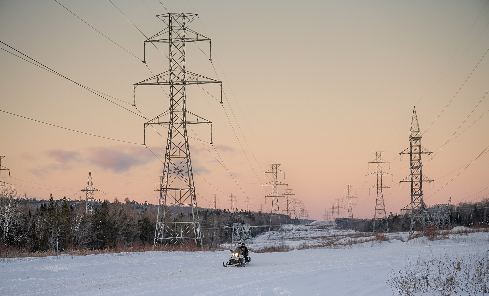

תעריף החשמל בישראל ממשיך להכביד על משקי הבית, ועבור משפחה ממוצעת מדובר באחת מהוצאות הקבע המשמעותיות ביותר בתקציב החודשי. אחרי שורת עדכונים שאישרה רשות החשמל בשנים האחרונות, חשבון החשמל הפך לסעיף שמקפיץ רבים — במיוחד בחודשי הקיץ הלוהטים והחורף הקר, כשהמזגנים עובדים שעות ארוכות. השאלה המרכזית שמעסיקה את הצרכן הישראלי היא פשוטה: למה זה מתייקר, וכיצד אפשר לבלום את העלייה בחשבון.

## למה תעריף החשמל ממשיך לעלות?

מחיר החשמל לצרכן הביתי נקבע על ידי רשות החשמל, ומושפע משורת גורמים. המרכזי שבהם הוא מחיר הדלקים לייצור — בעיקר הגז הטבעי והפחם — שמתנדנד בהתאם למחירי האנרגיה העולמיים ולשער הדולר-שקל. בנוסף, חברת החשמל וגורמי התשתית הפרטיים משקיעים מיליארדים בשדרוג רשת ההולכה והחלוקה, בהיערכות לעומסים הגוברים ובחיבור מתקני אנרגיה מתחדשת — והעלויות הללו מגולגלות בחלקן אל התעריף.

גורם נוסף הוא גידול מתמשך בביקוש. חדירת הרכבים החשמליים, התרחבות מרכזי הנתונים של ענף ההיי-טק והתחממות האקלים מעלים את צריכת החשמל הארצית, ומחייבים השקעות נוספות בתשתית. התוצאה: מגמת ייקור הדרגתית שנמשכת לאורך זמן.

## כמה באמת עולה לכם החשמל?

חשבון החשמל מורכב משני רכיבים עיקריים: צריכה בפועל (קילוואט-שעה) ותשלום קבוע. משק בית ממוצע בישראל צורך מאות קילוואט-שעה בחודשיים, אך בחודשי השיא — אוגוסט הלוהט או ינואר הקר — הצריכה עשויה להכפיל את עצמה בשל השימוש האינטנסיבי במזגנים ובמחממי מים.

החדשות הטובות הן שמאז רפורמת ספקי החשמל הפרטיים, צרכנים יכולים לעבור לספק מתחרה ולקבל הנחה קבועה על מרכיב האנרגיה. ההנחות נעות בדרך כלל בטווח של אחוזים בודדים ועד סביב 7%-8%, ולעיתים מותנות בהוראת קבע או בצריכה בשעות מסוימות.

## השוואה: דרכים לחסוך בחשבון החשמל

להלן השוואה כללית של אפיקי החיסכון הנפוצים והפוטנציאל שלהם:

| אפיק חיסכון | מאמץ נדרש | חיסכון שנתי משוער |
|---|---|---|
| מעבר לספק חשמל פרטי בהנחה | נמוך (שיחה אחת) | עשרות עד מאות שקלים |
| החלפת מזגן ישן למדורג אנרגטית | גבוה (השקעה ראשונית) | מאות שקלים |
| מעבר לתאורת לד בכל הבית | בינוני | עשרות שקלים |
| צמצום שימוש במחמם מים חשמלי | נמוך | מאות שקלים |
| ניצול שעות תעריף נמוך (היכן שרלוונטי) | בינוני | עשרות שקלים |

הנתונים הם הערכות כלליות ומשתנים לפי גודל משק הבית ודפוסי הצריכה.

## איך לחתוך את חשבון החשמל בפועל?

מעבר לבחירת ספק, ההרגלים היומיומיים הם שעושים את ההבדל הגדול. דוד השמש וחימום המים הם מהצרכנים הכבדים ביותר בבית — שימוש מושכל בדוד חשמלי, הפעלתו רק לפני השימוש והימנעות מהשארתו דולק לאורך זמן, חוסכים סכומים ניכרים.

גם המיזוג דורש תשומת לב: כל מעלה נוספת בקירור מייקרת את הצריכה באחוזים. הגדרת המזגן לטמפרטורה סבירה (סביב 24-25 מעלות בקיץ), ניקוי מסננים ואיטום חלונות ודלתות מצמצמים את העומס. בטווח הארוך, החלפת מכשירי חשמל ישנים — מזגנים, מקררים ומדיחים — בדגמים בעלי דירוג אנרגטי גבוה מחזירה את ההשקעה.

**טיפ חשוב:** כדאי לעקוב אחר הצריכה דרך חשבון החשמל המפורט או אפליקציית הספק, ולזהות קפיצות חריגות שעשויות להעיד על מכשיר תקול או על בזבוז מיותר.

## מה צפוי קדימה?

המגמה ארוכת הטווח צפויה להמשיך ולהיות מושפעת ממחירי האנרגיה העולמיים, מקצב המעבר לאנרגיה מתחדשת ומהשקעות התשתית הנדרשות. מנגד, התחרות ההולכת וגוברת בשוק ספקי החשמל הפרטיים עשויה למתן חלק מהעלייה עבור צרכנים פעילים שמשווים הצעות. בשורה התחתונה — תעריף החשמל נותר הוצאה שמשתלם לנהל באופן אקטיבי, בדיוק כפי שצרכנים מנהלים את חבילות הסלולר או ביטוח הרכב שלהם.
