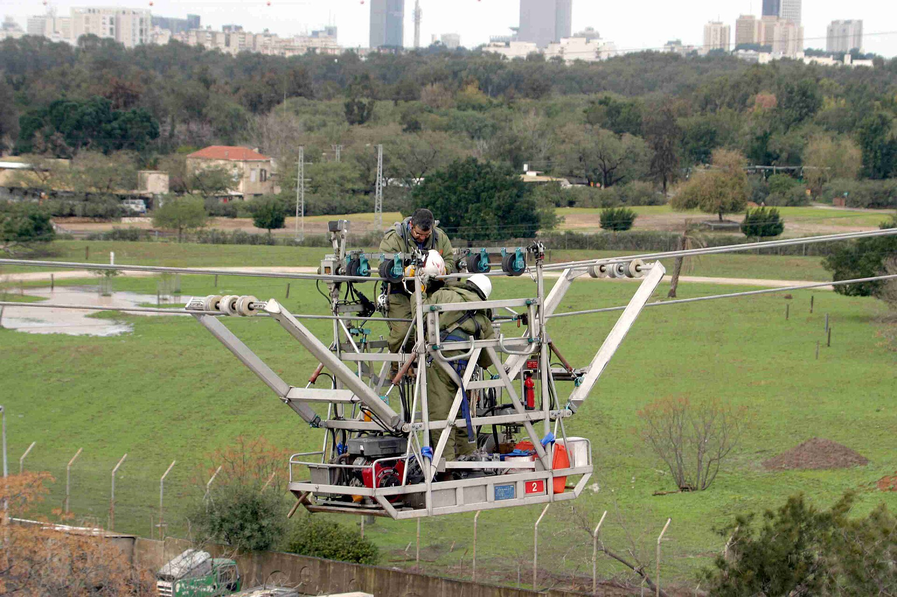
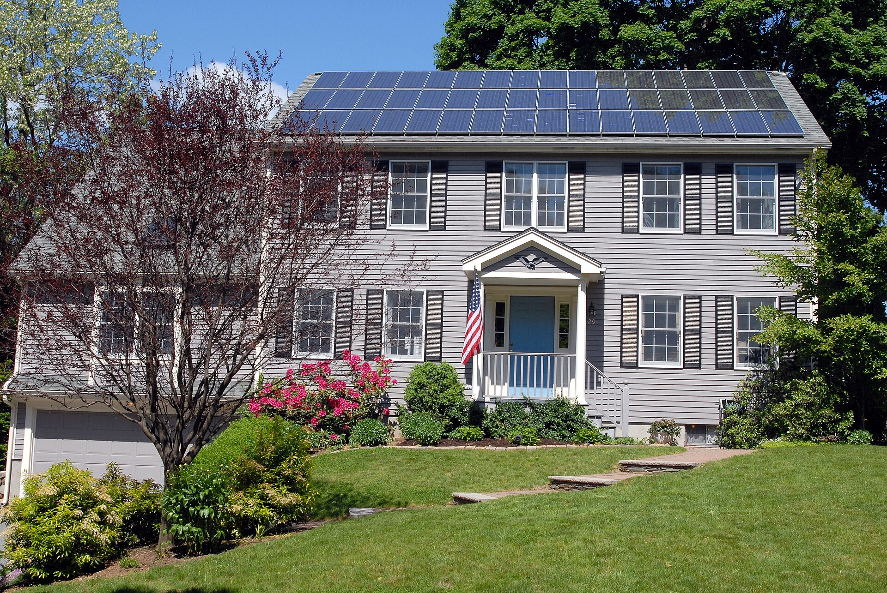

**מחירי החשמל** בישראל ממשיכים להכביד על הארנק של משק הבית הממוצע, על רקע עדכוני תעריף חוזרים ונשנים של רשות החשמל. התשובה הקצרה לשאלה מדוע החשבון תופח: שילוב של עלויות דלקים גבוהות, השקעות ענק בשדרוג רשת ההולכה והחלוקה, והמעבר ההדרגתי לאנרגיות מתחדשות. אלא שלצד המגמה הזו, נפתח בשנים האחרונות שוק תחרותי של ספקי חשמל פרטיים — שמאפשר לצרכן הישראלי לחתוך חלק ניכר מההוצאה.

## למה מחירי החשמל עולים?

תעריף החשמל נקבע על ידי רשות החשמל, המעדכנת אותו בדרך כלל בתחילת כל שנה. העדכון מגלם בתוכו כמה רכיבים מרכזיים: עלות הדלקים (בעיקר גז טבעי ופחם) המשמשים לייצור, עלויות התשתית של חברת החשמל, והוצאות הנובעות מהרחבת מערך האנרגיה הסולארית.

בשנים האחרונות נרשמה מגמת התייקרות מצטברת, שנבעה בין היתר מהתנודתיות במחירי האנרגיה העולמיים ומהצורך לחזק את רשת החשמל מול ביקושי שיא בקיץ ובחורף. התוצאה: רכיב החשמל בסל הצריכה של משק הבית הממוצע הפך למשמעותי יותר.

### כמה באמת עולה החשמל למשק בית?

משק בית ישראלי ממוצע צורך חשמל בהיקף של מאות שקלים בחודש, כאשר השיא נרשם בחודשי הקיץ — עקב השימוש האינטנסיבי במזגנים. חימום החורף, דוד המים החשמלי ומכשירי החשמל הביתיים משלימים את עיקר ההוצאה. על פי הערכות, מיזוג אוויר לבדו יכול להוות כשליש ועד מחצית מחשבון החשמל בחודשי השיא.

## ספקי חשמל פרטיים: איפה החיסכון?

עם פתיחת שוק החשמל לתחרות, נכנסו לשוק מספר ספקים פרטיים — בהם חברות כמו אלקטרה פאוור, פזגז, סלקום אנרג'י ואחרות — המציעות הנחה על **רכיב הייצור** בתעריף. חשוב להבין: ההנחה אינה חלה על מלוא החשבון, אלא על החלק שאחראי לייצור החשמל בלבד, שמהווה כ-60% מהתעריף.

ההנחות נעות לרוב בטווח של כ-5% ועד כ-20%, ולעיתים מותנות באופן התשלום (הוראת קבע) או בשעות צריכה מסוימות. עבור משפחה שמוציאה מאות שקלים בחודש, מדובר בחיסכון מצטבר של מאות שקלים בשנה — כמעט ללא מאמץ.

| אפיק חיסכון | היקף חיסכון משוער | הערות |
|---|---|---|
| מעבר לספק חשמל פרטי | עד כ-20% על רכיב הייצור | ללא התקנה, שינוי בחשבון בלבד |
| החלפת תאורה ללד | עד כ-80% בתאורה | החזר השקעה מהיר |
| מזגן בדירוג אנרגטי גבוה | 15%-30% בחודשי השיא | השקעה חד-פעמית משמעותית |
| מערכת סולארית ביתית | חיסכון משמעותי לאורך שנים | מתאים לבתים פרטיים וגגות |
| דוד שמש במקום חשמלי | עד כ-8% מהחשבון הכולל | חוסך חימום מים חשמלי |

## איך חותכים את חשבון החשמל בפועל?

מעבר לבחירת ספק, קיימות פעולות פרקטיות שמקטינות את הצריכה עצמה:

- **מיזוג חכם:** הגדרת טמפרטורה של כ-24-25 מעלות בקיץ, במקום הנמכה אגרסיבית, חוסכת אנרגיה רבה.
- **תאורת לד:** החלפת נורות ישנות בנורות לד מפחיתה דרמטית את צריכת החשמל בתאורה.
- **ניתוק מכשירים במצב המתנה:** מכשירי חשמל ב"סטנדביי" ממשיכים לצרוך חשמל גם כבויים.
- **שימוש נבון בדוד:** הפעלת דוד חשמלי לזמן קצוב, או מעבר לדוד שמש, חוסכת חלק ניכר מההוצאה.
- **מכשירים חסכוניים:** מקרר, מכונת כביסה ומייבש בדירוג אנרגטי A צורכים הרבה פחות.

## המגמה ארוכת הטווח: אנרגיה סולארית

ההשקעה הציבורית והפרטית באנרגיה מתחדשת צפויה לשנות את פני השוק בשנים הקרובות. התקנת מערכת סולארית על גג הבית — בין אם במודל של מכירת חשמל לרשת ובין אם לצריכה עצמית — הפכה למשתלמת יותר ויותר ככל שעלות ההתקנה יורדת ותעריף החשמל עולה. עבור בעלי בתים פרטיים, מדובר באחת ההשקעות האטרקטיביות להתמודדות עם התייקרות **מחירי החשמל** לאורך זמן.

השורה התחתונה לצרכן הישראלי: התייקרות החשמל אמנם מכבידה, אך בשונה מהוצאות אחרות — זהו תחום שבו לצרכן יש כלים ממשיים להוזיל. שילוב של מעבר לספק פרטי, ייעול הצריכה והשקעה בטכנולוגיה חסכונית יכול לקזז חלק ניכר מהעלייה בתעריף.
