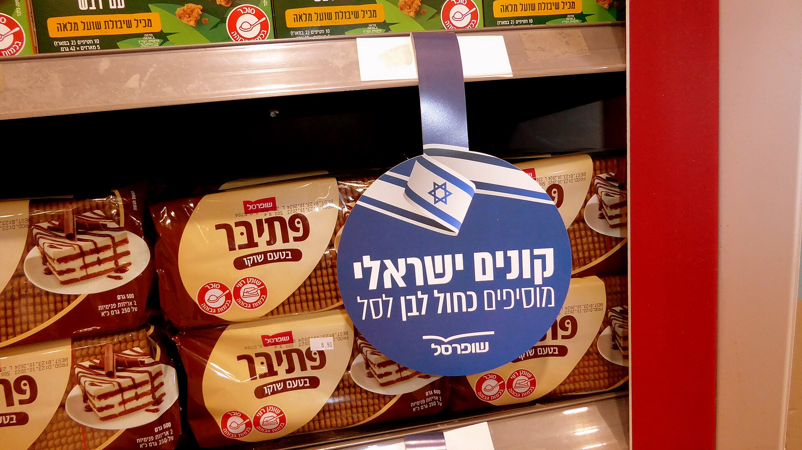

בעיצומו של גל יוקר המחיה, המותגים הפרטיים של רשתות השיווק הפכו לאחד הכלים המרכזיים של משקי הבית הישראלים לצמצום הוצאות. מדובר במוצרים הנושאים את שם הרשת — כמו שופרסל, רמי לוי, ויקטורי או טיב טעם — במקום את המותג היצרני המוכר, ונמכרים במחיר נמוך משמעותית. השאלה הצרכנית האמיתית היא לא רק כמה חוסכים, אלא האם האיכות מצדיקה את המעבר.

## מה הם בעצם המותגים הפרטיים?

מותג פרטי הוא מוצר שרשת השיווק מזמינה מיצרן — לעיתים אותו יצרן שמייצר את המותג המוביל — וממתגת בשמה. מכיוון שהרשת חוסכת בעלויות שיווק, פרסום ומיתוג, היא יכולה להציע מחיר נמוך יותר תוך שמירה על שולי רווח דומים. התוצאה: מוצר זהה או דומה מאוד, במחיר נוח יותר לצרכן.

בישראל נתח השוק של המותגים הפרטיים נחשב נמוך יחסית — הערכות מדברות על טווח של כ-10%-15% מסל הקניות, לעומת מדינות באירופה כמו בריטניה, גרמניה ושווייץ, שבהן הנתח חוצה לעיתים את רף ה-40%. הפער הזה מלמד על פוטנציאל צמיחה גדול, במיוחד כשהצרכן הישראלי לומד להעריך את ההבדלים.

## כמה באמת חוסכים?

ההנחה הטיפוסית במעבר למותג פרטי נעה בין 20% ל-40%, בהתאם לקטגוריה. במוצרי יסוד כמו קמח, סוכר, שמן, קטניות ונייר טואלט — הפער המוחלט באיכות קטן, והחיסכון בולט במיוחד. לעומת זאת, במוצרים שבהם למיתוג ולנאמנות הצרכנים משקל רב, כמו משקאות קלים, דגני בוקר או חטיפים, הפער באיכות ובטעם עשוי להיות מורגש יותר.

### טבלת השוואה: מותג מוביל מול מותג פרטי

| קטגוריה | מותג מוביל (מחיר מייצג) | מותג פרטי (מחיר מייצג) | חיסכון מוערך |
|---|---|---|---|
| חלב 3% ליטר | כ-6.5 ש"ח | כ-5.9 ש"ח | כ-10% |
| קורנפלקס 500 גרם | כ-18 ש"ח | כ-11 ש"ח | כ-39% |
| נייר טואלט (48 גלילים) | כ-70 ש"ח | כ-45 ש"ח | כ-36% |
| שמן קנולה ליטר | כ-12 ש"ח | כ-8 ש"ח | כ-33% |
| פסטה 500 גרם | כ-9 ש"ח | כ-5.5 ש"ח | כ-39% |

המחירים בטבלה הם הערכות מייצגות ומשתנים בין רשתות, סניפים ומבצעים — אך הם ממחישים את הסדר גודל של החיסכון האפשרי.

## האם האיכות באמת נופלת?

זהו החשש המרכזי של הצרכנים, אך בשנים האחרונות הפערים הצטמצמו. חלק ניכר מהמותגים הפרטיים מיוצרים במפעלים מובילים בעלי תקני איכות מחמירים, ולעיתים מדובר באותו קו ייצור ממש של המותג היקר. עם זאת, ההבדלים עשויים להתבטא ברכיבים משניים, באריזה, בעיצוב או בעקביות הטעם.

המלצה צרכנית פשוטה: לנסות קטגוריה אחת בכל קנייה. אם המוצר עומד בציפיות — לאמץ אותו לקבע. כך ניתן לבנות בהדרגה סל קניות חסכוני בלי להתפשר על מוצרים שחשובים במיוחד למשפחה.

## למה דווקא עכשיו?

גל ההתייקרויות במחירי המזון, לצד עליית מדד המחירים לצרכן שמעסיקה את בנק ישראל, דחף צרכנים רבים לחפש חלופות. הרשתות, מצידן, זיהו הזדמנות: הרחבת קו המותג הפרטי מגבירה את נאמנות הלקוחות ומשפרת את שולי הרווח. שופרסל, רמי לוי, ויקטורי ורשתות הדיסקאונט משקיעות בשנים האחרונות בהרחבת מגוון המותג הפרטי — מהמוצרים הבסיסיים ועד לקטגוריות פרימיום.

## איך לקנות נכון?

- **השוו מחיר ליחידת מידה:** בדקו את המחיר למאה גרם או לליטר, ולא את המחיר על המדף. אריזה גדולה וזולה לכאורה אינה תמיד המשתלמת.
- **בדקו רכיבים ומקור ייצור:** לעיתים המותג הפרטי זהה ברכיביו למותג היקר.
- **אל תתפשרו היכן שחשוב:** בקטגוריות שבהן הטעם קריטי, שווה לבדוק אם המותג הפרטי עומד בציפיות לפני מעבר מלא.
- **נצלו מבצעים:** לעיתים מותג מוביל במבצע זול יותר מהמותג הפרטי — הגמישות משתלמת.

השורה התחתונה: המותגים הפרטיים הפכו לכלי לגיטימי ויעיל בניהול תקציב משק הבית. עבור משפחה ממוצעת, מעבר חכם ומדורג יכול לחסוך מאות שקלים בחודש — בלי לוותר על איכות החיים.
