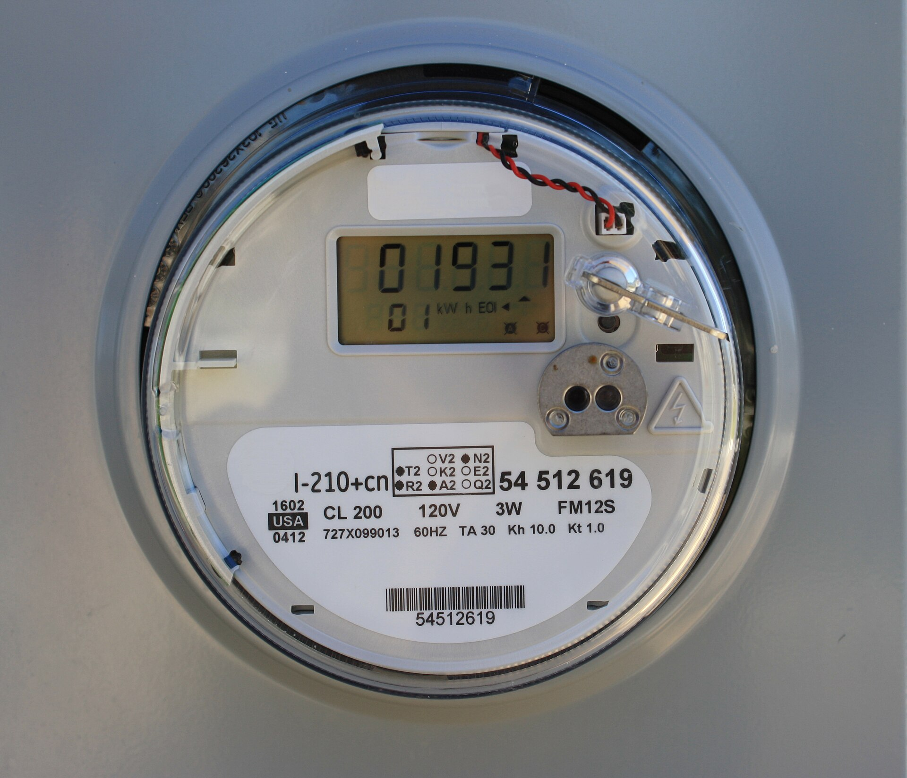

מחירי החשמל בישראל ממשיכים להכביד על כיס הצרכן: בשנה החולפת נרשמה מגמת התייקרות בתעריף החשמל לצרכן הביתי, והעדכון מתווסף לשורה ארוכה של התייקרויות בסל הצריכה של משק הבית הישראלי. התשובה הקצרה לשאלה מדוע זה קורה — שילוב של מחירי דלקים גבוהים, שער דולר-שקל תנודתי ועלויות תשתית מתרחבות, שכולם מגולגלים אל החשבון החודשי שלכם.

## מדוע מחירי החשמל מתייקרים?

תעריף החשמל בישראל נקבע על ידי **רשות החשמל**, שמעדכנת אותו מעת לעת בהתאם למבנה העלויות של **חברת החשמל** וספקי הייצור הפרטיים. מרכיב מרכזי בתעריף הוא עלות הדלקים — בעיקר גז טבעי ופחם — שמחיריהם נגזרים משוק האנרגיה העולמי ומשער הדולר. כאשר הדולר מתחזק מול השקל, עלות הדלק המיובא מתייקרת, וההתייקרות מחלחלת לתעריף.

לצד זאת, משפיעים על התעריף גם מרכיבי עלות נוספים: השקעות בתשתיות הולכה וחלוקה, מעבר לאנרגיות מתחדשות, עלויות כוח אדם, וביקוש הולך וגדל לחשמל — בין היתר בשל התפשטות הרכבים החשמליים ומרכזי הנתונים הצומחים בישראל.

## כמה באמת עולה החשמל למשק בית?

משק בית ישראלי ממוצע צורך מאות קילוואט-שעה בחודש, והחשבון מזנק במיוחד בחודשי הקיץ והחורף, כאשר המזגנים פועלים בעומס. בחודשי השיא יכול החשבון הדו-חודשי להגיע לסכומים משמעותיים, שמהווים נתח לא מבוטל מתקציב משק הבית.

הטבלה הבאה ממחישה היכן "נשרף" עיקר החשמל בבית ממוצע:

| מכשיר / שימוש | נתח משוער מהצריכה | פוטנציאל חיסכון |
|---|---|---|
| מיזוג אוויר (חימום/קירור) | כ-40%-50% | גבוה |
| דוד חשמלי (בּוֹיְלֶר) | כ-15%-20% | בינוני-גבוה |
| מקרר ומקפיא | כ-10%-15% | בינוני |
| תאורה | כ-5%-10% | גבוה (מעבר ללד) |
| מכשירי חשמל במצב המתנה | כ-5%-10% | בינוני |

## כיצד אפשר לחסוך בחשבון החשמל?

למרות שאין לצרכן שליטה על התעריף עצמו, יש בידיו כלים ממשיים לרסן את החשבון. הנה הצעדים המשתלמים ביותר:

- **ויסות המזגן:** כל מעלה בקיץ ובחורף מייקרת את הצריכה באחוזים בודדים. הגדרת טמפרטורה של כ-24-25 מעלות בקיץ, ושימוש בטיימר, חוסכים משמעותית.
- **מעבר לתאורת לד:** נורות לד צורכות עד פי עשרה פחות מנורות ליבון ישנות, ומחזירות את ההשקעה במהירות.
- **תזמון הדוד:** הפעלת הדוד החשמלי למשך זמן קצר לפני השימוש, או התקנת דוד שמש, חוסכים עשרות שקלים בחודש.
- **ניתוק מכשירים במצב המתנה:** טלוויזיות, ממירים ומטענים צורכים חשמל גם כשהם כבויים לכאורה.
- **תעריף לפי שעות (תעו"ז):** צרכנים שמעבירים חלק מהצריכה לשעות הזולות עשויים ליהנות מהוזלה.

## רפורמת התחרות: ספק חשמל פרטי

אחד השינויים המשמעותיים בשוק הוא פתיחתו לתחרות. כיום יכול הצרכן הביתי לעבור מ**חברת החשמל** לספק חשמל פרטי, שמציע לרוב הנחה של אחוזים בודדים על רכיב האנרגיה בתעריף. המעבר אינו כרוך בהחלפת תשתית פיזית, והחשמל ממשיך לזרום באותו האופן — ההבדל הוא חשבונאי בלבד.

עם זאת, כדאי לקרוא את האותיות הקטנות: חלק מההנחות מותנות בתקופת התחייבות או בהוראת קבע, וההנחה חלה רק על חלק מהתעריף ולא על כל מרכיביו. השוואה מדוקדקת בין ההצעות — בדומה להתנהלות מול חברות הסלולר והתקשורת — היא המפתח לחיסכון אמיתי.

## מה צפוי קדימה?

לנוכח המעבר ההדרגתי לאנרגיות מתחדשות, ההשקעות הנדרשות בתשתיות החשמל, והביקוש הגובר מצד הרכבים החשמליים ומרכזי הנתונים, ההערכה היא כי מחירי החשמל ימשיכו להיות נתונים ללחצים. עבור הצרכן הישראלי, המשמעות ברורה: ניהול מושכל של הצריכה ובחירה חכמה של ספק הם לא מותרות — אלא כלי הכרחי בהתמודדות עם יוקר המחיה.
