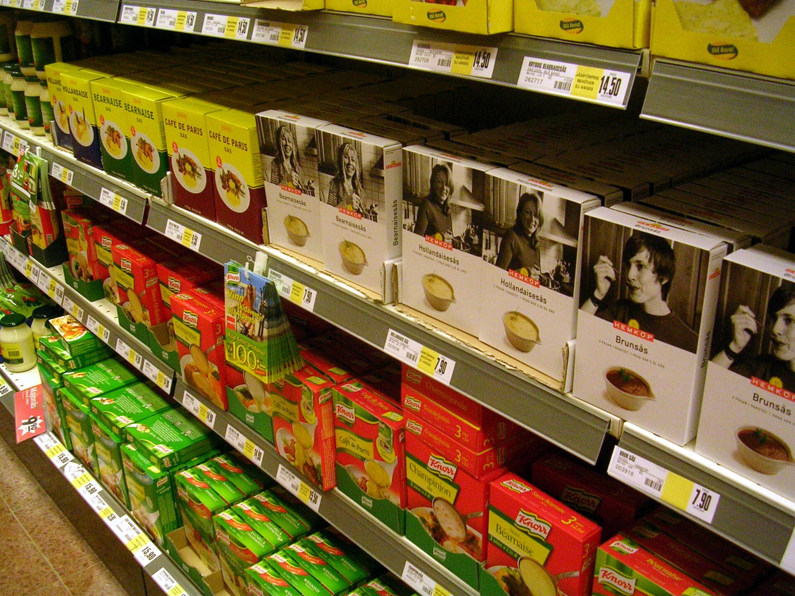

בשנים האחרונות, על רקע יוקר המחיה המתמשך, **המותג הפרטי** של רשתות השיווק הפך לאחד הכלים המרכזיים של הצרכן הישראלי לצמצום ההוצאה על סל הקניות. מדובר במוצרים שהרשת מייצרת או מזמינה תחת שמה המסחרי — ומוכרת אותם במחיר נמוך בעשרות אחוזים ממותגי היצרנים המובילים. התשובה הקצרה לשאלה "האם זה משתלם" היא: ברוב הקטגוריות כן, אך לא בכולן באותה מידה.

## מהו מותג פרטי ולמה הוא זול יותר?

מותג פרטי (Private Label בלעז, ובעברית "מותג הבית") הוא קו מוצרים הנושא את שם הרשת או מותג ייעודי שלה, במקום את שם היצרן. שופרסל, רמי לוי, ויקטורי ויינות ביתן כולן מפעילות קווים כאלה — מחלב ושמן ועד נייר טואלט, חטיפים ומוצרי ניקיון.

הפער במחיר אינו נובע בהכרח מאיכות ירודה. במקרים רבים את המוצר מייצר אותו יצרן גדול שמייצר את המותג הממותג, אך ללא עלויות השיווק, הפרסום הטלוויזיוני ומערך המכירות שמגולמות במחיר של מותג מוביל. התוצאה: חיסכון ממוצע של **20% עד 40%** לצרכן.

## כמה באמת חוסכים? השוואת מחירים

הטבלה הבאה ממחישה את סדרי הגודל של הפער בין מותג פרטי למותג יצרן מוביל בקטגוריות נפוצות. מדובר בטווחי הערכה כלליים, שמשתנים בין רשת לרשת ובין מבצע למבצע.

| קטגוריה | מותג יצרן מוביל | מותג פרטי | חיסכון מוערך |
|---|---|---|---|
| חלב ומוצריו | מחיר מלא | נמוך משמעותית | 15%-30% |
| שימורים וקטניות | מחיר מלא | נמוך מאוד | 30%-45% |
| נייר טואלט ומגבות | מחיר מלא | נמוך משמעותית | 25%-40% |
| חטיפים ומתוקים | מחיר מלא | נמוך בינוני | 20%-35% |
| מוצרי ניקיון | מחיר מלא | נמוך מאוד | 30%-50% |

עבור משפחה ממוצעת, מעבר חלקי למותג הפרטי בקטגוריות הבסיסיות עשוי לחסוך **מאות שקלים בחודש** — חיסכון שמצטבר לאלפי שקלים בשנה.

## מתי כדאי לקנות מותג פרטי ומתי להיזהר?

לא כל המוצרים נולדו שווים. ישנן קטגוריות שבהן הפער באיכות כמעט בלתי מורגש, ואחרות שבהן טעם, מרקם או ביצועים עושים את ההבדל.

### הקטגוריות "הבטוחות"

- **מוצרים בסיסיים ואחידים**: סוכר, מלח, קמח, קטניות, שמן בסיסי ומים מינרליים — כאן הפער באיכות שולי.
- **נייר ומוצרי ניקיון כלליים**: ברוב המקרים הביצועים דומים מאוד למותגים המובילים.
- **שימורים**: עגבניות, תירס, אפונה — פער איכות נמוך לצד חיסכון גבוה.

### הקטגוריות שבהן כדאי לבדוק

- **קפה ושוקולד**: מוצרי פינוק שבהם הטעם קריטי — שווה להתנסות לפני מעבר מלא.
- **מוצרי טיפוח וקוסמטיקה**: לעיתים ההרכב שונה מהותית מהמותג המקורי.
- **מוצרי תינוקות**: רבים מעדיפים לדבוק במותג מוכר מטעמי ביטחון.

## המשמעות לשוק: מאבק כוח מול היצרנים

התרחבות המותג הפרטי אינה רק סיפור צרכני — היא משנה את מאזן הכוחות בענף המזון הישראלי. ככל שהרשתות מגדילות את נתח המותג הפרטי, כך גדל כוח המיקוח שלהן מול היצרנים הגדולים — **אסם, תנובה, שטראוס ויוניליוור** — בכל הנוגע למחירי מדף ולתנאי התקשרות.

עבור הרשתות, המותג הפרטי הוא גם מנוע רווחיות: שולי הרווח עליו גבוהים יחסית, והוא יוצר נאמנות לקוחות שקשה לשחזר אצל המתחרים. לכן צפוי שהמגמה רק תתעצם, עם כניסת מותגי בית לקטגוריות פרימיום ואף למוצרים בריאותיים ואורגניים.

## מה שורת התחתונה לצרכן?

בעידן שבו כל שקל נחשב, המותג הפרטי הוא אחד הכלים היעילים ביותר להורדת עלות סל הקניות — בלי לוותר בהכרח על איכות. ההמלצה המעשית: לבצע מעבר **מדורג וסלקטיבי**, להתחיל מהקטגוריות הבסיסיות, ולבחון מוצר-מוצר. במקרים רבים תגלו שהפער שאתם משלמים עבור השם המוכר גדול בהרבה מהפער באיכות.
