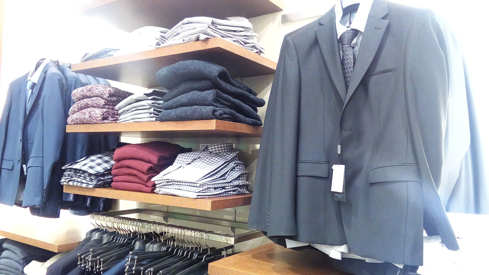

האתרים הסיניים **שיין (Shein) וטמו (Temu)** הפכו בשנה החולפת לשחקנים הדומיננטיים בזירת הקניות האונליין של הישראלים, כשהם מציעים מוצרים במחירים נמוכים עד כדי אבסורד — לעיתים שקלים בודדים לפריט. התופעה משנה את הרגלי הצריכה בישראל, מאתגרת את הקמעונאות המקומית, ומעוררת שאלות נוקבות על איכות, פרטיות ורגולציה.

## למה שיין וטמו כל כך זולות?

הסוד מאחורי המחירים של שיין וטמו טמון בשילוב של כמה גורמים: שרשרת אספקה קצרה היוצאת ישירות ממפעלים בסין, ייצור בכמויות אדירות, ויתור על חוליות תיווך, ושימוש אגרסיבי באלגוריתמים לזיהוי טרנדים. טמו, בבעלות ענקית המסחר הסינית **פינדודואו (PDD)**, מסבסדת משלוחים ומוצרים כדי לכבוש נתח שוק מהיר — אסטרטגיה של "צמיחה לפני רווחיות".

גורם מכריע נוסף הוא **הפטור ממכס על יבוא אישי** בישראל: רכישות עד 75 דולר פטורות ממכס, ועד 500 דולר פטורות ממס קנייה (אך לא ממע"מ בחלק מהמקרים). מבנה זה הופך את החבילות הקטנות מסין לכדאיות במיוחד עבור הצרכן הישראלי.

## כמה זה באמת זול? השוואת אפיקים

כדי להבין את עוצמת הפער, הנה השוואה כללית בין ערוצי הקנייה הנפוצים בישראל עבור פריטי אופנה ואביזרים:

| ערוץ קנייה | רמת מחיר | זמן אספקה | אחריות ושירות |
|---|---|---|---|
| שיין / טמו | נמוך מאוד | כשבועיים-שלושה | מוגבלת |
| אמזון / עליאקספרס | בינוני | ימים עד שבועות | בינונית |
| קמעונאות מקומית | גבוה | מיידי | מלאה |
| רשתות אופנה בקניון | גבוה-בינוני | מיידי | מלאה |

הטבלה ממחישה את הדילמה הצרכנית: שיין וטמו מנצחות בסעיף המחיר, אך מפגרות משמעותית באחריות, בזמינות השירות ובאפשרות להחזרה נוחה.

## מה הסיכונים לצרכן הישראלי?

המחיר הנמוך אינו חף ממחיר נסתר. בין הסיכונים המרכזיים:

- **איכות לא אחידה:** מוצרים רבים אינם עומדים בתקני הבטיחות האירופיים או הישראליים, בעיקר בקטגוריות של מוצרי חשמל, צעצועים וקוסמטיקה.
- **הגנת פרטיות:** האפליקציות של שיין וטמו נוהגות לאסוף היקף נרחב של נתוני משתמשים. רגולטורים באירופה פתחו בבדיקות בנושא.
- **קושי בהחזרות:** החזרת מוצר פגום לסין לרוב אינה משתלמת, והצרכן נותר ללא פתרון אמיתי.
- **טביעת רגל סביבתית:** מודל ה"אופנה המהירה" מעודד צריכת-יתר והשלכה מהירה של מוצרים.

## איך זה משפיע על הקמעונאות המקומית?

החנויות והרשתות הישראליות מתקשות להתחרות במבנה העלויות של הענקיות הסיניות. פריט דומה שנמכר ברשת מקומית בעשרות שקלים זמין בשיין או בטמו בשקלים בודדים. התוצאה: לחץ על שולי הרווח של הקמעונאים, ודרישה גוברת מצד איגודי המסחר ל"יישור קו" רגולטורי — כלומר ביטול או צמצום של הפטור ממכס, שלטענתם יוצר תחרות בלתי הוגנת.

מנגד, גופי הגנת הצרכן מזהירים כי ביטול הפטור עלול לייקר את סל הקניות של משקי הבית, בתקופה שבה יוקר המחיה כבר עומד במוקד השיח הציבורי. זהו מתח קלאסי בין אינטרס הצרכן לבין הגנה על התעשייה והמסחר המקומיים.

## מה צפוי בהמשך?

באיחוד האירופי כבר מקודמת רפורמה לביטול הפטור ממכס על חבילות זולות, ומגמה דומה נבחנת במדינות נוספות. בישראל, סוגיית הפטור על יבוא אישי עולה מעת לעת לדיון, אך שינוי ממשי צפוי לעורר ויכוח ציבורי טעון. בטווח הקצר, שיין וטמו צפויות להמשיך ולהרחיב את נוכחותן בשוק הישראלי, בעודן מהוות תמריץ ללמידה: הצרכן נהנה ממחירים נמוכים, אך נדרש לשקלל גם את עלויות האיכות, האחריות והפרטיות.

השורה התחתונה: שיין וטמו הן ביטוי מובהק לגלובליזציה של הצריכה. עבור הארנק — זו בשורה; עבור הקמעונאות המקומית והרגולטור — אתגר שדורש מענה.
