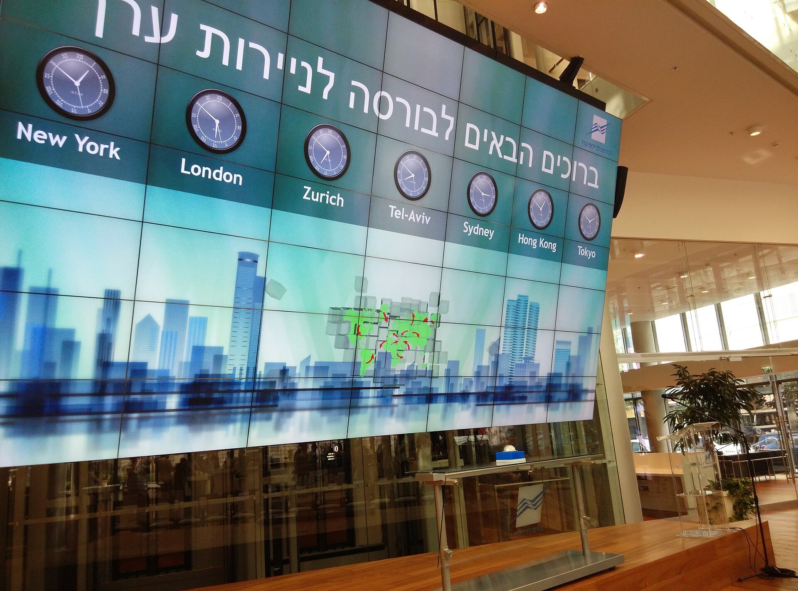

השקל מתחזק מול הדולר — וזו אחת המגמות המשמעותיות ביותר בכלכלה הישראלית בחודשים האחרונים. אחרי תקופה ממושכת של תנודתיות חדה ופיחות על רקע המלחמה, מטבע הישראלי נע חזרה למגמת ייסוף, בתמיכת הרגיעה הביטחונית, זרימת הון זר לבורסה בתל אביב וראלי במדדי המניות המקומיים. למי שמתכנן טיסה לחו"ל, מזמין מוצרים מאתרים בינלאומיים או מחזיק תיק השקעות דולרי — יש לכך השלכות ישירות על הכיס.

## למה השקל מתחזק מול הדולר?

שער הדולר-שקל מושפע משילוב של גורמים מקומיים וגלובליים. בצד המקומי, ירידה ברמת הסיכון הגאו-פוליטי מחזירה את אמון המשקיעים הזרים, שמגדילים חשיפה לנכסים ישראלים. במקביל, גופי הפנסיה והגמל הישראלים מחזיקים חשיפה עצומה למניות בוול סטריט — וכשהשווקים בארה"ב עולים, חלקם מגדרים את החשיפה המטבעית ומוכרים דולרים, מהלך שמחזק את השקל.

בצד הגלובלי, ציפיות להורדות ריבית בארה"ב מצד הפדרל ריזרב מחלישות את הדולר מול סל המטבעות בעולם, והשקל נהנה מהמגמה. גם הגיאות בבורסה בתל אביב, עם שיאים במדדי ת"א 35 ות"א 125, משכה הון נוסף פנימה.

## מי מרוויח ומי מפסיד מייסוף השקל?

שער חליפין אינו "טוב" או "רע" באופן מוחלט — הוא יוצר מנצחים ומפסידים. שקל חזק הוא בשורה טובה לצרכן הישראלי: הוא מוזיל את עלות היבוא, מחירי הדלק (המתומחרים בדולרים), מוצרי אלקטרוניקה, רכבים ונסיעות לחו"ל. למעשה, ייסוף השקל הוא אחד הכלים האפקטיביים לריסון האינפלציה המקומית.

מנגד, היצואנים נפגעים. חברות הייטק, תעשייה וביטחוניות שמוכרות בדולרים אך משלמות שכר בשקלים רואות שחיקה ברווחיות. גם תעשיית התיירות הנכנסת סובלת, מאחר שישראל הופכת יקרה יותר לתייר הזר.

| גורם במשק | השפעת התחזקות השקל |
|---|---|
| צרכן פרטי | חיובית — יבוא ונסיעות זולים יותר |
| יבואנים | חיובית — עלויות רכש יורדות |
| יצואנים והייטק | שלילית — שחיקה בהכנסות השקליות |
| משקיע בוול סטריט | שלילית — תשואה שקלית נשחקת |
| אינפלציה וריבית | ממתנת לחצי מחירים |

## איך זה משפיע על תיק ההשקעות שלכם?

עבור ישראלים רבים שמשקיעים במדדי S&P 500 ונאסד"ק או במניות כמו אנבידיה ואפל, ייסוף השקל הוא חרב פיפיות. גם אם המדד האמריקאי עולה, התחזקות השקל מול הדולר מכרסמת בתשואה כשממירים את הרווח חזרה לשקלים. לכן משקיעים רבים בוחנים מכשירים "מנוטרלי מט"ח" (Currency Hedged) כדי להגן על התשואה מפני תנודות השער.

מנגד, המשקיעים בבורסה בתל אביב נהנים כפל-כפליים: גם מעליית המדדים המקומיים וגם מכך שהנכסים שלהם נקובים ממילא בשקלים.

## מה עושה בנק ישראל?

בנק ישראל מחזיק ברזרבות מטבע חוץ עצומות, שנצברו לאורך שנים בין היתר באמצעות התערבות בשוק המט"ח. בשנים עברו רכש הבנק דולרים כדי לבלום ייסוף חד שפוגע ביצואנים. כיום המדיניות המוצהרת היא לאפשר לשער להיקבע בשוק החופשי, תוך שמירה על יכולת התערבות במקרי תנודתיות קיצונית.

התחזקות השקל גם מסייעת לנגיד בהורדת האינפלציה אל תוך יעד הממשלה, ועשויה לפנות מרחב להורדות ריבית עתידיות — מהלך שיקל על נוטלי המשכנתאות.

## לאן נע שער הדולר-שקל מכאן?

חשוב לזכור ששער החליפין הוא מהנכסים התנודתיים ביותר, וקשה לחזות אותו בוודאות. מגמת ההתחזקות תלויה בהמשך הרגיעה הביטחונית, בקצב הורדות הריבית בארה"ב ובזרימת ההון לבורסה המקומית. כל הסלמה גאו-פוליטית עלולה להפוך את המגמה במהירות. למשקיע ולצרכן הישראלי מומלץ להתייחס לשער כאל גורם סיכון שיש לנהל — ולא כאל מגמה מובטחת.
